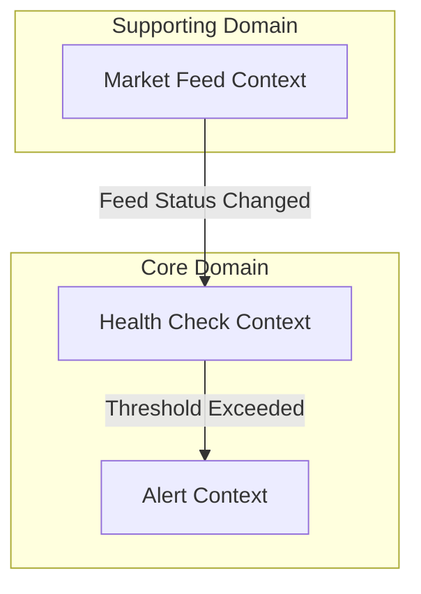

# Mermaid Diagram Generation

Your goal is to produce consistent, renderable Mermaid diagrams across all project documentation including analysis docs, architecture docs, README, API specs, and agent outputs.

## Diagram Type Selection

Choose the diagram type based on intent:

| Intent                              | Diagram Type         | Mermaid Keyword         |
| ----------------------------------- | -------------------- | ----------------------- |
| Bounded Context / component map     | Flowchart (TB or LR) | `graph TD` / `graph LR` |
| Domain object state transitions     | State Diagram        | `stateDiagram-v2`       |
| Cross-system interaction / API flow | Sequence Diagram     | `sequenceDiagram`       |
| Entity relationships / DB schema    | ER Diagram           | `erDiagram`             |
| Class structure / interfaces        | Class Diagram        | `classDiagram`          |
| Deployment / infrastructure         | Flowchart (LR)       | `graph LR`              |
| Timeline / process steps            | Flowchart (TD)       | `graph TD`              |

## Mandatory Rules

### Language
- Node labels and edge labels: **English** (technical terms)
- For multilingual support, use optional annotations in parentheses or quotes
- Example: `HC["Health Check Context (Monitoring)"]`

### Structure
- Always wrap related nodes in `subgraph` blocks for grouping (flowcharts)
- Use meaningful, concise node IDs (2-4 uppercase letters or camelCase): `HC`, `AlertMgr`, `OrderSvc`
- Max **3 levels** of subgraph nesting

### Edge Labels
- Always include edge labels on arrows to explain the relationship or message
- Format: `A -->|"action / event"| B`
- Avoid bare unlabeled arrows unless relationship is self-evident (parent→child hierarchy)
- **Line breaks in node labels**: Use `<br/>` inside quoted labels — `\n` is **not** reliably supported across renderers
  - ✅ CORRECT: `ZSS["ZeroMQ Subscriber<br/>(XSUB)"]`
  - ❌ WRONG: `ZSS["ZeroMQ Subscriber\nXSUB"]`
- **Edge labels cannot span multiple lines**: keep edge labels to a single concise phrase

### State Diagrams (`stateDiagram-v2`)
- Always define an explicit `[*]` initial state
- Annotate every transition with the triggering event: `StateA --> StateB : EventName`
- Group compound states using `state "Label" { ... }` blocks when needed
- **NEVER** add a bare `[*] --> [*]` line — it creates an invalid self-loop on the terminal pseudo-state and breaks rendering
- **Notes syntax**: Use the multi-line block form only — inline `note right of X : text` is **NOT supported** and causes a parse error
  - ✅ CORRECT:
    ```
    note right of StateName
      annotation text
    end note
    ```
  - ❌ WRONG: `note right of StateName : annotation text`

### Sequence Diagrams (`sequenceDiagram`)
- Declare all participants at the top with `participant` keyword
- Use `+` / `-` activation bars for request/response pairs
- Wrap async operations in `par` or `loop` blocks when applicable
- Include `Note over X,Y: description` for important domain rules or invariants
- **`\n` is NOT a line break** in `Note over` text or message labels — keep them to a single line or split into two separate Note statements

### ER Diagrams (`erDiagram`)
- Use standard crow's foot notation: `||--o{`, `}o--||`, etc.
- Always annotate relationship lines with a verb phrase: `PLACES`, `CONTAINS`, `TRIGGERS`

### Class Diagrams (`classDiagram`)
- Prefix interfaces with `<<interface>>` stereotype
- Show only public members relevant to the design; omit implementation details
- Use `<|--` for inheritance, `..>` for dependency, `o--` for aggregation

### Formatting and Readability
- Add a `%%` comment line above each diagram block describing its purpose
- Keep diagrams **focused**: one diagram per concern — split large diagrams rather than cramming
- After the closing code fence, add a `> **Design Intent**:` blockquote explaining why the diagram is structured this way

## Step-by-Step Workflow

1. **IDENTIFY** the diagram type from the table above
2. **DRAFT** node IDs and labels
3. **APPLY** all mandatory rules for the chosen type
4. **WRITE** the mermaid code block
5. **ADD** a `> Design Intent` blockquote immediately after the diagram
6. **VALIDATE**: check for unlabeled edges, missing `[*]` states, and undeclared participants

## Quality Checklist

- [ ] Correct diagram type chosen for the intent
- [ ] All nodes have meaningful IDs and readable labels
- [ ] All edges have labels (flowchart / state / sequence)
- [ ] `subgraph` used for logical grouping (flowchart)
- [ ] `[*]` initial state present (stateDiagram)
- [ ] No bare `[*] --> [*]` line in stateDiagram-v2
- [ ] Notes in stateDiagram-v2 use block form (`note right of X` / `end note`), NOT inline colon form
- [ ] Node labels use `<br/>` for line breaks, NOT `\n`
- [ ] Edge labels and Note/message labels are single-line
- [ ] All participants declared (sequenceDiagram)
- [ ] Design Intent blockquote written after the diagram
- [ ] No more than 3 subgraph nesting levels
- [ ] Diagram renders without syntax errors

## Example



> **Design Intent**: Core Domain contexts are grouped separately from Supporting Domain to clarify ownership boundaries. Edge labels express the domain event that crosses context boundaries.
