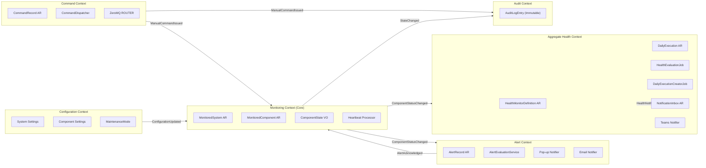
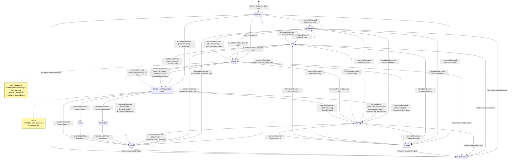
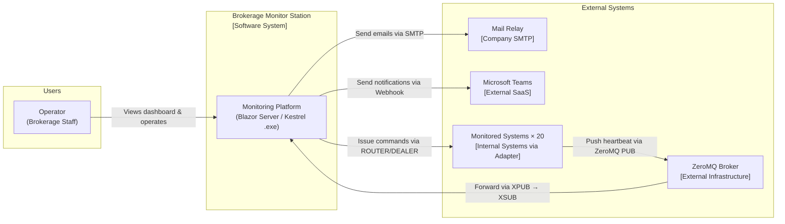
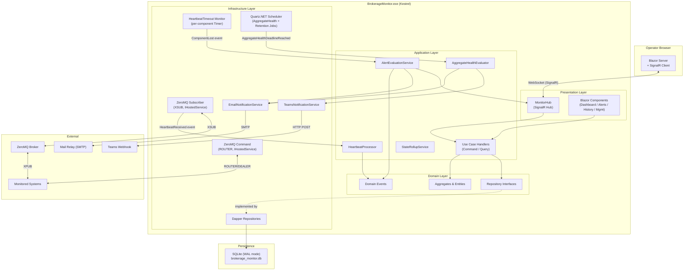
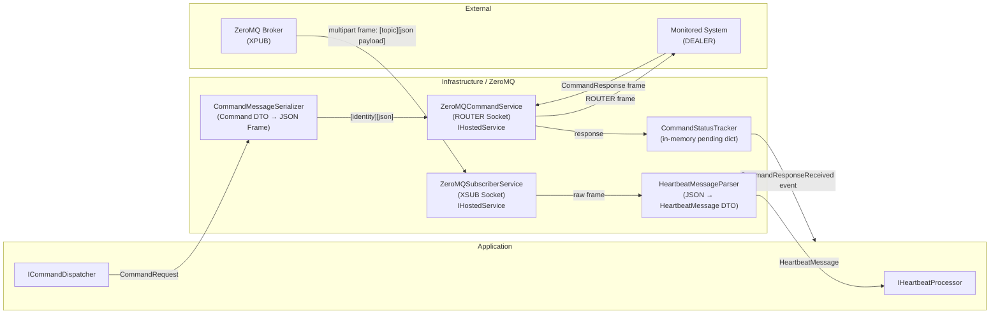
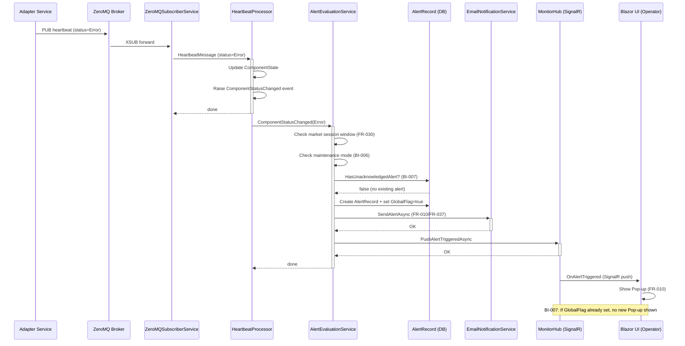
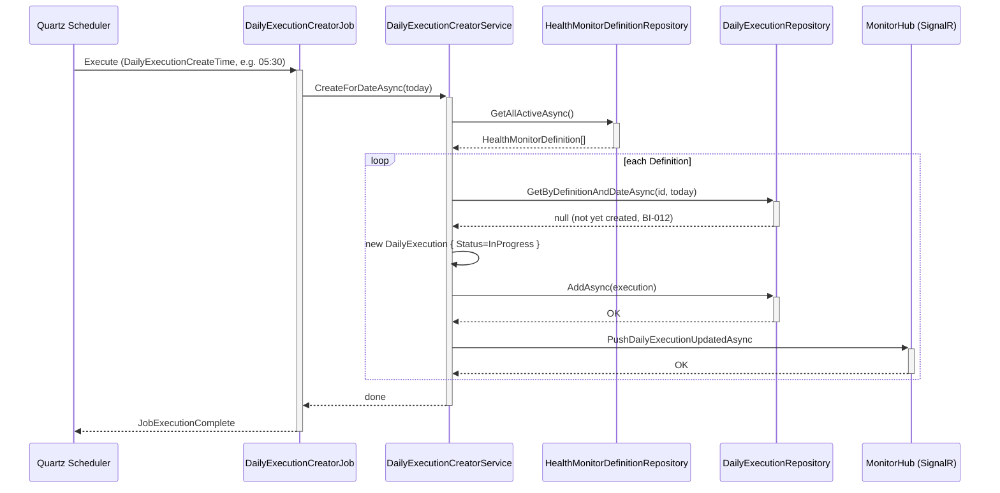
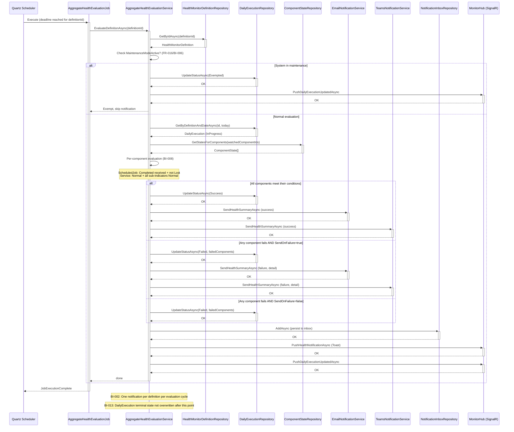

# 券商內部系統排程與服務監控站台 — Architecture Design

> **建立日期**: 2026-04-17
> **最後更新**: 2026-04-18
> **版本**: v1.3
> **狀態**: Draft
> **對應需求**: `docs/analysis/BrokerageMonitoringPlatform.requirements.md` (v1.9)
> **設計師**: System Architect

---

## 0. 確認技術選型

| 項目                | 選定方案                             | 理由                                          |
| ------------------- | ------------------------------------ | --------------------------------------------- |
| **ZeroMQ 指令通道** | ROUTER/DEALER                        | 支援並發多系統指令，非阻塞 (FR-026)           |
| **ORM**             | Dapper + SQLite Provider             | 輕量、直接 SQL 控制、無 migration overhead    |
| **Cron 引擎**       | Quartz.NET                           | 成熟 .NET 排程框架，內建 Cron 解析 (FR-012)   |
| **Email**           | System.Net.Mail                      | 無帳密 Mail Relay 場景，無需額外套件 (FR-010) |
| **ZeroMQ 訊息格式** | JSON (System.Text.Json)              | 可讀性佳、零依賴、易 Debug                    |
| **前端/即時推送**   | Blazor Server + ASP.NET Core SignalR | 已確認 (OI-011)                               |
| **資料庫**          | SQLite (WAL mode)                    | 已確認 (OI-012)                               |
| **ZeroMQ 訂閱**     | XSUB ← 獨立 Broker                   | 已確認 (OI-013)                               |
| **部署**            | Kestrel self-hosted .exe (Windows)   | 已確認 (OI-015)                               |

---

## 1. Domain Model (DDD)

### 1.1 Bounded Contexts



> **Design Intent**: 六個 Bounded Context 各自擁有獨立的資料模型與職責。Monitoring Context 是核心，負責狀態機與失聯偵測；Alert Context 消費狀態變更事件並執行通知決策；Command Context 獨立維護 ZeroMQ 指令通道（BI-005）。

---

### 1.2 Aggregate Roots、Entities & Value Objects

#### Aggregate Root: `MonitoredSystem`
> 對應 FR-031, FR-032, FR-036

| 成員                  | 類型                               | 說明                    |
| --------------------- | ---------------------------------- | ----------------------- |
| `SystemId`            | `string` (PK)                      | 系統唯一識別碼          |
| `Name`                | `string`                           | 顯示名稱                |
| `MarketSession`       | `MarketSessionWindow` (VO)         | 盤中時段 (FR-029)       |
| `CommandEndpoint`     | `string`                           | ZeroMQ DEALER 端點      |
| `AlertRecipients`     | `IReadOnlyList<EmailAddress>` (VO) | 個別告警收件人 (FR-037) |
| `IsMaintenanceActive` | `bool`                             | 維護模式 (FR-032)       |
| `IsActive`            | `bool`                             | 是否停用                |

**業務不變式**:
- `AlertRecipients` 與聚合規則收件人完全獨立 (BI-010)
- 維護模式開啟/關閉須附 Operator Session (BI-009)

#### Aggregate Root: `MonitoredComponent`
> 對應 FR-028, FR-036, FR-038, FR-039

| 成員                      | 類型                   | 說明                               |
| ------------------------- | ---------------------- | ---------------------------------- |
| `ComponentId`             | `string` (PK)          | 元件唯一識別碼                     |
| `SystemId`                | `string` (FK)          | 所屬系統                           |
| `Name`                    | `string`               | 元件顯示名稱                       |
| `ComponentType`           | `ComponentType` (Enum) | `Service` / `ScheduledJob`         |
| `ZeroMQTopic`             | `string`               | 訂閱 Topic                         |
| `HeartbeatTimeoutSeconds` | `int`                  | 心跳超時閾值 (FR-028)              |
| `CronExpression`          | `string?`              | 排程任務用，Lost 判定窗口 (FR-038) |
| `IsActive`                | `bool`                 | 是否停用                           |

#### Entity: `ComponentState`
> 狀態為熱資料，獨立維護於記憶體及 SQLite upsert

| 成員                  | 類型                               | 說明                |
| --------------------- | ---------------------------------- | ------------------- |
| `ComponentId`         | `string` (FK)                      |                     |
| `Status`              | `ComponentStatus` (Enum)           | 八種狀態            |
| `LastHeartbeatAt`     | `DateTimeOffset?`                  | 最後心跳時間        |
| `LastStatusChangedAt` | `DateTimeOffset`                   | 狀態變更時間        |
| `SubIndicators`       | `IReadOnlyList<SubIndicator>` (VO) | 子指標快照 (FR-039) |

#### Aggregate Root: `AlertRecord`
> 對應 FR-010, FR-011, FR-017, FR-018, FR-019

| 成員                 | 類型              | 說明                  |
| -------------------- | ----------------- | --------------------- |
| `AlertId`            | `Guid` (PK)       |                       |
| `SystemId`           | `string`          |                       |
| `ComponentId`        | `string`          |                       |
| `AlertStatus`        | `ComponentStatus` | 觸發告警的狀態        |
| `OccurredAt`         | `DateTimeOffset`  |                       |
| `IsGlobalFlagActive` | `bool`            | 全域告警標記 (FR-011) |
| `AcknowledgedBy`     | `string?`         | 操作人                |
| `AcknowledgedAt`     | `DateTimeOffset?` |                       |

**業務不變式**:
- 同一系統未 Acknowledge 前，不重複彈出 Pop-up (BI-007)

#### Aggregate Root: `HealthMonitorDefinition`
> 對應 FR-041, FR-042, FR-046, FR-047（取代原 `AggregateHealthRule`）

| 成員                | 類型                                   | 說明                                         |
| ------------------- | -------------------------------------- | -------------------------------------------- |
| `DefinitionId`      | `Guid` (PK)                            |                                              |
| `SystemId`          | `string`                               | 所屬系統                                     |
| `Name`              | `string`                               |                                              |
| `DeadlineTime`      | `TimeOnly`                             | 截止時間                                     |
| `Schedule`          | `HealthRuleSchedule` (VO)              | Daily / Weekly / Cron                        |
| `WatchedComponents` | `IReadOnlyList<WatchedComponent>` (VO) | 監控元件清單（含元件 ID 與類型，BI-014: ≥1） |
| `EmailRecipients`   | `IReadOnlyList<EmailAddress>` (VO)     | 獨立收件人 (BI-010)                          |
| `TeamsWebhookUrl`   | `string?`                              |                                              |
| `SendOnFailure`     | `bool`                                 | 失敗時是否通知 (FR-014)                      |
| `IsActive`          | `bool`                                 |                                              |

**業務不變式**:
- `WatchedComponents` 不得為空 (BI-014)
- `EmailRecipients` 與系統個別告警收件人完全獨立 (BI-010)

#### Aggregate Root: `DailyExecution`
> 對應 FR-042, FR-043, FR-044, FR-045, BI-012, BI-013

| 成員                 | 類型                     | 說明                                                |
| -------------------- | ------------------------ | --------------------------------------------------- |
| `ExecutionId`        | `Guid` (PK)              |                                                     |
| `DefinitionId`       | `Guid` (FK)              | 對應 HealthMonitorDefinition                        |
| `SystemId`           | `string`                 |                                                     |
| `ExecutionDate`      | `DateOnly`               | 當日日期（BI-012: 同一 Definition + Date 唯一）     |
| `Status`             | `DailyExecutionStatus`   | `InProgress / Success / Failed / Missed / Exempted` |
| `CreatedAt`          | `DateTimeOffset`         | 實例建立時間（批次建立或補建）                      |
| `EvaluatedAt`        | `DateTimeOffset?`        | 截止時間到達時評估時間（終態才有值）                |
| `FailedComponents`   | `IReadOnlyList<string>?` | 未達成條件的元件 ID 清單（Failed 時記錄）           |
| `MissedReason`       | `string?`                | Missed 原因描述（例：「站台未運行」）               |
| `NotificationSentAt` | `DateTimeOffset?`        | 通知發送時間                                        |

**業務不變式**:
- 一旦進入終態（Success / Failed / Missed / Exempted）不得再被覆寫 (BI-013)
- 補建邏輯呼叫前須先查詢是否已存在 (BI-012)
- `Failed` 狀態反映客觀評估結果，與 `SendOnFailure` 無關；`SendOnFailure` 僅控制外部通知（Email / Teams）是否發送，Inbox 寫入一律執行 (FR-014, FR-020)

#### Aggregate Root: `NotificationInboxItem`
> 對應 FR-015, FR-020, FR-024

| 成員               | 類型                      | 說明                              |
| ------------------ | ------------------------- | --------------------------------- |
| `InboxItemId`      | `Guid` (PK)               |                                   |
| `DefinitionId`     | `Guid`                    | 對應 HealthMonitorDefinition      |
| `ExecutionId`      | `Guid?`                   | 對應 DailyExecution（若有）       |
| `Title`            | `string`                  |                                   |
| `Body`             | `string`                  |                                   |
| `NotificationType` | `NotificationType` (Enum) | `HealthSuccess` / `HealthFailure` |
| `SentAt`           | `DateTimeOffset`          |                                   |
| `IsRead`           | `bool`                    |                                   |

#### Value Objects（新增 / 更新）

| VO                    | 欄位                                                                                             | 說明                                  |
| --------------------- | ------------------------------------------------------------------------------------------------ | ------------------------------------- |
| `MarketSessionWindow` | `StartTime: TimeOnly`, `EndTime: TimeOnly`                                                       | 盤中時段                              |
| `EmailAddress`        | `Value: string`                                                                                  | 含格式驗證                            |
| `SubIndicator`        | `Name`, `Status (Normal/Error)`, `Metric: MetricValue?`                                          | FR-039                                |
| `MetricValue`         | `Label: string`, `Value: decimal`                                                                | 數值指標                              |
| `HealthRuleSchedule`  | `ScheduleType`, `CronExpression: string?`, `DayOfWeek: DayOfWeek?` (含 `IsMatch(DateOnly)` 邏輯) |                                       |
| `WatchedComponent`    | `ComponentId: string`, `ComponentType: ComponentType`                                            | **新增**；Definition 監控元件清單項目 |

---

### 1.3 ComponentStatus 狀態機



> **Design Intent**: 將 Service 與 ScheduledJob 的 Lost 判定差異明確編入狀態機 (FR-003, FR-028, BI-011)。Service 元件一旦進入 Stopped 狀態（經由回報或心跳帶 Stopped），不適用心跳超時（豁免），避免手動停機後出現 Lost 誤報。其餘狀態的 Service 心跳計時器從最後一次心跳起算，無論當前狀態為 Normal、Warning 或 Error，超時均轉為 Lost 並觸發告警；Lost 恢復後一律需人工 Acknowledge 清除全域告警標記（FR-019）。ScheduledJob 的計時器（最大允許執行時間）僅在進入 Running 狀態時啟動，收到 Completed / Failed 即取消；站台重啟時若最後狀態為 Running，因執行結果未知，立即轉為 Warning 並觸發告警要求人工確認（FR-033），不重啟計時器。維護模式從任何狀態均可進入，退出後重置為 Unknown 等待下次心跳。

---

### 1.4 Domain Events

| 事件                             | 觸發條件                                 | 訂閱方                                                                    |
| -------------------------------- | ---------------------------------------- | ------------------------------------------------------------------------- |
| `ComponentHeartbeatReceived`     | 收到 ZeroMQ 訂閱訊息                     | MonitoringService, HeartbeatTimeoutMonitor                                |
| `ComponentStatusChanged`         | 狀態機轉換 (含子指標造成的卷積升/降級)   | AlertEvaluationService, AggregateHealthContext, SignalR Hub, AuditLogger  |
| `ComponentLost`                  | 心跳計時器逾時                           | AlertEvaluationService, SignalR Hub                                       |
| `AlertTriggered`                 | 狀態轉為 Lost/Error/Warning 且盤中       | PopupNotifier, EmailNotifier                                              |
| `AlertAcknowledged`              | 維運人員操作 Acknowledge                 | AlertRecord, SignalR Hub                                                  |
| `MaintenanceModeToggled`         | 維運人員操作                             | AlertSuppressor, AuditLogger, SignalR Hub                                 |
| `ManualCommandIssued`            | 維運人員操作觸發/暫停/啟停               | CommandDispatcher, AuditLogger                                            |
| `CommandResponseReceived`        | ZeroMQ DEALER 回應                       | CommandStatusTracker, SignalR Hub                                         |
| `CommandTimedOut`                | 指令逾時未回應                           | SignalR Hub (顯示警告)                                                    |
| `DailyExecutionCreated`          | DailyExecutionCreatorJob 批次建立或補建  | SignalR Hub (管理更新), ComponentStateUpdater (重置 ScheduledJob 至 Idle) |
| `AggregateHealthDeadlineReached` | Quartz.NET Job 觸發（截止時間到達）      | HealthEvaluationService                                                   |
| `DailyExecutionCompleted`        | 截止時間評估完成（Success / Failed）     | NotificationInbox, EmailNotifier, TeamsNotifier, SignalR Hub              |
| `DailyExecutionMissed`           | 站台重啟後截止時間已過，補建 Missed 實例 | NotificationInbox, SignalR Hub                                            |
| `HealthNotificationSent`         | 彙整通知發出                             | NotificationInbox, SignalR Hub (Toast)                                    |

---

## 2. Architecture Design (Clean Architecture)

### 2.1 層次職責

| 層                 | 專案                              | 職責                                                                     | 允許依賴                     |
| ------------------ | --------------------------------- | ------------------------------------------------------------------------ | ---------------------------- |
| **Domain**         | `BrokerageMonitor.Domain`         | AR、Entity、VO、Domain Events、Repository Interfaces                     | 無外部依賴                   |
| **Application**    | `BrokerageMonitor.Application`    | Use Cases、Command/Query Handlers、Application Services Interfaces、DTOs | Domain only                  |
| **Infrastructure** | `BrokerageMonitor.Infrastructure` | Dapper/SQLite、NetMQ、System.Net.Mail、Teams HttpClient、Quartz.NET      | Domain + Application         |
| **Presentation**   | `BrokerageMonitor.Web`            | Blazor Components、SignalR Hub、Startup/DI、Kestrel                      | Application (via interfaces) |

### 2.2 Solution 結構

```
BrokerageMonitor.sln
├── src/
│   ├── BrokerageMonitor.Domain/
│   │   ├── Aggregates/
│   │   │   ├── MonitoredSystem.cs
│   │   │   ├── MonitoredComponent.cs
│   │   │   ├── AlertRecord.cs
│   │   │   ├── HealthMonitorDefinition.cs      ← 取代 AggregateHealthRule.cs
│   │   │   ├── DailyExecution.cs               ← 新增
│   │   │   └── NotificationInboxItem.cs
│   │   ├── ValueObjects/
│   │   │   ├── ComponentStatus.cs          (enum)
│   │   │   ├── DailyExecutionStatus.cs     (enum: InProgress/Success/Failed/Missed/Exempted) ← 新增
│   │   │   ├── MarketSessionWindow.cs
│   │   │   ├── EmailAddress.cs
│   │   │   ├── SubIndicator.cs
│   │   │   ├── MetricValue.cs
│   │   │   ├── HealthRuleSchedule.cs
│   │   │   └── WatchedComponent.cs             ← 新增（含 ComponentId + ComponentType）
│   │   ├── Events/
│   │   │   ├── ComponentStatusChanged.cs
│   │   │   ├── ComponentLost.cs
│   │   │   ├── AlertTriggered.cs
│   │   │   ├── AlertAcknowledged.cs
│   │   │   ├── MaintenanceModeToggled.cs
│   │   │   ├── ManualCommandIssued.cs
│   │   │   ├── CommandResponseReceived.cs
│   │   │   ├── DailyExecutionCreated.cs         ← 新增
│   │   │   ├── DailyExecutionCompleted.cs       ← 新增
│   │   │   ├── DailyExecutionMissed.cs          ← 新增
│   │   │   └── HealthNotificationSent.cs
│   │   └── Repositories/
│   │       ├── IMonitoredSystemRepository.cs
│   │       ├── IMonitoredComponentRepository.cs
│   │       ├── IComponentStateRepository.cs
│   │       ├── IAlertRecordRepository.cs
│   │       ├── IHealthMonitorDefinitionRepository.cs  ← 取代 IAggregateHealthRuleRepository.cs
│   │       ├── IDailyExecutionRepository.cs           ← 新增
│   │       ├── IExecutionHistoryRepository.cs
│   │       ├── IAuditLogRepository.cs
│   │       └── INotificationInboxRepository.cs
│   │
│   ├── BrokerageMonitor.Application/
│   │   ├── UseCases/
│   │   │   ├── Dashboard/
│   │   │   │   ├── GetDashboardQuery.cs
│   │   │   │   └── GetDashboardQueryHandler.cs
│   │   │   ├── Commands/
│   │   │   │   ├── IssueManualCommandCommand.cs
│   │   │   │   └── IssueManualCommandHandler.cs
│   │   │   ├── Alerts/
│   │   │   │   ├── AcknowledgeAlertCommand.cs
│   │   │   │   └── AcknowledgeAlertHandler.cs
│   │   │   ├── Maintenance/
│   │   │   │   ├── ToggleMaintenanceModeCommand.cs
│   │   │   │   └── ToggleMaintenanceModeHandler.cs
│   │   │   ├── History/
│   │   │   │   └── GetExecutionHistoryQuery.cs
│   │   │   ├── SystemManagement/
│   │   │   │   ├── UpsertMonitoredSystemCommand.cs
│   │   │   │   └── UpsertMonitoredComponentCommand.cs
│   │   │   └── HealthManagement/                           ← 新增
│   │   │       ├── UpsertHealthDefinitionCommand.cs
│   │   │       ├── GetHealthDefinitionsQuery.cs
│   │   │       └── GetDailyExecutionHistoryQuery.cs
│   │   ├── Services/
│   │   │   ├── IAlertEvaluationService.cs
│   │   │   ├── IHeartbeatProcessor.cs
│   │   │   ├── IStateRollupService.cs
│   │   │   ├── IAggregateHealthEvaluationService.cs
│   │   │   ├── IDailyExecutionCreatorService.cs            ← 新增
│   │   │   └── ICommandDispatcher.cs
│   │   ├── Notifications/
│   │   │   ├── IEmailNotificationService.cs
│   │   │   ├── ITeamsNotificationService.cs
│   │   │   └── IRealtimeNotificationService.cs    (SignalR abstraction)
│   │   └── DTOs/
│   │       ├── SystemSummaryDto.cs
│   │       ├── ComponentStatusDto.cs
│   │       ├── AlertDto.cs
│   │       ├── NotificationInboxItemDto.cs
│   │       ├── AuditLogDto.cs
│   │       ├── ExecutionHistoryDto.cs
│   │       ├── HealthDefinitionDto.cs                      ← 新增
│   │       └── DailyExecutionDto.cs                        ← 新增
│   │
│   ├── BrokerageMonitor.Infrastructure/
│   │   ├── Persistence/
│   │   │   ├── DatabaseInitializer.cs          (Schema creation + WAL mode)
│   │   │   ├── DbConnectionFactory.cs
│   │   │   ├── Repositories/
│   │   │   │   ├── MonitoredSystemRepository.cs
│   │   │   │   ├── MonitoredComponentRepository.cs
│   │   │   │   ├── ComponentStateRepository.cs
│   │   │   │   ├── AlertRecordRepository.cs
│   │   │   │   ├── HealthMonitorDefinitionRepository.cs    ← 取代 AggregateHealthRuleRepository.cs
│   │   │   │   ├── DailyExecutionRepository.cs             ← 新增
│   │   │   │   ├── ExecutionHistoryRepository.cs
│   │   │   │   ├── AuditLogRepository.cs
│   │   │   │   └── NotificationInboxRepository.cs
│   │   │   └── Migrations/
│   │   │       └── V001_InitialSchema.sql
│   │   ├── ZeroMQ/
│   │   │   ├── ZeroMQSubscriberService.cs      (XSUB, IHostedService)
│   │   │   ├── ZeroMQCommandService.cs         (ROUTER, IHostedService)
│   │   │   ├── HeartbeatMessageParser.cs
│   │   │   └── CommandMessageSerializer.cs
│   │   ├── Monitoring/
│   │   │   ├── HeartbeatTimeoutMonitor.cs      (per-component Timer, IHostedService)
│   │   │   └── DataRetentionService.cs         (Quartz job, 30-day cleanup)
│   │   ├── Scheduling/
│   │   │   ├── AggregateHealthEvaluationJob.cs (Quartz.NET IJob — deadline evaluation)
│   │   │   ├── DailyExecutionCreatorJob.cs     (Quartz.NET IJob — daily 05:30 batch create) ← 新增
│   │   │   └── QuartzJobScheduler.cs
│   │   ├── Notifications/
│   │   │   ├── EmailNotificationService.cs
│   │   │   ├── TeamsNotificationService.cs
│   │   │   └── SignalRNotificationService.cs
│   │   └── ConfigImport/
│   │       └── AppSettingsImporter.cs          (FR-031 initial import)
│   │
│   └── BrokerageMonitor.Web/
│       ├── Program.cs                          (Kestrel + DI composition root)
│       ├── Hubs/
│       │   └── MonitorHub.cs                   (SignalR Hub)
│       ├── Components/
│       │   ├── Dashboard/
│       │   │   ├── DashboardPage.razor
│       │   │   ├── SystemGroupCard.razor
│       │   │   └── ComponentStatusRow.razor
│       │   ├── Alerts/
│       │   │   ├── AlertCenterPage.razor
│       │   │   └── AlertPopup.razor
│       │   ├── History/
│       │   │   └── HistoryPage.razor
│       │   ├── Management/
│       │   │   ├── SystemManagementPage.razor       (FR-031, 內嵌 Definition 清單 FR-047)
│       │   │   ├── HealthDefinitionEditorPage.razor ← 取代 HealthRuleEditorPage.razor
│       │   │   └── HealthManagementPage.razor       ← 新增（集中式管理頁 FR-046）
│       │   └── Shared/
│       │       ├── OperatorSessionModal.razor   (FR-009)
│       │       ├── ReasonInputModal.razor       (FR-008, BI-001)
│       │       └── NotificationToast.razor
│       └── appsettings.json
│
└── tests/
    ├── BrokerageMonitor.Domain.Tests/
    ├── BrokerageMonitor.Application.Tests/
    └── BrokerageMonitor.Infrastructure.Tests/
```

---

## 3. C4 Architecture Diagrams

### 3.1 Context Diagram (Level 1)



> **Design Intent**: 監控站台是唯一與 ZeroMQ Broker 互動的消費方；Adapter 服務在 Broker 上游，不在本系統範疇。指令通道直連被監控系統，繞過 Broker。

---

### 3.2 Container Diagram (Level 2)



> **Design Intent**: 所有外部通訊（ZeroMQ、SMTP、Teams）均隔離於 Infrastructure 層，透過 Application 層介面解耦。HeartbeatTimeoutMonitor 作為獨立 Hosted Service 維護每個元件的計時器，避免 Quartz 過度 overhead。

---

### 3.3 Component Diagram (Level 3) — Infrastructure: ZeroMQ Layer



> **Design Intent**: XSUB 訂閱通道與 ROUTER 指令通道完全分開 (BI-005)。CommandStatusTracker 以 in-memory `ConcurrentDictionary<CommandId, PendingCommand>` 追蹤指令狀態，搭配 `CancellationTokenSource` 實作逾時 (FR-027)。

---

## 4. API Contract

### 4.1 SignalR Hub Methods (`MonitorHub`)

#### Server → Client (Hub Push)

| Hub Method                     | Payload                        | 觸發時機                                    |
| ------------------------------ | ------------------------------ | ------------------------------------------- |
| `OnComponentStatusChanged`     | `ComponentStatusDto`           | 任何元件狀態變更                            |
| `OnAlertTriggered`             | `AlertDto`                     | 盤中告警觸發 (FR-010)                       |
| `OnAlertAcknowledged`          | `{ SystemId, AcknowledgedBy }` | Acknowledge 完成                            |
| `OnMaintenanceModeChanged`     | `{ SystemId, IsActive }`       | 維護模式切換                                |
| `OnCommandStatusChanged`       | `CommandStatusDto`             | 指令狀態更新 (FR-027)                       |
| `OnHealthNotificationReceived` | `NotificationInboxItemDto`     | 彙整通知 Toast (FR-020)                     |
| `OnDailyExecutionUpdated`      | `DailyExecutionDto`            | 每日執行實例狀態變更（建立/評估完成）← 新增 |

#### Client → Server (Hub Invoke)

| Hub Method              | 參數                           | 說明           |
| ----------------------- | ------------------------------ | -------------- |
| `SubscribeDashboard`    | `void`                         | 訂閱儀表板推送 |
| `AcknowledgeAlert`      | `AcknowledgeAlertRequest`      | FR-018         |
| `IssueCommand`          | `IssueCommandRequest`          | FR-005/006/007 |
| `ToggleMaintenanceMode` | `ToggleMaintenanceModeRequest` | FR-032         |

---

### 4.2 DTOs

```csharp
// Application/DTOs/SystemSummaryDto.cs
public sealed record SystemSummaryDto(
    string SystemId,
    string Name,
    ComponentStatus RolledUpStatus,        // Worst-case roll-up
    bool IsMaintenanceActive,
    bool HasUnacknowledgedAlert,
    IReadOnlyList<ComponentStatusDto> Components
);

// Application/DTOs/ComponentStatusDto.cs
public sealed record ComponentStatusDto(
    string ComponentId,
    string Name,
    ComponentType ComponentType,
    ComponentStatus Status,
    DateTimeOffset? LastHeartbeatAt,
    DateTimeOffset LastStatusChangedAt,
    IReadOnlyList<SubIndicatorDto> SubIndicators
);

// Application/DTOs/SubIndicatorDto.cs
public sealed record SubIndicatorDto(
    string Name,
    string Status,               // "Normal" | "Error"
    string? MetricLabel,
    decimal? MetricValue
);

// Application/DTOs/AlertDto.cs
public sealed record AlertDto(
    Guid AlertId,
    string SystemId,
    string SystemName,
    string ComponentId,
    string ComponentName,
    ComponentType ComponentType,
    ComponentStatus AlertStatus,
    DateTimeOffset OccurredAt,
    bool IsAcknowledged
);

// Application/DTOs/CommandStatusDto.cs
public sealed record CommandStatusDto(
    Guid CommandId,
    string SystemId,
    string ComponentId,
    CommandType Command,
    CommandStatus Status,        // Sending | Acknowledged | Failed | TimedOut
    string? ResponseMessage,
    DateTimeOffset IssuedAt
);

// Application/DTOs/NotificationInboxItemDto.cs
public sealed record NotificationInboxItemDto(
    Guid InboxItemId,
    string Title,
    string Body,
    NotificationType NotificationType,
    DateTimeOffset SentAt,
    bool IsRead
);

// Application/DTOs/HealthDefinitionDto.cs  ← 新增
public sealed record HealthDefinitionDto(
    Guid DefinitionId,
    string SystemId,
    string SystemName,
    string Name,
    TimeOnly DeadlineTime,
    string ScheduleType,
    string? CronExpression,
    IReadOnlyList<WatchedComponentDto> WatchedComponents,
    IReadOnlyList<string> EmailRecipients,
    string? TeamsWebhookUrl,
    bool SendOnFailure,
    bool IsActive
);

// Application/DTOs/WatchedComponentDto.cs  ← 新增
public sealed record WatchedComponentDto(
    string ComponentId,
    string ComponentName,
    ComponentType ComponentType
);

// Application/DTOs/DailyExecutionDto.cs  ← 新增
public sealed record DailyExecutionDto(
    Guid ExecutionId,
    Guid DefinitionId,
    string DefinitionName,
    string SystemId,
    string SystemName,
    DateOnly ExecutionDate,
    string Status,                           // InProgress / Success / Failed / Missed / Exempted
    DateTimeOffset CreatedAt,
    DateTimeOffset? EvaluatedAt,
    IReadOnlyList<string>? FailedComponents,
    string? MissedReason,
    DateTimeOffset? NotificationSentAt
);

// Application/DTOs/AuditLogDto.cs
public sealed record AuditLogDto(
    Guid LogId,
    string SystemId,
    string? ComponentId,
    string OperatorName,
    string ActionType,
    string? PreviousStatus,
    string? NewStatus,
    string Reason,
    DateTimeOffset OccurredAt
);

// Application/DTOs/ExecutionHistoryDto.cs
public sealed record ExecutionHistoryDto(
    Guid HistoryId,
    string SystemId,
    string ComponentId,
    string ComponentName,
    ComponentType ComponentType,
    ComponentStatus ResultStatus,
    DateTimeOffset StartedAt,
    DateTimeOffset? EndedAt,
    string? Message
);
```

---

### 4.3 Hub Request DTOs

```csharp
// IssueCommandRequest
public sealed record IssueCommandRequest(
    string SystemId,
    string ComponentId,
    CommandType Command,    // Trigger | Pause | Resume | Start | Stop
    string OperatorName,   // from Session (FR-009)
    string Reason          // BI-001: must not be empty
);

// AcknowledgeAlertRequest
public sealed record AcknowledgeAlertRequest(
    string SystemId,
    string OperatorName
);

// ToggleMaintenanceModeRequest
public sealed record ToggleMaintenanceModeRequest(
    string SystemId,
    bool Activate,
    string OperatorName,
    string? Reason         // FR-032: optional
);
```

---

## 5. C# Interface Drafts

### 5.1 Repository Interfaces (Domain Layer)

```csharp
// Domain/Repositories/IMonitoredSystemRepository.cs
public interface IMonitoredSystemRepository
{
    Task<MonitoredSystem?> GetByIdAsync(string systemId, CancellationToken ct = default);
    Task<IReadOnlyList<MonitoredSystem>> GetAllActiveAsync(CancellationToken ct = default);
    Task UpsertAsync(MonitoredSystem system, CancellationToken ct = default);
    Task SetMaintenanceModeAsync(string systemId, bool active, CancellationToken ct = default);
}

// Domain/Repositories/IMonitoredComponentRepository.cs
public interface IMonitoredComponentRepository
{
    Task<MonitoredComponent?> GetByIdAsync(string componentId, CancellationToken ct = default);
    Task<IReadOnlyList<MonitoredComponent>> GetBySystemIdAsync(string systemId, CancellationToken ct = default);
    Task<IReadOnlyList<MonitoredComponent>> GetAllActiveAsync(CancellationToken ct = default);
    Task UpsertAsync(MonitoredComponent component, CancellationToken ct = default);
}

// Domain/Repositories/IComponentStateRepository.cs
public interface IComponentStateRepository
{
    Task<ComponentState?> GetByComponentIdAsync(string componentId, CancellationToken ct = default);
    Task<IReadOnlyList<ComponentState>> GetByComponentIdsAsync(IEnumerable<string> componentIds, CancellationToken ct = default);  // batch fetch for health evaluation (FR-045)
    Task<IReadOnlyList<ComponentState>> GetAllAsync(CancellationToken ct = default);
    Task UpsertAsync(ComponentState state, CancellationToken ct = default);  // FR-033 restore
}

// Domain/Repositories/IAlertRecordRepository.cs
public interface IAlertRecordRepository
{
    Task<IReadOnlyList<AlertRecord>> GetUnacknowledgedAsync(CancellationToken ct = default);
    Task<bool> HasUnacknowledgedAlertAsync(string systemId, CancellationToken ct = default);
    Task AddAsync(AlertRecord alert, CancellationToken ct = default);
    Task AcknowledgeBySystemAsync(string systemId, string operatorName, CancellationToken ct = default);
    Task<IReadOnlyList<AlertRecord>> GetHistoryAsync(
        string? systemId, DateTimeOffset from, DateTimeOffset to, CancellationToken ct = default);
}

// Domain/Repositories/IHealthMonitorDefinitionRepository.cs  ← 取代 IAggregateHealthRuleRepository
public interface IHealthMonitorDefinitionRepository
{
    Task<HealthMonitorDefinition?> GetByIdAsync(Guid definitionId, CancellationToken ct = default);
    Task<IReadOnlyList<HealthMonitorDefinition>> GetAllActiveAsync(CancellationToken ct = default);
    Task<IReadOnlyList<HealthMonitorDefinition>> GetBySystemIdAsync(string systemId, CancellationToken ct = default);
    Task UpsertAsync(HealthMonitorDefinition definition, CancellationToken ct = default);
    Task DeleteAsync(Guid definitionId, CancellationToken ct = default);
}

// Domain/Repositories/IDailyExecutionRepository.cs  ← 新增
public interface IDailyExecutionRepository
{
    Task<DailyExecution?> GetByDefinitionAndDateAsync(Guid definitionId, DateOnly date, CancellationToken ct = default);
    Task<IReadOnlyList<DailyExecution>> GetByDateAsync(DateOnly date, CancellationToken ct = default);
    Task<IReadOnlyList<DailyExecution>> QueryHistoryAsync(
        Guid? definitionId, string? systemId, DateOnly from, DateOnly to, CancellationToken ct = default);
    Task AddAsync(DailyExecution execution, CancellationToken ct = default);
    Task UpdateStatusAsync(Guid executionId, DailyExecutionStatus status,
        DateTimeOffset evaluatedAt, IReadOnlyList<string>? failedComponents,
        DateTimeOffset? notificationSentAt, CancellationToken ct = default);  // BI-013: terminal state only
    Task DeleteOlderThanAsync(DateTimeOffset cutoff, CancellationToken ct = default);  // FR-024
}

// Domain/Repositories/IExecutionHistoryRepository.cs
public interface IExecutionHistoryRepository
{
    Task AddAsync(ExecutionHistoryEntry entry, CancellationToken ct = default);
    Task<IReadOnlyList<ExecutionHistoryEntry>> QueryAsync(
        string? systemId, DateTimeOffset from, DateTimeOffset to, CancellationToken ct = default);
    Task DeleteOlderThanAsync(DateTimeOffset cutoff, CancellationToken ct = default);  // FR-024
}

// Domain/Repositories/IAuditLogRepository.cs
public interface IAuditLogRepository
{
    Task AddAsync(AuditLogEntry entry, CancellationToken ct = default);
    Task<IReadOnlyList<AuditLogEntry>> QueryAsync(
        string? systemId, DateTimeOffset from, DateTimeOffset to, CancellationToken ct = default);
    Task DeleteOlderThanAsync(DateTimeOffset cutoff, CancellationToken ct = default);
}

// Domain/Repositories/INotificationInboxRepository.cs
public interface INotificationInboxRepository
{
    Task AddAsync(NotificationInboxItem item, CancellationToken ct = default);
    Task<IReadOnlyList<NotificationInboxItem>> GetAllAsync(CancellationToken ct = default);
    Task MarkAsReadAsync(Guid itemId, CancellationToken ct = default);
    Task DeleteOlderThanAsync(DateTimeOffset cutoff, CancellationToken ct = default);
}
```

---

### 5.2 Application Service Interfaces

```csharp
// Application/Services/IHeartbeatProcessor.cs
public interface IHeartbeatProcessor
{
    /// <summary>
    /// Process incoming ZeroMQ heartbeat/status message and update component state.
    /// Messages are expected to arrive both periodically (Keep-alive) AND immediately upon event-driven anomalies (FR-002).
    /// Computes the sub-indicator worst-case rollup to determine final status.
    /// Raises ComponentStatusChanged (if rolled-up status changes) / ComponentHeartbeatReceived domain events.
    /// </summary>
    Task ProcessAsync(HeartbeatMessage message, CancellationToken ct = default);
}

// Application/Services/IStateRollupService.cs
public interface IStateRollupService
{
    /// <summary>
    /// Compute Worst-case roll-up status for a system from its active components.
    /// Severity order: Lost > Error > Warning > Unknown > Stopped > Idle > Normal (FR-001)
    /// </summary>
    ComponentStatus ComputeSystemStatus(IEnumerable<ComponentStatus> componentStatuses);
}

// Application/Services/IAlertEvaluationService.cs
public interface IAlertEvaluationService
{
    /// <summary>
    /// Evaluate whether an alert should be triggered for a status transition.
    /// Enforces: market session window, maintenance mode suppression, dedup by acknowledge (BI-004/006/007)
    /// </summary>
    Task EvaluateAsync(ComponentStatusChangedContext context, CancellationToken ct = default);
}

// Application/Services/IAggregateHealthEvaluationService.cs
public interface IAggregateHealthEvaluationService
{
    /// <summary>
    /// Evaluate one HealthMonitorDefinition at its deadline (FR-045).
    /// Per-component completion conditions (BI-008):
    ///   - ScheduledJob: received Completed before deadline AND current status != Lost
    ///   - Service: current status == Normal AND all sub-indicators == Normal
    /// Exempts systems in maintenance mode (FR-016, BI-006).
    /// Updates DailyExecution terminal status and sends notifications (FR-013/FR-014).
    /// </summary>
    Task EvaluateDefinitionAsync(Guid definitionId, CancellationToken ct = default);
}

// Application/Services/IDailyExecutionCreatorService.cs  ← 新增
public interface IDailyExecutionCreatorService
{
    /// <summary>
    /// Batch-create DailyExecution instances for all active definitions matching the given date's schedule (FR-042, BI-015).
    /// Skips definitions that already have an instance for the date (BI-012) or do not match the schedule.
    /// Called by DailyExecutionCreatorJob at DailyExecutionCreateTime (e.g., 05:30).
    /// Additionally resets the real-time state of all associated ScheduledJob components to Idle (FR-042 附註).
    /// </summary>
    Task CreateForDateAsync(DateOnly date, CancellationToken ct = default);

    /// <summary>
    /// On station startup: create missing instances for today if the schedule matches (FR-044, BI-015).
    /// If deadline has not passed → create InProgress; if deadline passed → create Missed.
    /// </summary>
    Task RecoverTodayAsync(CancellationToken ct = default);
}

// Application/Services/ICommandDispatcher.cs
public interface ICommandDispatcher
{
    /// <summary>
    /// Dispatch a manual command via ZeroMQ ROUTER/DEALER.
    /// Returns immediately; result is pushed via CommandResponseReceived event.
    /// No auto-retry on timeout (FR-027, OI-022)
    /// </summary>
    Task<Guid> DispatchAsync(CommandRequest command, CancellationToken ct = default);
}

// Application/Notifications/IEmailNotificationService.cs
public interface IEmailNotificationService
{
    Task SendAlertAsync(AlertEmailRequest request, CancellationToken ct = default);
    Task SendHealthSummaryAsync(HealthSummaryEmailRequest request, CancellationToken ct = default);
}

// Application/Notifications/ITeamsNotificationService.cs
public interface ITeamsNotificationService
{
    Task SendHealthSummaryAsync(string webhookUrl, HealthSummaryTeamsRequest request, CancellationToken ct = default);
}

// Application/Notifications/IRealtimeNotificationService.cs
public interface IRealtimeNotificationService
{
    Task PushComponentStatusChangedAsync(ComponentStatusDto dto, CancellationToken ct = default);
    Task PushAlertTriggeredAsync(AlertDto dto, CancellationToken ct = default);
    Task PushAlertAcknowledgedAsync(string systemId, string acknowledgedBy, CancellationToken ct = default);
    Task PushCommandStatusChangedAsync(CommandStatusDto dto, CancellationToken ct = default);
    Task PushHealthNotificationAsync(NotificationInboxItemDto dto, CancellationToken ct = default);
    Task PushDailyExecutionUpdatedAsync(DailyExecutionDto dto, CancellationToken ct = default);  // FR-046: real-time update for management page
}
```

---

## 6. ZeroMQ Message Contract (JSON)

### 6.1 Heartbeat / Status Message (Adapter → Broker → Station XSUB)

ZeroMQ multipart frame: `[topic_bytes][json_payload_bytes]`

```json
{
  "messageType": "Heartbeat | StatusUpdate",
  "systemId": "WMM",
  "componentId": "svc01",
  "timestamp": "2026-04-17T08:30:00.000Z",
  "status": "Normal | Running | Idle | Completed | Failed | Error | Warning",
  "message": "optional human-readable message",
  "subIndicators": [
    {
      "name": "AS400 Connection",
      "status": "Normal | Error",
      "metric": {
        "label": "Received Count",
        "value": 1234
      }
    }
  ]
}
```

**Topic 命名規範**: `{systemId}.{componentType}.{componentId}`
- 範例: `wmm.service.svc01`, `wmm.job.settlement_job`

**C# DTO**:
```csharp
public sealed record HeartbeatMessage(
    string MessageType,
    string SystemId,
    string ComponentId,
    DateTimeOffset Timestamp,
    string Status,
    string? Message,
    IReadOnlyList<SubIndicatorPayload>? SubIndicators
);

public sealed record SubIndicatorPayload(
    string Name,
    string Status,
    MetricPayload? Metric
);

public sealed record MetricPayload(string Label, decimal Value);
```

---

### 6.2 Command Message (Station ROUTER → Monitored System DEALER)

ZeroMQ ROUTER frame: `[dealer_identity][empty][json_payload]`

```json
{
  "commandId": "3fa85f64-5717-4562-b3fc-2c963f66afa6",
  "systemId": "WMM",
  "componentId": "svc01",
  "command": "Trigger | Pause | Resume | Start | Stop",
  "issuedBy": "張三",
  "issuedAt": "2026-04-17T08:30:00.000Z",
  "reason": "排程提前觸發測試",
  "timeoutSeconds": 30
}
```

### 6.3 Command Response (Monitored System DEALER → Station ROUTER)

```json
{
  "commandId": "3fa85f64-5717-4562-b3fc-2c963f66afa6",
  "status": "Acknowledged | Failed",
  "message": "optional error detail",
  "respondedAt": "2026-04-17T08:30:05.000Z"
}
```

---

## 7. Data Schema (SQLite + Dapper)

> Schema 初始化於 `DatabaseInitializer.cs`，啟動時執行 `CREATE TABLE IF NOT EXISTS`，並設定 `PRAGMA journal_mode=WAL`。

```sql
-- Monitored Systems
CREATE TABLE IF NOT EXISTS MonitoredSystems (
    SystemId        TEXT PRIMARY KEY,
    Name            TEXT NOT NULL,
    MarketStart     TEXT NOT NULL,          -- HH:mm
    MarketEnd       TEXT NOT NULL,          -- HH:mm
    CommandEndpoint TEXT NOT NULL,
    AlertRecipients TEXT NOT NULL,          -- JSON array of email strings
    IsMaintenanceActive INTEGER NOT NULL DEFAULT 0,
    IsActive        INTEGER NOT NULL DEFAULT 1,
    CreatedAt       TEXT NOT NULL,
    UpdatedAt       TEXT NOT NULL
);

-- Monitored Components
CREATE TABLE IF NOT EXISTS MonitoredComponents (
    ComponentId             TEXT PRIMARY KEY,
    SystemId                TEXT NOT NULL REFERENCES MonitoredSystems(SystemId),
    Name                    TEXT NOT NULL,
    ComponentType           TEXT NOT NULL,  -- 'Service' | 'ScheduledJob'
    ZeroMQTopic             TEXT NOT NULL,
    HeartbeatTimeoutSeconds INTEGER NOT NULL,
    CronExpression          TEXT,           -- nullable; ScheduledJob only
    IsActive                INTEGER NOT NULL DEFAULT 1,
    CreatedAt               TEXT NOT NULL,
    UpdatedAt               TEXT NOT NULL
);

-- Current Component State (upsert on every heartbeat)
CREATE TABLE IF NOT EXISTS ComponentStates (
    ComponentId         TEXT PRIMARY KEY REFERENCES MonitoredComponents(ComponentId),
    Status              TEXT NOT NULL,
    LastHeartbeatAt     TEXT,
    LastStatusChangedAt TEXT NOT NULL,
    SubIndicatorsJson   TEXT            -- JSON snapshot of SubIndicator[]
);

-- Alert Records
CREATE TABLE IF NOT EXISTS AlertRecords (
    AlertId          TEXT PRIMARY KEY,   -- GUID
    SystemId         TEXT NOT NULL,
    ComponentId      TEXT NOT NULL,
    AlertStatus      TEXT NOT NULL,
    OccurredAt       TEXT NOT NULL,
    IsGlobalFlagActive INTEGER NOT NULL DEFAULT 1,
    AcknowledgedBy   TEXT,
    AcknowledgedAt   TEXT
);
CREATE INDEX IF NOT EXISTS idx_alert_system ON AlertRecords(SystemId, IsGlobalFlagActive);

-- Aggregate Health Monitor Definitions  ← 取代 AggregateHealthRules
CREATE TABLE IF NOT EXISTS HealthMonitorDefinitions (
    DefinitionId     TEXT PRIMARY KEY,   -- GUID
    SystemId         TEXT NOT NULL REFERENCES MonitoredSystems(SystemId),
    Name             TEXT NOT NULL,
    DeadlineTime     TEXT NOT NULL,      -- HH:mm
    ScheduleType     TEXT NOT NULL,      -- 'Daily' | 'Weekly' | 'Cron'
    CronExpression   TEXT,
    DayOfWeek        INTEGER,            -- nullable; Weekly only
    EmailRecipients  TEXT NOT NULL,      -- JSON array
    TeamsWebhookUrl  TEXT,
    SendOnFailure    INTEGER NOT NULL DEFAULT 0,
    IsActive         INTEGER NOT NULL DEFAULT 1
);

-- HealthMonitorDefinition ↔ Component junction  ← 取代 AggregateHealthRuleComponents
CREATE TABLE IF NOT EXISTS HealthDefinitionComponents (
    DefinitionId    TEXT NOT NULL REFERENCES HealthMonitorDefinitions(DefinitionId),
    ComponentId     TEXT NOT NULL REFERENCES MonitoredComponents(ComponentId),
    ComponentType   TEXT NOT NULL,       -- 'Service' | 'ScheduledJob' (denormalized for eval logic)
    PRIMARY KEY (DefinitionId, ComponentId)
);

-- Daily Execution Instances  ← 新增
CREATE TABLE IF NOT EXISTS DailyExecutions (
    ExecutionId          TEXT PRIMARY KEY,  -- GUID
    DefinitionId         TEXT NOT NULL REFERENCES HealthMonitorDefinitions(DefinitionId),
    SystemId             TEXT NOT NULL,
    ExecutionDate        TEXT NOT NULL,     -- YYYY-MM-DD
    Status               TEXT NOT NULL,     -- 'InProgress' | 'Success' | 'Failed' | 'Missed' | 'Exempted'
    CreatedAt            TEXT NOT NULL,
    EvaluatedAt          TEXT,
    FailedComponentsJson TEXT,             -- JSON array of ComponentId strings; nullable
    MissedReason         TEXT,
    NotificationSentAt   TEXT
);
CREATE UNIQUE INDEX IF NOT EXISTS idx_dailyexec_def_date
    ON DailyExecutions(DefinitionId, ExecutionDate);  -- BI-012: unique per definition per day
CREATE INDEX IF NOT EXISTS idx_dailyexec_date ON DailyExecutions(ExecutionDate);

-- Execution History (FR-021)
CREATE TABLE IF NOT EXISTS ExecutionHistory (
    HistoryId    TEXT PRIMARY KEY,   -- GUID
    SystemId     TEXT NOT NULL,
    ComponentId  TEXT NOT NULL,
    ResultStatus TEXT NOT NULL,
    StartedAt    TEXT NOT NULL,
    EndedAt      TEXT,
    Message      TEXT
);
CREATE INDEX IF NOT EXISTS idx_history_time ON ExecutionHistory(SystemId, StartedAt);

-- Audit Logs (FR-022, FR-023)
CREATE TABLE IF NOT EXISTS AuditLogs (
    LogId          TEXT PRIMARY KEY,  -- GUID
    SystemId       TEXT NOT NULL,
    ComponentId    TEXT,
    OperatorName   TEXT NOT NULL,
    ActionType     TEXT NOT NULL,
    PreviousStatus TEXT,
    NewStatus      TEXT,
    Reason         TEXT NOT NULL DEFAULT '',
    OccurredAt     TEXT NOT NULL
);
CREATE INDEX IF NOT EXISTS idx_audit_time ON AuditLogs(SystemId, OccurredAt);

-- Notification Inbox (FR-015, FR-020, FR-024)
CREATE TABLE IF NOT EXISTS NotificationInbox (
    InboxItemId      TEXT PRIMARY KEY,  -- GUID
    DefinitionId     TEXT NOT NULL,     ← 取代 RuleId
    ExecutionId      TEXT,              -- nullable; links to DailyExecution ← 新增
    Title            TEXT NOT NULL,
    Body             TEXT NOT NULL,
    NotificationType TEXT NOT NULL,     -- 'HealthSuccess' | 'HealthFailure'
    SentAt           TEXT NOT NULL,
    IsRead           INTEGER NOT NULL DEFAULT 0
);
```

**資料保留**：`DataRetentionJob`（Quartz.NET，每日 01:00 執行）刪除 `ExecutionHistory`、`AuditLogs`、`NotificationInbox`、**`DailyExecutions`** 中 `OccurredAt/SentAt/ExecutionDate < NOW() - 30days` 的記錄 (FR-024)。

---

## 8. Error Handling Strategy

### 8.1 Exception 層次

```csharp
// Domain Layer — business rule violations
public abstract class DomainException : Exception { ... }
public sealed class BusinessInvariantViolationException : DomainException { ... }  // BI-001 empty reason
public sealed class InvalidStateTransitionException : DomainException { ... }

// Application Layer — operation results (no exceptions for expected failures)
public readonly struct Result<T>
{
    public bool IsSuccess { get; }
    public T? Value { get; }
    public string? ErrorCode { get; }
    public static Result<T> Ok(T value) => ...;
    public static Result<T> Fail(string errorCode) => ...;
}

// Infrastructure Layer — wrapped external failures
public sealed class ZeroMQConnectionException : Exception { ... }
public sealed class EmailDeliveryException : Exception { ... }
public sealed class TeamsWebhookException : Exception { ... }
```

### 8.2 Error Codes

| Code                              | 場景                                                |
| --------------------------------- | --------------------------------------------------- |
| `ERR_REASON_REQUIRED`             | 手動操作未提供理由 (BI-001)                         |
| `ERR_SESSION_MISSING`             | Operator Session 姓名為空 (BI-009)                  |
| `ERR_COMMAND_TIMEOUT`             | 指令逾時 (FR-027)                                   |
| `ERR_COMMAND_FAILED`              | 被監控系統回應 Failed                               |
| `ERR_ZMQ_DISCONNECTED`            | ZeroMQ Broker 連線中斷                              |
| `ERR_EMAIL_DELIVERY`              | SMTP 發送失敗                                       |
| `ERR_TEAMS_WEBHOOK`               | Teams Webhook 呼叫失敗                              |
| `ERR_SYSTEM_NOT_FOUND`            | 系統 ID 不存在                                      |
| `ERR_COMPONENT_NOT_FOUND`         | 元件 ID 不存在                                      |
| `ERR_DEFINITION_EMPTY_COMPONENTS` | Definition 監控元件清單為空 (BI-014) ← 新增         |
| `ERR_DAILY_EXECUTION_TERMINAL`    | 嘗試更新已進入終態的 DailyExecution (BI-013) ← 新增 |

### 8.3 Failure Behavior

| 失敗點             | 行為                                                       |
| ------------------ | ---------------------------------------------------------- |
| ZeroMQ Broker 斷線 | 自動重連（指數退避），重連前元件計時器仍運行               |
| Email 發送失敗     | Log ERROR，不重試（避免重複通知），不影響主流程            |
| Teams Webhook 失敗 | Log ERROR，不重試                                          |
| SQLite 寫入失敗    | Log CRITICAL，狀態仍保持 in-memory，下次心跳補寫           |
| Quartz Job 例外    | Quartz 記錄錯誤，下個週期重新觸發                          |
| 指令逾時           | 觸發 `CommandTimedOut` 事件，顯示警告，不自動重試 (FR-027) |

### 8.4 Blazor UI 錯誤處理

- 操作失敗在元件層 try/catch，顯示 inline error message
- 未預期例外由 `<ErrorBoundary>` 捕獲，顯示友善錯誤頁
- 所有 Hub Invoke 回傳 `Result<T>` 並在 UI 檢查 `IsSuccess`

---

## 9. Non-Functional Specifications

### 9.1 Performance

| 指標           | 目標                               | 對應設計                               |
| -------------- | ---------------------------------- | -------------------------------------- |
| 心跳處理延遲   | < 100ms（ZMQ 收訊 → SignalR 推送） | In-memory 狀態快取，非同步事件鏈       |
| 儀表板更新頻率 | Push on change（無輪詢）           | SignalR WebSocket                      |
| 心跳計時精度   | ± 500ms                            | `System.Threading.Timer` per component |
| 同時連線用戶   | 預計 < 20（內部站台）              | Blazor Server Circuit 模型足夠         |
| 資料庫並發讀取 | SQLite WAL mode                    | 讀寫不互相阻塞                         |

### 9.2 Security

| 項目               | 設計                                                                            |
| ------------------ | ------------------------------------------------------------------------------- |
| 認證               | 無（Session 姓名機制，per requirements）                                        |
| SQL Injection 防範 | Dapper 全程使用參數化查詢（`@param`），禁止字串拼接 SQL                         |
| XSS 防範           | Blazor Server 內建 HTML encode，`MarkupString` 僅用於已知安全內容               |
| 敏感資料           | SMTP Host/Port 存 appsettings.json；Teams Webhook URL 存 SQLite（非直接暴露）   |
| ZeroMQ 通道        | 內網部署，無 TLS（Phase 1）；Phase 2 可評估 CurveZMQ                            |
| 指令驗證           | 所有 Hub Invoke 強制驗證 `OperatorName` 非空 (BI-009) 及 `Reason` 非空 (BI-001) |

### 9.3 Scalability

- Phase 1：單一 .exe 實例，~20 系統 × 平均 10 元件 = ~200 個計時器，記憶體需求 < 50MB
- 無水平擴展需求（內部工具，單點部署）
- SQLite 足以支撐 200 元件 × 每 5 秒心跳 = 每分鐘 ~2,400 筆插入

### 9.4 Reliability

| 項目              | 設計                                                                     |
| ----------------- | ------------------------------------------------------------------------ |
| ZeroMQ 重連       | NetMQ 自動重連，`ReconnectIvl` / `ReconnectIvlMax` 配置於 appsettings    |
| 站台重啟復原      | 從 SQLite `ComponentStates` 恢復最後已知狀態，立即啟動計時器 (FR-033)    |
| 心跳計時器隔離    | 每個元件獨立 `Timer`，一個元件失敗不影響其他                             |
| Quartz Job 持久化 | 使用 in-memory Job Store（無需 DB Job 持久化；站台重啟 Quartz 重新排程） |
| SQLite WAL        | Write-Ahead Logging 確保讀寫並發與崩潰恢復                               |

### 9.5 Observability

| 項目          | 設計                                                                                                     |
| ------------- | -------------------------------------------------------------------------------------------------------- |
| 日誌框架      | Serilog（結構化）→ Console + Rolling File Sink                                                           |
| 日誌等級      | DEBUG（開發）/ INFO（生產正常）/ WARNING（可恢復問題）/ ERROR（通知失敗、斷線）/ CRITICAL（DB 寫入失敗） |
| 關聯 ID       | 每個 Manual Command 帶 `CommandId (GUID)` 貫穿整個指令生命週期                                           |
| 關鍵 Log 事件 | 心跳收訊、狀態變更、告警觸發/確認、指令發送/回應/逾時、Health Rule 評估結果                              |
| 稽核日誌      | 所有人工操作持久化至 SQLite `AuditLogs`（不依賴 Log 檔案）                                               |

---

## 10. Domain Event Sequence — Alert Flow



> **Design Intent**: AlertEvaluationService 是唯一決策點，確保 BI-004/006/007 的不變式集中執行。Email 與 SignalR 推送均為 fire-and-forget（失敗 Log，不影響狀態機）。

---

## 11. Domain Event Sequence — Aggregate Health Evaluation





> **Design Intent**: `DailyExecutionCreatorJob` 與 `AggregateHealthEvaluationJob` 職責分離——前者負責每日 05:30 建立實例，後者負責截止時間評估。`HealthEvaluationJob` 以 per-definition Cron 觸發，評估時直接對元件套用 BI-008 的類型分別條件，維護模式系統標記 Exempted 而非略過。

---

## 12. Startup & Dependency Injection Outline

```csharp
// Web/Program.cs (Kestrel Composition Root)
var builder = WebApplication.CreateBuilder(args);

// Infrastructure
builder.Services.AddSingleton<IDbConnectionFactory, SqliteConnectionFactory>();
builder.Services.AddHostedService<DatabaseInitializer>();
builder.Services.AddHostedService<AppSettingsImporter>();   // FR-031 initial import
builder.Services.AddHostedService<ZeroMQSubscriberService>();
builder.Services.AddHostedService<ZeroMQCommandService>();
builder.Services.AddHostedService<HeartbeatTimeoutMonitor>();
builder.Services.AddHostedService<DailyExecutionStartupRecovery>(); // FR-044: recover today's instances ← 新增

// Quartz
builder.Services.AddQuartz(q =>
{
    q.AddJob<AggregateHealthEvaluationJob>(opts => opts.WithIdentity("HealthEval"));
    q.AddJob<DailyExecutionCreatorJob>(opts => opts.WithIdentity("DailyExecCreate")    // ← 新增
        .UsingJobData("CreateTime", config["DailyExecutionCreateTime"] ?? "05:30"));
    q.AddJob<DataRetentionJob>(opts => opts.WithIdentity("DataRetention")
        .UsingJobData("RetentionDays", 30));
    // Health definition deadline triggers are registered dynamically at startup from DB
    // DailyExecutionCreatorJob fires daily at DailyExecutionCreateTime (e.g., 05:30 cron)
});
builder.Services.AddQuartzHostedService(opt => opt.WaitForJobsToComplete = true);

// Repositories
builder.Services.AddScoped<IMonitoredSystemRepository, MonitoredSystemRepository>();
builder.Services.AddScoped<IMonitoredComponentRepository, MonitoredComponentRepository>();
builder.Services.AddScoped<IComponentStateRepository, ComponentStateRepository>();
builder.Services.AddScoped<IAlertRecordRepository, AlertRecordRepository>();
builder.Services.AddScoped<IHealthMonitorDefinitionRepository, HealthMonitorDefinitionRepository>(); // ← 取代 IAggregateHealthRuleRepository
builder.Services.AddScoped<IDailyExecutionRepository, DailyExecutionRepository>();                  // ← 新增
builder.Services.AddScoped<IExecutionHistoryRepository, ExecutionHistoryRepository>();
builder.Services.AddScoped<IAuditLogRepository, AuditLogRepository>();
builder.Services.AddScoped<INotificationInboxRepository, NotificationInboxRepository>();

// Application Services
builder.Services.AddScoped<IHeartbeatProcessor, HeartbeatProcessorService>();
builder.Services.AddSingleton<IStateRollupService, StateRollupService>();
builder.Services.AddScoped<IAlertEvaluationService, AlertEvaluationService>();
builder.Services.AddScoped<IAggregateHealthEvaluationService, AggregateHealthEvaluationService>();
builder.Services.AddScoped<IDailyExecutionCreatorService, DailyExecutionCreatorService>();          // ← 新增
builder.Services.AddScoped<ICommandDispatcher, ZeroMQCommandDispatcher>();

// Notifications
builder.Services.AddScoped<IEmailNotificationService, SmtpEmailNotificationService>();
builder.Services.AddHttpClient<ITeamsNotificationService, TeamsNotificationService>();
builder.Services.AddScoped<IRealtimeNotificationService, SignalRNotificationService>();

// Blazor + SignalR
builder.Services.AddRazorComponents().AddInteractiveServerComponents();
builder.Services.AddSignalR();

var app = builder.Build();
app.MapHub<MonitorHub>("/hubs/monitor");
app.MapRazorComponents<App>().AddInteractiveServerRenderMode();
app.Run();
```

---

## 13. Open Design Decisions (Pending)

| #      | 項目                                  | 建議                                                    | 需確認方               |
| ------ | ------------------------------------- | ------------------------------------------------------- | ---------------------- |
| OD-001 | ZeroMQ DEALER Identity 格式           | 使用 `SystemId` ASCII bytes 作為 DEALER identity        | Adapter/被監控系統團隊 |
| OD-002 | HeartbeatMessage Topic 命名規範最終版 | `{systemId}.{componentType}.{componentId}`              | Adapter 服務團隊       |
| OD-003 | appsettings.json 初始匯入格式         | 提供 YAML schema 草案供確認                             | 維運團隊               |
| OD-004 | Quartz.NET Job Store                  | In-memory（重啟後從 DB 重新排程）vs RAMJobStore         | 開發團隊決定           |
| OD-005 | 盤中時段跨午夜支援                    | Phase 1 假設不跨午夜（08:00~17:30）；跨午夜移至 Phase 2 | PM 確認                |
