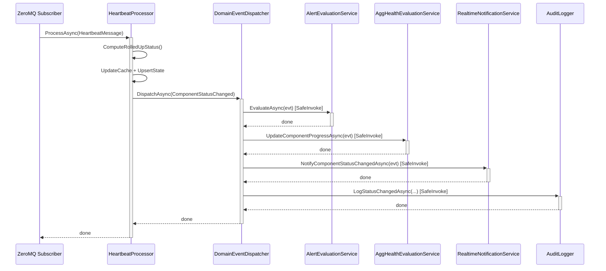

# BrokerageMonitor.Application — Architecture Review

> **Reviewer**: Chief Software Architect
> **Date**: 2026-05-01 _(fourth pass — refactor compliance check)_
> **Layer**: Application (depends on Domain only)

### Δ Changes Since Previous Review

| #   | Issue                                                                   | Status                                                                           |
| --- | ----------------------------------------------------------------------- | -------------------------------------------------------------------------------- |
| 1   | `ComponentStateOverridden` not dispatched to `AlertEvaluationService`   | ✅ **FIXED** (previous review)                                                    |
| 2   | Cache invalidation gap in both operator handlers                        | ✅ **FIXED** (previous review)                                                    |
| 3   | N+1 dashboard query (2N+1 per refresh)                                  | ✅ **FIXED** (previous review)                                                    |
| 4   | Synthetic `PreviousStatus = Unknown` for `ComponentLost`                | ✅ **FIXED** (previous review)                                                    |
| 5   | `FinalizeExecutionAsync` sends success notifications when flag is false | ✅ **FIXED** (previous review)                                                    |
| 6   | `AppSettingsImporter` locale-sensitive `TimeOnly.Parse()`               | ✅ **FIXED** (previous review)                                                    |
| 7   | `SendOnFailure` naming/semantic ambiguity                               | ✅ **FIXED** — renamed to `NotificationsEnabled`                                  |
| —   | `GetAllActiveAsync` called on every `ComponentStatusChanged` event      | ✅ **FIXED** — replaced with `GetByWatchedComponentAsync(evt.ComponentId)` JOIN   |
| —   | `NullAggregateHealthEvaluationService` defined but never registered     | ✅ **FIXED** — class deleted from `ApplicationServiceCollectionExtensions`        |
| —   | `GetSystemsWithComponentsQueryHandler` foreach + per-system query       | 🟡 **NEW — LOW** — N+1 moved from Web page into Application handler; not resolved |

---

## 📊 Architecture Health Score: 9.0 / 10

Both outstanding violations from the 2026-05-01 review have been resolved. `GetAllActiveAsync` in `UpdateComponentProgressAsync` is replaced by the new `GetByWatchedComponentAsync(evt.ComponentId)` JOIN query; `NullAggregateHealthEvaluationService` has been deleted. Four new Application-layer query handlers (`GetAlertsQueryHandler`, `GetActiveSystemIdsQueryHandler`, `GetActiveComponentsQueryHandler`, `GetSystemsWithComponentsQueryHandler`) were added to serve the Web layer — an architectural improvement. One new finding: `GetSystemsWithComponentsQueryHandler` still executes a `foreach` + `GetBySystemIdAsync` loop (N+1), moving the problem from the Web page into the Application layer rather than resolving it.

---

## ✅ Architectural Strengths

1. **`DomainEventDispatcher` with `SafeInvokeAsync`** — One handler failure never cascades to siblings. `OperationCanceledException` is explicitly handled to respect shutdown, while other exceptions are swallowed with a warning log (US-028).

2. **Null-Object Pattern for Stubs** — `NullAuditLogger`, `NullHeartbeatTimerRegistry`, `NullEmailNotificationService`, and `NullTeamsNotificationService` allow the Application layer to be unit-tested without Infrastructure. `TryAddSingleton` for notification services ensures Infrastructure implementations win when registered later.

3. **`MailChannelProcessor` — Efficient Wildcard Matching** — The `WildcardMatch` implementation uses a two-row rolling DP array with `stackalloc`, avoiding heap allocations for short subjects. O(m×n) worst-case is bounded by realistic email subject lengths.

4. **Explicit Severity Ordering in `HeartbeatProcessor`** — `GetSeverity()` documents the canonical severity ranking as a comment, making the intent clear. `ComputeRolledUpStatus()` is a pure static function, testable in isolation.

5. **`PeriodicTimer` / Cancellation Propagation** — All async methods accept `CancellationToken`, and `.ConfigureAwait(false)` is used consistently throughout library code.

6. **Business Rules Co-located with Use Cases** — Handler classes (e.g., `ToggleMaintenanceModeHandler`, `AcknowledgeAlertHandler`) enforce BI rules directly, with clear XML documentation referencing requirement IDs.

---

## ✅ Fixed Violation — Hot-Path N+1 in `UpdateComponentProgressAsync`

On every `ComponentStatusChanged` event, the service previously loaded **all** active definitions from SQLite, then filtered in memory. This has been fixed with a new repository method:

```csharp
// Before ❌ — full table scan per heartbeat event
var definitions = await _definitionRepo.GetAllActiveAsync(ct);
var watchingDefinitions = definitions
    .Where(d => d.WatchedComponents.Any(w => w.ComponentId == evt.ComponentId))
    .ToList();

// After ✅ — index-backed JOIN, only relevant definitions returned
var watchingDefinitions = await _definitionRepo
    .GetByWatchedComponentAsync(evt.ComponentId, ct)
    .ConfigureAwait(false);
```

---

## ⚠️ New Violation (LOW) — N+1 in `GetSystemsWithComponentsQueryHandler`

### Problem

`GetSystemsWithComponentsQueryHandler.HandleAsync()` still uses a `foreach` loop that calls `GetBySystemIdAsync` once per system — the same N+1 pattern that was present in `SystemManagementPage.razor`. The violation has been **moved into the Application layer** rather than resolved:

```csharp
// GetSystemsWithComponentsQueryHandler.cs — ❌ N+1 still present
foreach (var sys in allSystems)
{
    var comps = await _componentRepo.GetBySystemIdAsync(sys.SystemId, ct) // N queries
        .ConfigureAwait(false);
    componentsBySystem[sys.SystemId] = comps.OrderBy(c => c.Name).ToList();
}
```

**Impact**: Low in the current SQLite environment (management page load, not a hot path). However, the pattern is architecturally identical to the one that was just corrected in the dashboard.

**Fix**: Add `GetAllActiveAsync()` to `IMonitoredComponentRepository` (if not present) and group in memory, or add a dedicated `GetAllActiveGroupedBySystemAsync()` repository method:

```csharp
// Preferred fix — single query + in-memory grouping
var allComponents = await _componentRepo.GetAllActiveAsync(ct).ConfigureAwait(false);
var componentsBySystem = allComponents
    .GroupBy(c => c.SystemId, StringComparer.Ordinal)
    .ToDictionary(
        g => g.Key,
        g => (IReadOnlyList<MonitoredComponent>)g.OrderBy(c => c.Name).ToList(),
        StringComparer.Ordinal);
```

---

## 💡 Observations

### 1. New Application Handlers — Indentation Convention Inconsistency

All four new query handlers (`GetAlertsQueryHandler`, `GetActiveSystemIdsQueryHandler`, `GetActiveComponentsQueryHandler`, `GetSystemsWithComponentsQueryHandler`) use **2-space indentation** while the rest of the codebase uses **4-space indentation**. This is a minor style inconsistency that should be corrected for consistency.

### 2. `SendOnFailure` Schema Column — Resolved

The `SendOnFailure` column has been renamed `NotificationsEnabled` in both the DDL schema and all repository SQL. An idempotent migration (`ApplyMigrationsAsync`) is applied on every startup to handle existing databases. Cross-layer semantic drift is eliminated.

---

## 📝 Implementation Example — Before vs After

### Before — Full Table Scan on Every Event (current)

```csharp
// AggregateHealthEvaluationService.cs
var definitions = await _definitionRepo.GetAllActiveAsync(ct);      // ❌ full scan
var watchingDefinitions = definitions
    .Where(d => d.WatchedComponents.Any(w => w.ComponentId == evt.ComponentId))
    .ToList();
```

### After — Targeted Repository Query (proposed)

```csharp
// AggregateHealthEvaluationService.cs
var watchingDefinitions = await _definitionRepo
    .GetByWatchedComponentAsync(evt.ComponentId, ct);               // ✅ index-backed JOIN

if (watchingDefinitions.Count == 0)
    return;
```

---

## 📝 Fixed Violation Reference — Before vs After

### Before — N+1 Dashboard Query (FIXED, previous review)

```csharp
// GetDashboardQueryHandler.cs (previous)
foreach (var system in systems)
{
    var components = await _componentRepository.GetBySystemIdAsync(system.SystemId, ct); // ❌ N calls
    bool hasAlert = await _alertRepository.HasUnacknowledgedAlertAsync(system.SystemId, ct); // ❌ N calls
}
```

### After — 3 Batch Queries (current)

```csharp
// GetDashboardQueryHandler.cs (current)
var systems      = await _systemRepository.GetAllActiveAsync(ct);
var allComponents = await _componentRepository.GetAllActiveAsync(ct);    // ✅ 1 query
var alertSystems  = await _alertRepository.GetSystemsWithUnacknowledgedAlertAsync(ct); // ✅ 1 query

var componentsBySystem = allComponents.GroupBy(c => c.SystemId).ToDictionary(...);

foreach (var system in systems)
{
    var components = componentsBySystem.TryGetValue(...);
    bool hasAlert = alertSystems.Contains(system.SystemId); // ✅ O(1) hash lookup
}
```

---



> **Design Intent**: The `DomainEventDispatcher` acts as a fan-out bus within a single async call chain. `SafeInvokeAsync` provides subscriber isolation — no handler failure propagates to others. All handlers are invoked sequentially in a defined priority order.
