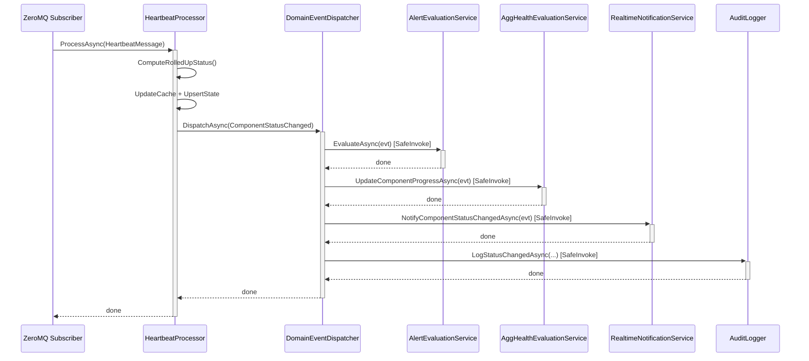

# BrokerageMonitor.Application — Architecture Review

> **Reviewer**: Chief Software Architect
> **Date**: 2026-04-25 _(previous: 2026-04-24)_
> **Layer**: Application (depends on Domain only)

### Δ Changes Since Previous Review

| #   | Issue                                                                                     | Status            |
| --- | ----------------------------------------------------------------------------------------- | ----------------- |
| 1   | `ComponentStateOverridden` not dispatched to `AlertEvaluationService`                     | ✅ **FIXED**       |
| 2   | Cache invalidation gap (`ToggleMaintenanceModeHandler` / `OverrideComponentStateHandler`) | ✅ **FIXED**       |
| 3   | N+1 dashboard query (2N+1 per refresh)                                                    | ✅ **FIXED**       |
| 4   | Synthetic `PreviousStatus = Unknown` for `ComponentLost`                                  | ✅ **FIXED**       |
| 5   | `FinalizeExecutionAsync` sends success notifications when `SendOnFailure = false`         | ✅ **FIXED**       |
| 6   | `AppSettingsImporter` — locale-sensitive `TimeOnly.Parse()`                               | ✅ **FIXED**       |
| —   | `SendOnFailure` naming/semantic ambiguity                                                 | 🟡 **NEW (minor)** |

---

## 📊 Architecture Health Score: 8.5 / 10

The Application layer is in strong shape. All critical violations from the previous review have been resolved: the `ComponentStateOverridden` event is now dispatched to `AlertEvaluationService`, both operator handlers correctly invalidate the state cache, the dashboard uses 3 batch queries instead of 2N+1, `ComponentLost` synthesizes accurate `PreviousStatus` from the cache, and `FinalizeExecutionAsync` correctly guards notifications behind `SendOnFailure`. The sole remaining concern is a naming ambiguity on the `SendOnFailure` flag.

---

## ✅ Architectural Strengths

1. **`DomainEventDispatcher` with `SafeInvokeAsync`** — One handler failure never cascades to siblings. `OperationCanceledException` is explicitly handled to respect shutdown, while other exceptions are swallowed with a warning log (US-028).

2. **Null-Object Pattern for Stubs** — `NullAuditLogger`, `NullHeartbeatTimerRegistry`, `NullEmailNotificationService`, and `NullTeamsNotificationService` allow the Application layer to be unit-tested without Infrastructure. `TryAddSingleton` for notification services ensures Infrastructure implementations win when registered later.

3. **`MailChannelProcessor` — Efficient Wildcard Matching** — The `WildcardMatch` implementation uses a two-row rolling DP array with `stackalloc`, avoiding heap allocations for short subjects. O(m×n) worst-case is bounded by realistic email subject lengths.

4. **Explicit Severity Ordering in `HeartbeatProcessor`** — `GetSeverity()` documents the canonical severity ranking as a comment, making the intent clear. `ComputeRolledUpStatus()` is a pure static function, testable in isolation.

5. **`PeriodicTimer` / Cancellation Propagation** — All async methods accept `CancellationToken`, and `.ConfigureAwait(false)` is used consistently throughout library code.

6. **Business Rules Co-located with Use Cases** — Handler classes (e.g., `ToggleMaintenanceModeHandler`, `AcknowledgeAlertHandler`) enforce BI rules directly, with clear XML documentation referencing requirement IDs.

---

## ⚠️ Remaining Violation

### 1. `SendOnFailure` Flag Name Does Not Match Actual Semantics

The implementation sends notifications for **both** `Success` and `Failed` when `SendOnFailure = true`, and for **neither** when `false`. The flag name implies "send only on failure":

```csharp
// FinalizeExecutionAsync — current behaviour
if (terminalStatus != DailyExecutionStatus.Exempted && definition.SendOnFailure)
{
    // ✅ correct: no notifications when false
    // ⚠️  name implies failure-only, but Success notifications also go out when true
    notificationSentAt = await SendNotificationsAsync(...);
}
```

**Impact**: Low risk now (behaviour is consistent and documented in code comments), but the flag name will confuse future maintainers configuring definitions — a definition named `SendOnFailure = false` silently suppresses success notifications too.

**Fix**: Rename `SendOnFailure` → `NotificationsEnabled` across the domain, repositories, and UI, or add a companion `SendOnSuccess` bool.

---

## 💡 Refactoring Suggestion

```csharp
// HealthMonitorDefinition.cs (proposed — no logic change, only naming)
public bool NotificationsEnabled { get; private set; }  // replaces SendOnFailure

// FinalizeExecutionAsync: semantics unchanged, intent clearer
if (terminalStatus != DailyExecutionStatus.Exempted && definition.NotificationsEnabled)
{
    notificationSentAt = await SendNotificationsAsync(...);
}
```

---

## 📝 Implementation Example — Before vs After (Fixed Violations for Reference)

### Before — N+1 Dashboard Query (FIXED)

```csharp
// GetDashboardQueryHandler.cs (previous)
foreach (var system in systems)
{
    var components = await _componentRepository.GetBySystemIdAsync(system.SystemId, ct); // ❌ N calls
    bool hasAlert = await _alertRepository.HasUnacknowledgedAlertAsync(system.SystemId, ct); // ❌ N calls
}
```

### After — 3 Batch Queries (current)

```csharp
// GetDashboardQueryHandler.cs (current)
var systems      = await _systemRepository.GetAllActiveAsync(ct);
var allComponents = await _componentRepository.GetAllActiveAsync(ct);    // ✅ 1 query
var alertSystems  = await _alertRepository.GetSystemsWithUnacknowledgedAlertAsync(ct); // ✅ 1 query

var componentsBySystem = allComponents.GroupBy(c => c.SystemId).ToDictionary(...);

foreach (var system in systems)
{
    var components = componentsBySystem.TryGetValue(...);
    bool hasAlert = alertSystems.Contains(system.SystemId); // ✅ O(1) hash lookup
}
```

---



> **Design Intent**: The `DomainEventDispatcher` acts as a fan-out bus within a single async call chain. `SafeInvokeAsync` provides subscriber isolation — no handler failure propagates to others. All handlers are invoked sequentially in a defined priority order.
