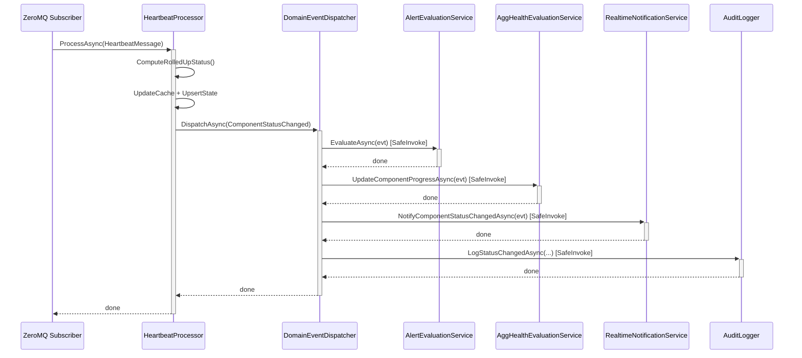

# BrokerageMonitor.Application — Architecture Review

> **Reviewer**: Chief Software Architect
> **Date**: 2026-05-01 _(previous: 2026-04-25)_
> **Layer**: Application (depends on Domain only)

### Δ Changes Since Previous Review

| #   | Issue                                                                   | Status                                                                          |
| --- | ----------------------------------------------------------------------- | ------------------------------------------------------------------------------- |
| 1   | `ComponentStateOverridden` not dispatched to `AlertEvaluationService`   | ✅ **FIXED** (previous review)                                                   |
| 2   | Cache invalidation gap in both operator handlers                        | ✅ **FIXED** (previous review)                                                   |
| 3   | N+1 dashboard query (2N+1 per refresh)                                  | ✅ **FIXED** (previous review)                                                   |
| 4   | Synthetic `PreviousStatus = Unknown` for `ComponentLost`                | ✅ **FIXED** (previous review)                                                   |
| 5   | `FinalizeExecutionAsync` sends success notifications when flag is false | ✅ **FIXED** (previous review)                                                   |
| 6   | `AppSettingsImporter` locale-sensitive `TimeOnly.Parse()`               | ✅ **FIXED** (previous review)                                                   |
| 7   | `SendOnFailure` naming/semantic ambiguity                               | ✅ **FIXED** — renamed to `NotificationsEnabled`                                 |
| —   | `GetAllActiveAsync` called on every `ComponentStatusChanged` event      | 🟡 **STILL OPEN** — hot-path N+1 in `UpdateComponentProgressAsync`               |
| —   | `NullAggregateHealthEvaluationService` defined but never registered     | 🟡 **NEW** — orphaned dead-code stub in `ApplicationServiceCollectionExtensions` |

---

## 📊 Architecture Health Score: 8.5 / 10

The `GetAllActiveAsync` N+1 hot-path remains the sole open performance concern. A new minor finding is also noted: `NullAggregateHealthEvaluationService` is defined in `ApplicationServiceCollectionExtensions.cs` but is never registered with the DI container and never referenced in any test project — it is dead code.

---

## ✅ Architectural Strengths

1. **`DomainEventDispatcher` with `SafeInvokeAsync`** — One handler failure never cascades to siblings. `OperationCanceledException` is explicitly handled to respect shutdown, while other exceptions are swallowed with a warning log (US-028).

2. **Null-Object Pattern for Stubs** — `NullAuditLogger`, `NullHeartbeatTimerRegistry`, `NullEmailNotificationService`, and `NullTeamsNotificationService` allow the Application layer to be unit-tested without Infrastructure. `TryAddSingleton` for notification services ensures Infrastructure implementations win when registered later.

3. **`MailChannelProcessor` — Efficient Wildcard Matching** — The `WildcardMatch` implementation uses a two-row rolling DP array with `stackalloc`, avoiding heap allocations for short subjects. O(m×n) worst-case is bounded by realistic email subject lengths.

4. **Explicit Severity Ordering in `HeartbeatProcessor`** — `GetSeverity()` documents the canonical severity ranking as a comment, making the intent clear. `ComputeRolledUpStatus()` is a pure static function, testable in isolation.

5. **`PeriodicTimer` / Cancellation Propagation** — All async methods accept `CancellationToken`, and `.ConfigureAwait(false)` is used consistently throughout library code.

6. **Business Rules Co-located with Use Cases** — Handler classes (e.g., `ToggleMaintenanceModeHandler`, `AcknowledgeAlertHandler`) enforce BI rules directly, with clear XML documentation referencing requirement IDs.

---

## ⚠️ Remaining Violation

### 1. Hot-Path N+1 in `UpdateComponentProgressAsync`

On every `ComponentStatusChanged` event, the service loads **all** active definitions from SQLite, then filters in memory:

```csharp
// AggregateHealthEvaluationService.cs — current
public async Task UpdateComponentProgressAsync(ComponentStatusChanged evt, ...)
{
    var definitions = await _definitionRepo.GetAllActiveAsync(ct); // ❌ full table scan per event
    var watchingDefinitions = definitions
        .Where(d => d.WatchedComponents.Any(w => w.ComponentId == evt.ComponentId))
        .ToList();
    ...
}
```

**Impact**: In a production environment with 20 systems × 10 components each, a burst of 200 heartbeats per second means 200 `GetAllActiveAsync` calls per second, each returning all 20+ definitions and their junction rows. Under normal operating conditions the definitions table is small and SQLite is fast, but this pattern will not scale and obscures the intent.

**Fix**: Add a targeted query to `IHealthMonitorDefinitionRepository` and implement it in the repository:

```csharp
// IHealthMonitorDefinitionRepository.cs (proposed addition)
Task<IReadOnlyList<HealthMonitorDefinition>> GetByWatchedComponentAsync(
    string componentId, CancellationToken ct = default);
```

```csharp
// AggregateHealthEvaluationService.cs (proposed)
var watchingDefinitions = await _definitionRepo
    .GetByWatchedComponentAsync(evt.ComponentId, ct)
    .ConfigureAwait(false);

if (watchingDefinitions.Count == 0)
    return;
```

The SQL implementation is a single join:

```sql
SELECT hmd.* FROM HealthMonitorDefinitions hmd
INNER JOIN HealthMonitorWatchedComponents w ON w.DefinitionId = hmd.DefinitionId
WHERE hmd.IsActive = 1 AND w.ComponentId = @ComponentId
```

---

## 💡 Observations

### 1. `NullAggregateHealthEvaluationService` — Orphaned Stub

`ApplicationServiceCollectionExtensions.cs` defines an `internal sealed class NullAggregateHealthEvaluationService : IAggregateHealthEvaluationService` at the bottom of the file, but it is **never registered** in `AddApplicationServices()` and **never referenced** from any test project. The real `AggregateHealthEvaluationService` is registered directly. The null-object stub is dead code and should be removed to avoid confusion.

```csharp
// ApplicationServiceCollectionExtensions.cs — dead code
internal sealed class NullAggregateHealthEvaluationService : IAggregateHealthEvaluationService
{
    public Task UpdateComponentProgressAsync(...) => Task.CompletedTask;  // ❌ never used
    public Task EvaluateDefinitionAsync(...)      => Task.CompletedTask;  // ❌ never used
}
```

### 2. `SendOnFailure` Schema Column — Documented Cross-Layer Inconsistency

The `SendOnFailure` flag has been renamed `NotificationsEnabled` in the domain model. The DB column retains the legacy name `SendOnFailure` — this creates a semantic gap documented separately in the Infrastructure review. The repository mapping `notificationsEnabled: row.SendOnFailure == 1` is functionally correct.

---

## 📝 Implementation Example — Before vs After

### Before — Full Table Scan on Every Event (current)

```csharp
// AggregateHealthEvaluationService.cs
var definitions = await _definitionRepo.GetAllActiveAsync(ct);      // ❌ full scan
var watchingDefinitions = definitions
    .Where(d => d.WatchedComponents.Any(w => w.ComponentId == evt.ComponentId))
    .ToList();
```

### After — Targeted Repository Query (proposed)

```csharp
// AggregateHealthEvaluationService.cs
var watchingDefinitions = await _definitionRepo
    .GetByWatchedComponentAsync(evt.ComponentId, ct);               // ✅ index-backed JOIN

if (watchingDefinitions.Count == 0)
    return;
```

---

## 📝 Fixed Violation Reference — Before vs After

### Before — N+1 Dashboard Query (FIXED, previous review)

```csharp
// GetDashboardQueryHandler.cs (previous)
foreach (var system in systems)
{
    var components = await _componentRepository.GetBySystemIdAsync(system.SystemId, ct); // ❌ N calls
    bool hasAlert = await _alertRepository.HasUnacknowledgedAlertAsync(system.SystemId, ct); // ❌ N calls
}
```

### After — 3 Batch Queries (current)

```csharp
// GetDashboardQueryHandler.cs (current)
var systems      = await _systemRepository.GetAllActiveAsync(ct);
var allComponents = await _componentRepository.GetAllActiveAsync(ct);    // ✅ 1 query
var alertSystems  = await _alertRepository.GetSystemsWithUnacknowledgedAlertAsync(ct); // ✅ 1 query

var componentsBySystem = allComponents.GroupBy(c => c.SystemId).ToDictionary(...);

foreach (var system in systems)
{
    var components = componentsBySystem.TryGetValue(...);
    bool hasAlert = alertSystems.Contains(system.SystemId); // ✅ O(1) hash lookup
}
```

---



> **Design Intent**: The `DomainEventDispatcher` acts as a fan-out bus within a single async call chain. `SafeInvokeAsync` provides subscriber isolation — no handler failure propagates to others. All handlers are invoked sequentially in a defined priority order.
