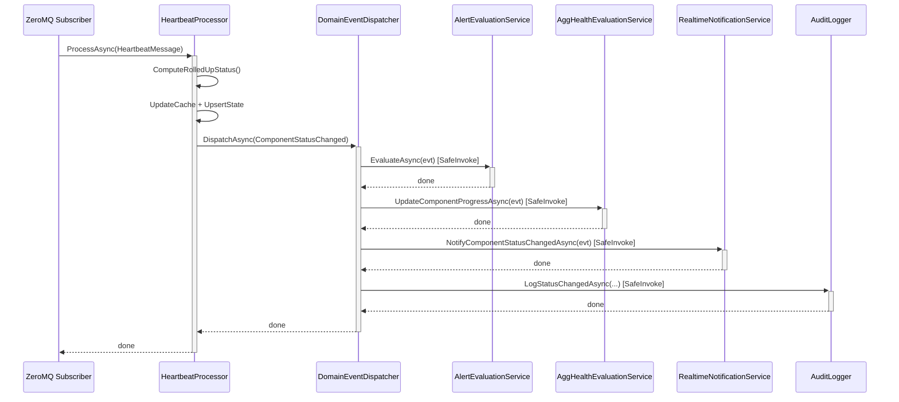

# BrokerageMonitor.Application — Architecture Review

> **Reviewer**: Chief Software Architect
> **Date**: 2026-04-24 _(previous: 2026-04-22)_
> **Layer**: Application (depends on Domain only)

### Δ Changes Since Previous Review

| # | Issue | Status |
|---|-------|--------|
| — | `IAuditLogger` (NullAuditLogger stub) — Infrastructure now provides concrete `AuditLogger` via `TryAddScoped` override | ✅ **FIXED** |
| 1 | Cache invalidation gap (`ToggleMaintenanceModeHandler` / `OverrideComponentStateHandler`) | 🔴 **STILL OPEN** |
| 2 | Synthetic `PreviousStatus = Unknown` for `ComponentLost` | 🔴 **STILL OPEN** |
| 3 | N+1 dashboard query | 🟡 **STILL OPEN** |
| 5 | `FinalizeExecutionAsync` notification semantics | 🟡 **STILL OPEN** |
| 6 | `AppSettingsImporter` — locale-sensitive `TimeOnly.Parse()` | 🟡 **STILL OPEN** |
| — | **NEW**: `ComponentStateOverridden` event not handled by `DomainEventDispatcher` | 🔴 **NEW FINDING** |

---

## 📊 Architecture Health Score: 7 / 10

The Application layer is well-structured with clear CQRS-like use-case handlers, a robust domain event dispatcher with handler isolation, and a thoughtful null-object pattern for testing. Key concerns are a cache invalidation gap in two handlers, an N+1 query in the dashboard, inaccurate synthetic event data in the dispatcher, and a newly discovered dead-code path in the event dispatcher for component state overrides.

---

## ✅ Architectural Strengths

1. **`DomainEventDispatcher` with `SafeInvokeAsync`** — One handler failure never cascades to siblings. `OperationCanceledException` is explicitly handled to respect shutdown, while other exceptions are swallowed with a warning log (US-028).

2. **Null-Object Pattern for Stubs** — `NullAuditLogger`, `NullHeartbeatTimerRegistry`, `NullEmailNotificationService`, and `NullTeamsNotificationService` allow the Application layer to be unit-tested without Infrastructure. `TryAddSingleton` for notification services ensures Infrastructure implementations win when registered later.

3. **`MailChannelProcessor` — Efficient Wildcard Matching** — The `WildcardMatch` implementation uses a two-row rolling DP array with `stackalloc`, avoiding heap allocations for short subjects. O(m×n) worst-case is bounded by realistic email subject lengths.

4. **Explicit Severity Ordering in `HeartbeatProcessor`** — `GetSeverity()` documents the canonical severity ranking as a comment, making the intent clear. `ComputeRolledUpStatus()` is a pure static function, testable in isolation.

5. **`PeriodicTimer` / Cancellation Propagation** — All async methods accept `CancellationToken`, and `.ConfigureAwait(false)` is used consistently throughout library code.

6. **Business Rules Co-located with Use Cases** — Handler classes (e.g., `ToggleMaintenanceModeHandler`, `AcknowledgeAlertHandler`) enforce BI rules directly, with clear XML documentation referencing requirement IDs.

---

## ⚠️ Critical Violations

### 1. Cache Invalidation Gap — `ToggleMaintenanceModeHandler` and `OverrideComponentStateHandler`

Both handlers update `IComponentStateRepository` (SQLite) but do not update `IComponentStateCache` (in-memory). The dashboard reads component status from the **cache**, so state changes made by these operators will be invisible until the next heartbeat arrives.

**Files**: `ToggleMaintenanceModeHandler.cs`, `OverrideComponentStateHandler.cs`

```csharp
// ToggleMaintenanceModeHandler — update persists but cache is stale:
state.UpdateStatus(targetStatus, now);
await _stateRepository.UpsertAsync(state, ct); // ✅ persistence
// ❌ _stateCache.SetState(state) is missing
```

---

### 2. Synthetic `PreviousStatus` Is Hardcoded to `Unknown` in `DispatchComponentLostAsync`

When a `ComponentLost` event arrives, the dispatcher synthesizes a `ComponentStatusChanged` with `PreviousStatus: ComponentStatus.Unknown`. The actual previous status is available in the `IComponentStateCache` but is not consulted.

**Impact**: Audit log entries and `AlertEvaluationService` receive incorrect `PreviousStatus` data. A component that was `Normal` and then `Lost` is logged as `Unknown → Lost`.

```csharp
// DomainEventDispatcher.cs
var syntheticChange = new ComponentStatusChanged(
    evt.ComponentId,
    evt.SystemId,
    PreviousStatus: Domain.ValueObjects.ComponentStatus.Unknown, // ❌ always Unknown
    NewStatus: Domain.ValueObjects.ComponentStatus.Lost,
    evt.OccurredAt);
```

---

### 3. N+1 Query in `GetDashboardQueryHandler`

`GetBySystemIdAsync` is called inside a `foreach` loop over all active systems, producing `N+1` database queries.

```csharp
foreach (var system in systems)
{
    // ❌ One DB round-trip per system
    var components = await _componentRepository.GetBySystemIdAsync(system.SystemId, ct);
    // ...
}
```

**Impact**: For 10 systems, this is 11 queries on every dashboard refresh. Since the dashboard is live (SignalR-driven) and polling, this multiplies under load.

---

### 4. ~~Audit Logging Is Silently Disabled~~ — ✅ FIXED

`InfrastructureServiceCollectionExtensions.AddPersistence()` now registers `services.AddScoped<IAuditLogger, AuditLogger>()`. The Application layer correctly uses `TryAddScoped` for the `NullAuditLogger` stub, so the Infrastructure implementation wins when both layers are loaded. Audit records are now written for all operator actions.

---

### 4 (new). `ComponentStateOverridden` Event Is Not Dispatched to Alert Evaluation

`OverrideComponentStateHandler` dispatches a `ComponentStateOverridden` event via `IDomainEventDispatcher.DispatchAsync`, but the dispatcher's `switch` statement has no case for this event type:

```csharp
// DomainEventDispatcher.cs
switch (@event)
{
    case ComponentStatusChanged e: ...  // ✅ handled
    case ComponentLost e:          ...  // ✅ handled
    default: break;                     // ❌ ComponentStateOverridden falls here
}
```

**Impact**: When an operator manually overrides a component state to `Normal` or `Alerting`, `AlertEvaluationService` is never called. Active alerts are not cleared; no new alerts are raised. The UI reflects the change via a direct SignalR push, but the alert subsystem remains unaware of the state transition.

---

### 5. `FinalizeExecutionAsync` Notification Logic Is Ambiguous

The `SendOnFailure` flag gates failure notifications but not success notifications. The code expresses this as two disconnected `if/else if` branches with a misleading comment:

```csharp
// ❌ Sends Success unconditionally even when SendOnFailure = false
if (terminalStatus != DailyExecutionStatus.Exempted
    && definition.SendOnFailure
    && terminalStatus == DailyExecutionStatus.Failed)
{
    notificationSentAt = await SendNotificationsAsync(...);
}
else if (terminalStatus == DailyExecutionStatus.Success)
{
    // Success notifications always sent if SendOnFailure is false (i.e., always send)
    notificationSentAt = await SendNotificationsAsync(...); // ❌ comment is confusing
}
```

**Impact**: A definition with `SendOnFailure = false` will never send a failure notification but **will** silently send success notifications — this may be intentional but is not expressed by the flag name, leading to future misconfigurations.

---

### 6. `AppSettingsImporter` Uses `TimeOnly.Parse()` Without Invariant Culture

```csharp
var startTime = TimeOnly.Parse(cfg.MarketSessionStart);
```

On systems with non-English locale settings, this may fail to parse `"09:00"` if the locale uses a different time separator. `CultureInfo.InvariantCulture` should be used.

---

### 7. `DailyExecutionCreatorService.RecoverTodayAsync` Uses `DateTime.Today` / `DateTime.Now`

```csharp
var today = DateOnly.FromDateTime(DateTime.Today);
var now = TimeOnly.FromDateTime(DateTime.Now);
```

These use local server time. If the server is in a different timezone than the exchange, recovery may target the wrong date. `DateTimeOffset.UtcNow` should be used consistently.

---

## 💡 Refactoring Suggestions

1. **Inject `IComponentStateCache` into `ToggleMaintenanceModeHandler` and `OverrideComponentStateHandler`** — Call `_stateCache.SetState(state)` after every `_stateRepository.UpsertAsync(state)`.

2. **Read actual `PreviousStatus` from cache in `DispatchComponentLostAsync`** — Inject `IComponentStateCache` into `DomainEventDispatcher` and look up the component state before synthesizing the event.

3. **Batch component loading in dashboard** — Add `GetAllActiveAsync()` to `IMonitoredComponentRepository`, load all components once, and group by `SystemId` in memory.

4. **Create a concrete `AuditLogger` in Infrastructure** — Implement `IAuditLogger` by delegating to `IAuditLogRepository`, then register it in `InfrastructureServiceCollectionExtensions.AddPersistence()` (replacing the null stub).

5. **Rename `SendOnFailure` or introduce `SendOnSuccess` flag** — Make notification intent explicit so the flag name matches the behavior it controls.

---

## 📝 Implementation Examples

### Before — Cache Not Updated After Override

```csharp
// OverrideComponentStateHandler.cs (current)
state.UpdateStatus(command.NewStatus, now);
await _stateRepository.UpsertAsync(state, ct);
// Dashboard now shows stale data until next heartbeat ❌
```

### After — Cache Updated Atomically

```csharp
// OverrideComponentStateHandler.cs (proposed)
state.UpdateStatus(command.NewStatus, now);
_stateCache.SetState(state);               // ✅ in-memory
await _stateRepository.UpsertAsync(state, ct); // ✅ persistent
```

---

### Before — N+1 Dashboard Query

```csharp
foreach (var system in systems)
{
    var components = await _componentRepository.GetBySystemIdAsync(system.SystemId, ct); // ❌ N calls
}
```

### After — Single Batch Load

```csharp
// Add to IMonitoredComponentRepository:
// Task<IReadOnlyList<MonitoredComponent>> GetAllActiveAsync(CancellationToken ct = default);

var allComponents = await _componentRepository.GetAllActiveAsync(ct);
var componentsBySystem = allComponents
    .GroupBy(c => c.SystemId, StringComparer.OrdinalIgnoreCase)
    .ToDictionary(g => g.Key, g => g.ToList(), StringComparer.OrdinalIgnoreCase);

foreach (var system in systems)
{
    var components = componentsBySystem.GetValueOrDefault(system.SystemId) ?? [];
    // ...
}
```

---

### Before — Audit Logging Silently Disabled

```csharp
// ApplicationServiceCollectionExtensions.cs
services.AddSingleton<IAuditLogger, NullAuditLogger>(); // ❌ no-op in production
```

### After — Concrete Infrastructure Implementation

```csharp
// Infrastructure: new file AuditLogger.cs
public sealed class AuditLogger : IAuditLogger
{
    private readonly IAuditLogRepository _repo;
    public AuditLogger(IAuditLogRepository repo) => _repo = repo;

    public Task LogStatusChangedAsync(string systemId, string componentId,
        ComponentStatus previous, ComponentStatus current,
        DateTimeOffset occurredAt, CancellationToken ct = default)
        => _repo.AddAsync(new AuditLogEntry(
            Guid.NewGuid(), systemId, componentId,
            $"StatusChanged:{previous}→{current}", "system", null, occurredAt), ct);

    public Task LogOperatorActionAsync(string systemId, string? componentId,
        string actionType, string operatorName,
        string? reason, DateTimeOffset occurredAt, CancellationToken ct = default)
        => _repo.AddAsync(new AuditLogEntry(
            Guid.NewGuid(), systemId, componentId,
            actionType, operatorName, reason, occurredAt), ct);
}

// InfrastructureServiceCollectionExtensions.cs
// In AddPersistence(), replace the null stub:
services.AddScoped<IAuditLogger, AuditLogger>(); // ✅
```

---



> **Design Intent**: The `DomainEventDispatcher` acts as a fan-out bus within a single async call chain. `SafeInvokeAsync` provides subscriber isolation — no handler failure propagates to others. All handlers are invoked sequentially in a defined priority order.
