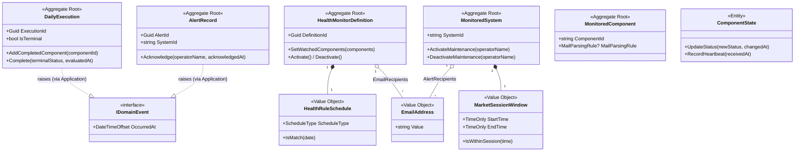

# BrokerageMonitor.Domain — Architecture Review

> **Reviewer**: Chief Software Architect
> **Date**: 2026-05-01 _(third pass — deep re-review)_
> **Layer**: Domain (innermost — no project references)

### Δ Changes Since Previous Review

| #   | Issue                                             | Status                                     |
| --- | ------------------------------------------------- | ------------------------------------------ |
| 1   | Value objects missing `IEquatable<T>`             | ✅ **FIXED**                                |
| 2   | `AlertRecord.Acknowledge()` allows overwriting    | ✅ **FIXED**                                |
| 3   | `HealthRuleSchedule.MatchesCron()` fragile parser | ✅ **FIXED**                                |
| 4   | Read models in `Repositories/` folder             | ✅ **FIXED**                                |
| 5   | `ComponentState.Rehydrate()` missing              | ✅ **FIXED**                                |
| 6   | Non-deterministic public constructors             | ✅ **FIXED**                                |
| 7   | `IMonitoredSystemRepository` dual-write path      | 🔴 **NEW — HIGH** (this review)             |
| 8   | `DailyExecution.Complete()` fails to deduplicate  | 🟡 **NEW — MEDIUM** (this review)           |
| 9   | `MailParsingRule.GetHashCode()` incomplete        | 🟠 **NEW — LOW** (this review)              |
| 10  | `AcknowledgeBySystemAsync` bypasses aggregate     | 🟠 **NEW — LOW / Documented** (this review) |

---

## 📊 Architecture Health Score: 8.0 / 10

Three violations were found in this deep re-review pass. The Domain layer remains structurally sound, but the **dual-write path on `IMonitoredSystemRepository`** is a genuine aggregate boundary violation: `SetMaintenanceModeAsync` exposes a mutation path that silently bypasses the operator-name invariant enforced by `ActivateMaintenance` / `DeactivateMaintenance`, breaking both the aggregate contract and the audit trail. Two additional correctness gaps — missing idempotency guard in `Complete()` and an incomplete hash function contract in `MailParsingRule` — are documented below.

---

## 🔴 Violation 1 (HIGH) — `IMonitoredSystemRepository`: Dual-Write Path Anti-Pattern

### Problem

`MonitoredSystem` exposes two mutating methods that enforce the BI-009 operator invariant:

```csharp
// MonitoredSystem.cs
public void ActivateMaintenance(string operatorName)   // BI-009: operatorName required
public void DeactivateMaintenance(string operatorName)  // BI-009: operatorName required
```

Both methods keep `IsMaintenanceActive` and `MaintenanceOperator` in sync as a single atomic state change inside the aggregate. `IMonitoredSystemRepository`, however, exposes a second mutation path that bypasses the aggregate entirely:

```csharp
// IMonitoredSystemRepository.cs — ❌ aggregate boundary violation
Task SetMaintenanceModeAsync(string systemId, bool active, CancellationToken ct = default);
```

This method carries no `operatorName`. Any caller routing through it:
1. Bypasses the BI-009 invariant guard — no operator identity is enforced or recorded.
2. Produces inconsistent aggregate state: if the infrastructure issues a targeted `UPDATE SET IsMaintenanceActive = @active`, `MaintenanceOperator` in the DB row is left as-is (or `NULL`), diverging from what the in-memory aggregate would produce via `ActivateMaintenance`.
3. Breaks the audit trail — no actor is associated with the state change.

### Fix

Remove `SetMaintenanceModeAsync` from the repository interface. All maintenance-mode transitions must follow the canonical **load → mutate → upsert** pattern so the aggregate remains the single source of invariant enforcement:

```csharp
// Application layer — correct pattern ✅
var system = await _systemRepo.GetByIdAsync(systemId, ct)
    ?? throw new NotFoundException(systemId);

system.ActivateMaintenance(currentUser);   // aggregate enforces BI-009 invariant
await _systemRepo.UpsertAsync(system, ct); // persists full aggregate state (all columns)
```

`UpsertAsync` already writes every column including `IsMaintenanceActive` and `MaintenanceOperator`. The targeted method is unnecessary.

---

## 🟡 Violation 2 (MEDIUM) — `DailyExecution.Complete()`: Missing Idempotency Guard on `failedComponents`

### Problem

`AddCompletedComponent()` applies an explicit deduplication guard before mutating the backing list:

```csharp
// DailyExecution.cs — AddCompletedComponent ✅ idempotent
if (!_completedComponents.Contains(componentId, StringComparer.OrdinalIgnoreCase))
    _completedComponents.Add(componentId);
```

`Complete()` has no equivalent guard on `failedComponents`:

```csharp
// DailyExecution.cs — Complete() ❌ no deduplication
if (failedComponents is not null)
    _failedComponents.AddRange(failedComponents);   // caller-supplied duplicates stored as-is
```

If the Application layer aggregates component IDs from multiple events before calling `Complete()` — a common event-sourced accumulation pattern — duplicate entries can appear in `FailedComponents`. This produces incorrect failure counts and misleading notification body content.

### Fix

Apply the same deduplication strategy used by `AddCompletedComponent()`:

```csharp
if (failedComponents is not null)
    _failedComponents.AddRange(
        failedComponents.Distinct(StringComparer.OrdinalIgnoreCase));
```

---

## 🟠 Violation 3 (LOW) — `MailParsingRule.GetHashCode()`: Hash Contract Inconsistency

### Problem

The `IEquatable<T>` contract requires that objects considered equal by `Equals()` return identical values from `GetHashCode()`. The converse is not required — non-equal objects may share the same hash. `MailParsingRule` violates the spirit of the contract by including all four fields in `Equals()` but only two in `GetHashCode()`:

```csharp
// MailParsingRule.cs
public bool Equals(MailParsingRule? other) =>
    other is not null &&
    FromPattern == other.FromPattern &&
    SubjectPattern == other.SubjectPattern &&
    SuccessKeywords.SequenceEqual(other.SuccessKeywords) &&   // ✅ in Equals
    FailureKeywords.SequenceEqual(other.FailureKeywords);     // ✅ in Equals

public override int GetHashCode() =>
    HashCode.Combine(FromPattern, SubjectPattern);            // ❌ keyword lists excluded
```

The contract is not technically broken — the implementation is merely a poor hash function. Two `MailParsingRule` instances that differ only in keyword content will produce identical hashes, causing O(n) bucket degradation in any `Dictionary<MailParsingRule, T>` or `HashSet<MailParsingRule>` keyed on the full value. Because `SuccessKeywords` and `FailureKeywords` are the primary differentiating fields, excluding them maximises collision probability rather than minimising it.

### Fix

```csharp
public override int GetHashCode()
{
    var h = new HashCode();
    h.Add(FromPattern);
    h.Add(SubjectPattern);
    foreach (var k in SuccessKeywords) h.Add(k, StringComparer.OrdinalIgnoreCase);
    foreach (var k in FailureKeywords) h.Add(k, StringComparer.OrdinalIgnoreCase);
    return h.ToHashCode();
}
```

---

## 🟠 Observation — `IAlertRecordRepository.AcknowledgeBySystemAsync`: Documented Aggregate Bypass

`AcknowledgeBySystemAsync(string systemId, string operatorName, ...)` batch-acknowledges all open alerts for a system in a single call. This deliberately bypasses `AlertRecord.Acknowledge()` — which enforces the `IsAcknowledged` re-entry guard — and pushes the invariant responsibility into the infrastructure SQL layer.

This is an accepted **performance trade-off**: executing a load→mutate→save cycle for N alerts on every user acknowledgement would be disproportionately expensive given the low frequency of the operation. The trade-off is acceptable, but the repository interface must encode the SQL constraint it delegates, so future implementations cannot silently omit it:

```csharp
/// <summary>
/// Batch-acknowledges all open alerts for <paramref name="systemId"/>.
/// Infrastructure MUST issue a conditional UPDATE (WHERE AcknowledgedAt IS NULL)
/// to preserve the BI-009 no-overwrite invariant enforced by AlertRecord.Acknowledge().
/// </summary>
Task AcknowledgeBySystemAsync(string systemId, string operatorName, CancellationToken ct = default);
```

---

## ✅ Architectural Strengths (Carried Forward)

1. **Strong Aggregate Encapsulation** — All aggregates use `private init` / `private set`, with dedicated Dapper-materialization constructors and separate `Rehydrate()` factory methods.

2. **Domain Events as Records** — `sealed record` types ensure immutability and structural equality. The `IDomainEvent` marker with `OccurredAt` is clean and minimal.

3. **Value Object Invariants Enforced at Construction** — `EmailAddress`, `MarketSessionWindow`, `MailParsingRule`, and `HealthRuleSchedule` all throw `ArgumentException` on invalid input.

4. **ReDoS Protection on `EmailAddress`** — The compiled regex includes a `TimeSpan.FromMilliseconds(100)` timeout.

5. **Terminal State Guards** — `DailyExecution.Complete()` rejects non-terminal statuses and prevents terminal-state overwrites (BI-013). `TerminalStatuses` is a static `IReadOnlySet<DailyExecutionStatus>`.

6. **`Rehydrate()` Factories** — `ComponentState` and `DailyExecution` expose `public static Rehydrate(...)`. Repositories use these for DB hydration — no reflection, deterministic timestamps.

7. **`IEquatable<T>` on All Value Objects** — All seven value objects implement `IEquatable<T>` — no boxing in generic collections.

8. **`AlertRecord.Acknowledge()` is Idempotent-Safe** — Throws `InvalidOperationException` on a second call, protecting audit integrity.

9. **Safe Cron Parser** — `MatchesCron()` uses `int.TryParse` throughout, guards step-divisor zero, documents the 3-of-5 field intent.

10. **Read Models Correctly Placed** — `AuditLogEntry` and `ExecutionHistoryEntry` live in `ReadModels/`. The `Repositories/` folder contains only interface contracts.

---

## 💡 Persistent Observation — Implicit UTC Assumptions in Two Locations

1. **`MarketSessionWindow.IsWithinSession(DateTimeOffset)`** calls `dateTime.TimeOfDay`, which resolves the wall-clock time in the stored UTC offset — not in UTC. Two `DateTimeOffset` values representing the same UTC instant but carrying different offsets will return different wall-clock times and can therefore produce different `IsWithinSession` results. The method should document its offset convention (UTC-normalized `DateTimeOffset` strongly recommended at all call sites).

2. **`DailyExecutionCreatorService`** (Application layer) derives the execution date via `DateTime.Today`, which returns the server's local calendar day. On a host configured to a non-UTC time zone this can diverge from the UTC calendar day, feeding the wrong `DateOnly` to `HealthRuleSchedule.IsMatch()`. Replacing `DateTime.Today` with a `ISystemClock` or `TimeProvider` abstraction resolves both the correctness risk and the testability gap.

---

## 📝 Violation Fix Reference

### Violation 1 — Remove `SetMaintenanceModeAsync` (aggregate boundary violation)

```csharp
// IMonitoredSystemRepository.cs — DELETE this method ❌
Task SetMaintenanceModeAsync(string systemId, bool active, CancellationToken ct = default);

// Application layer — canonical load → mutate → upsert ✅
var system = await _systemRepo.GetByIdAsync(systemId, ct)
    ?? throw new NotFoundException(systemId);
system.ActivateMaintenance(currentUser);   // invariant enforced inside aggregate
await _systemRepo.UpsertAsync(system, ct); // full-row upsert, no partial update
```

### Violation 2 — Add deduplication guard in `DailyExecution.Complete()`

```csharp
// Before ❌ — no idempotency guard
if (failedComponents is not null)
    _failedComponents.AddRange(failedComponents);

// After ✅ — consistent with AddCompletedComponent()
if (failedComponents is not null)
    _failedComponents.AddRange(
        failedComponents.Distinct(StringComparer.OrdinalIgnoreCase));
```

### Violation 3 — Fix hash function contract in `MailParsingRule`

```csharp
// Before ❌ — keyword lists excluded; maximises hash collision probability
public override int GetHashCode() => HashCode.Combine(FromPattern, SubjectPattern);

// After ✅ — all Equals() fields participate in hash
public override int GetHashCode()
{
    var h = new HashCode();
    h.Add(FromPattern);
    h.Add(SubjectPattern);
    foreach (var k in SuccessKeywords) h.Add(k, StringComparer.OrdinalIgnoreCase);
    foreach (var k in FailureKeywords) h.Add(k, StringComparer.OrdinalIgnoreCase);
    return h.ToHashCode();
}
```

### Historical — Non-Deterministic Constructor Timestamps (resolved in pass 2)

```csharp
// ComponentState.cs (current) ✅
public ComponentState(
    string componentId,
    ComponentStatus initialStatus = ComponentStatus.Unknown,
    DateTimeOffset? changedAt = null)         // test-injectable; defaults to UtcNow
{
    LastStatusChangedAt = changedAt ?? DateTimeOffset.UtcNow;
}

// DailyExecution.cs (current) ✅
public DailyExecution(
    Guid executionId, Guid definitionId, string systemId,
    DateOnly executionDate,
    DailyExecutionStatus initialStatus = DailyExecutionStatus.InProgress,
    string? missedReason = null,
    DateTimeOffset? createdAt = null)         // test-injectable; defaults to UtcNow
{
    CreatedAt = createdAt ?? DateTimeOffset.UtcNow;
}
```

---



> **Design Intent**: Aggregates own their invariants. Domain events are raised via the Application layer's `DomainEventDispatcher` rather than directly from aggregate methods — a pragmatic departure from classical DDD that trades strict boundary purity for implementation simplicity with Dapper.
