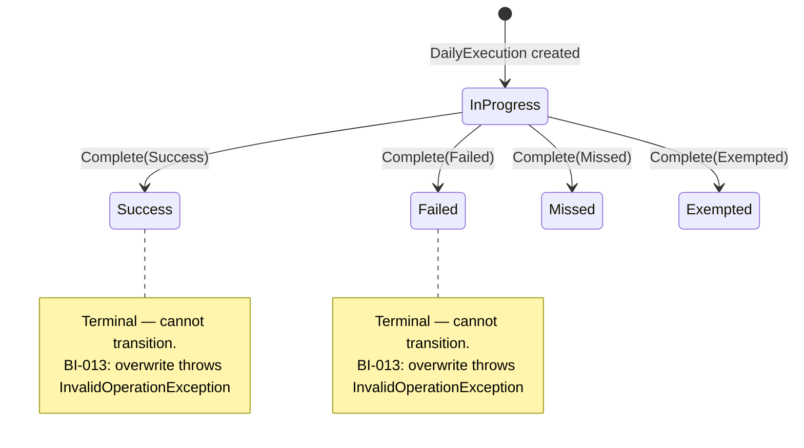

# Code Review: BrokerageMonitor.Domain

**Reviewer**: Chief Software Architect (GitHub Copilot)
**Date**: 2026-04-20 (Updated after `arch` branch merge)
**Scope**: `src/BrokerageMonitor.Domain` — Aggregates, ValueObjects, Events, Repositories
**Application Layer**: `src/BrokerageMonitor.Application` reviewed for Domain interaction correctness

---

## 🔄 Re-Review Summary (post `arch` merge)

| Violation | Status | Notes |
|-----------|--------|-------|
| 🔴 V-01 `SetMaintenanceModeAsync` bypasses domain | **⚠️ STILL OPEN** | Dead API — never called, but still declared & implemented with a hardcoded BI-009 violation |
| 🟠 V-02 `AuditLogEntry`/`ExecutionHistoryEntry` in `Repositories/` | **⚠️ STILL OPEN** | Unchanged |
| 🟠 V-03 `AlertRecord.Acknowledge()` re-acknowledgement | **⚠️ STILL OPEN** | Plus new compound issue: `AcknowledgeBySystemAsync` bypasses aggregate entirely |
| 🟠 V-04 `int.Parse` in cron parser | **⚠️ STILL OPEN** | Unchanged |
| ✅ `ToggleMaintenanceModeHandler` uses correct aggregate path | **RESOLVED** | Correctly calls `ActivateMaintenance` / `DeactivateMaintenance` + `UpsertAsync` |

---

---

## 📊 Architecture Health Score: **8.5 / 10**

The Domain layer demonstrates strong DDD discipline. Aggregates are rich with enforced invariants, value objects are immutable with proper equality, and repository interfaces correctly maintain the Dependency Inversion Principle. The primary deductions come from a leaked persistence method on a repository interface, misplaced read-model types, and a few resilience gaps.

---

## ✅ Architectural Strengths

### 1. Pure Domain — Zero Infrastructure Leakage
`BrokerageMonitor.Domain.csproj` has no `<PackageReference>` entries. The domain is a pure .NET 8 class library with no ORM, no serialization framework, and no IoC container dependencies — a textbook Clean Architecture inner layer.

### 2. Rich Aggregates with Enforced Invariants
Every aggregate enforces business rules in its constructor and mutation methods. Business identifiers (`FR-`, `BI-`) are cited inline, making traceability from code to requirements trivial.

```csharp
// HealthMonitorDefinition — BI-014 enforced at construction AND mutation
if (watchedList.Count == 0)
    throw new ArgumentException("WatchedComponents must not be empty (BI-014).", ...);
```

### 3. Correct Terminal-State Guard in `DailyExecution`
`BI-013` ("once terminal, cannot be overwritten") is enforced by the domain itself — not delegated to the repository or application layer.

```csharp
if (IsTerminal)
    throw new InvalidOperationException($"... already in terminal state '{Status}' (BI-013).");
```

### 4. Domain Events as Immutable Records
All 14 domain events are `sealed record` types implementing `IDomainEvent`. The pattern is consistent, carries the `OccurredAt` timestamp, and is free of behaviour — purely data carriers. ✅

### 5. Encapsulated Collections
All aggregates expose `IReadOnlyList<T>` views backed by private `List<T>` fields. External callers cannot mutate internal state.

### 6. Regex DoS Protection in `EmailAddress`
The compiled regex includes a 100 ms timeout — a subtle but important safety net against malicious input causing catastrophic backtracking.

```csharp
new Regex(@"^[^@\s]+@[^@\s]+\.[^@\s]+$",
    RegexOptions.Compiled | RegexOptions.IgnoreCase,
    TimeSpan.FromMilliseconds(100));
```

### 7. Repository Interfaces in Domain (DIP)
All `IXxxRepository` interfaces live in `BrokerageMonitor.Domain.Repositories`, keeping the dependency arrow pointing inward. Infrastructure implements; Domain contracts.

---

## ⚠️ Critical Violations

### 🔴 V-01 — `SetMaintenanceModeAsync` is a Dead, Dangerous API *(STILL OPEN)*

**Files**: `Repositories/IMonitoredSystemRepository.cs:10`, `Infrastructure/.../MonitoredSystemRepository.cs:68`

**Good news**: `ToggleMaintenanceModeHandler` correctly calls `system.ActivateMaintenance(operatorName)` / `system.DeactivateMaintenance(operatorName)` + `UpsertAsync` — the happy path is correct. ✅

**Bad news**: `SetMaintenanceModeAsync` still exists on the interface and infrastructure, is never called, and its implementation contains a **hardcoded BI-009 violation**:

```csharp
// MonitoredSystemRepository.cs:82 — BI-009 violated: real operator replaced with "System"
Operator = active ? "System" : (string?)null,
```

Any future developer who discovers and calls this method will:
1. Bypass `ActivateMaintenance()` / `DeactivateMaintenance()` domain guards
2. Record `"System"` as the operator name — a direct BI-009 violation
3. Leave `MaintenanceOperator = null` on deactivation, inconsistent with aggregate state

**Impact**: Guaranteed BI-009 violation if ever called. Should be removed.

---

### 🟠 V-02 — `AuditLogEntry` and `ExecutionHistoryEntry` Misplaced in `Repositories/` *(STILL OPEN)*

**Files**: `Repositories/AuditLogEntry.cs`, `Repositories/ExecutionHistoryEntry.cs`

These are **read model projections** / **query result shapes** — not repository abstractions. Unchanged since initial review.

**Correct location**: `BrokerageMonitor.Domain.ReadModels/` or a dedicated `Projections/` folder.

---

### 🟠 V-03 — `AlertRecord` Acknowledgement Has Two Compounding Issues *(STILL OPEN)*

**Files**: `Aggregates/AlertRecord.cs:61`, `Repositories/IAlertRecordRepository.cs:10`, `Infrastructure/.../AlertRecordRepository.cs:58`

**Issue A — Domain still has no re-acknowledgement guard** (unchanged):

```csharp
public void Acknowledge(string operatorName, DateTimeOffset acknowledgedAt)
{
    // no IsAcknowledged check — silently overwrites AcknowledgedBy
    AcknowledgedBy = operatorName;
    AcknowledgedAt = acknowledgedAt;
    IsGlobalFlagActive = false;
}
```

**Issue B (NEW) — `AcknowledgeAlertHandler` bypasses the aggregate entirely**:

`AcknowledgeAlertHandler` calls `_alertRepository.AcknowledgeBySystemAsync()` directly. The implementation issues a raw bulk `UPDATE` to the DB with no aggregate loaded:

```csharp
// AlertRecordRepository.cs:61 — domain aggregate never touched
UPDATE AlertRecords
SET IsGlobalFlagActive = 0, AcknowledgedBy = @OperatorName, AcknowledgedAt = @Now
WHERE SystemId = @SystemId AND IsGlobalFlagActive = 1;
```

This means:
- All business logic in `AlertRecord.Acknowledge()` is completely bypassed
- `MapToDomain` in `AlertRecordRepository` calls `alert.Acknowledge()` **during Dapper rehydration** of already-acknowledged rows — if an idempotency guard is ever added to the domain, this materialization breaks silently

**Impact**: Persistent domain bypass pattern. If `Acknowledge()` ever gains richer logic (e.g., validation, event raising), it will be silently skipped in production.

---

### 🟠 V-04 — `MatchesCron` Uses Bare `int.Parse` (FormatException Risk) *(STILL OPEN)*

**File**: `ValueObjects/HealthRuleSchedule.cs`, line 66

```csharp
var rangeStart = stepParts[0] == "*" ? min : int.Parse(stepParts[0]);
```

A malformed cron expression (e.g., `"*/abc 0 * * *"`) causes an unhandled `FormatException` at runtime. Domain value object constructors validate the *presence* of a cron expression but not its *structure*, so this can explode inside `IsMatch()`.

---

## 💡 Refactoring Suggestions

| # | Issue | Recommendation |
|---|-------|----------------|
| S-01 | `SetMaintenanceModeAsync` bypasses domain | **Remove** from `IMonitoredSystemRepository` and its Infrastructure implementation entirely. `ToggleMaintenanceModeHandler` already uses the correct path. |
| S-02 | `AuditLogEntry` / `ExecutionHistoryEntry` in wrong namespace | Move to `BrokerageMonitor.Domain.ReadModels/`. |
| S-03 | `AlertRecord` double-acknowledgement | Add `if (IsAcknowledged) throw new InvalidOperationException(...)` guard. |
| S-04 | `int.Parse` in cron parser | Replace with `int.TryParse`; return `false` on parse failure. |
| S-05 | `DateTimeOffset.UtcNow` in aggregate constructors | Inject via constructor parameter or `.NET 8 TimeProvider` to enable deterministic unit tests. |
| S-06 | Unbounded `GetAllAsync` / `GetHistoryAsync` | Add `int skip, int take` or a `DateTimeOffset? after` cursor parameter to `INotificationInboxRepository.GetAllAsync` and `IAlertRecordRepository.GetHistoryAsync`. |
| S-07 | Value objects missing `IEquatable<T>` | Implement `IEquatable<T>` on all value objects (see S-07 example below). |
| S-08 | `MarketSessionWindow` rejects overnight windows | Support cross-midnight sessions by treating `endTime < startTime` as an overnight window. |
| S-09 | `ComponentState` in `Aggregates/` folder | Move to `Entities/` or document it explicitly as a standalone entity, not an Aggregate Root. |
| S-10 | `MailParsingRule.GetHashCode` omits keywords | Include keyword content in the hash to reduce collisions. |

---

## 📝 Implementation Examples

### Before / After — V-01: Removing `SetMaintenanceModeAsync`

**Before** (Current — leaks persistence concern into repository contract):

```csharp
// IMonitoredSystemRepository.cs
Task SetMaintenanceModeAsync(string systemId, bool active, CancellationToken ct = default);

// Infrastructure implementation writes directly to DB, bypassing domain
public async Task SetMaintenanceModeAsync(string systemId, bool active, CancellationToken ct)
{
    await _db.ExecuteAsync(
        "UPDATE Systems SET IsMaintenanceActive = @Active WHERE SystemId = @Id",
        new { Active = active, Id = systemId });
}
```

**After** (Correct — Application layer orchestrates, domain enforces):

```csharp
// IMonitoredSystemRepository.cs — method removed entirely

// Application/Commands/ActivateMaintenanceCommandHandler.cs
public sealed class ActivateMaintenanceCommandHandler(
    IMonitoredSystemRepository repo,
    IEventPublisher events)
{
    public async Task HandleAsync(ActivateMaintenanceCommand cmd, CancellationToken ct)
    {
        var system = await repo.GetByIdAsync(cmd.SystemId, ct)
            ?? throw new NotFoundException(cmd.SystemId);

        system.ActivateMaintenance(cmd.OperatorName); // BI-009 enforced here

        await repo.UpsertAsync(system, ct);
        await events.PublishAsync(new MaintenanceModeToggled(
            system.SystemId, true, cmd.OperatorName, DateTimeOffset.UtcNow), ct);
    }
}
```

---

### Before / After — V-03: Idempotent `Acknowledge`

**Before**:
```csharp
public void Acknowledge(string operatorName, DateTimeOffset acknowledgedAt)
{
    if (string.IsNullOrWhiteSpace(operatorName))
        throw new ArgumentException("OperatorName is required (BI-009).", nameof(operatorName));

    AcknowledgedBy = operatorName;  // silently overwrites
    AcknowledgedAt = acknowledgedAt;
    IsGlobalFlagActive = false;
}
```

**After**:
```csharp
public void Acknowledge(string operatorName, DateTimeOffset acknowledgedAt)
{
    if (string.IsNullOrWhiteSpace(operatorName))
        throw new ArgumentException("OperatorName is required (BI-009).", nameof(operatorName));

    if (IsAcknowledged)
        throw new InvalidOperationException(
            $"Alert '{AlertId}' is already acknowledged by '{AcknowledgedBy}'.");

    AcknowledgedBy = operatorName;
    AcknowledgedAt = acknowledgedAt;
    IsGlobalFlagActive = false;
}
```

---

### Before / After — V-04: Safe Cron Field Parsing

**Before**:
```csharp
var rangeStart = stepParts[0] == "*" ? min : int.Parse(stepParts[0]); // throws FormatException
```

**After**:
```csharp
var rangeStart = stepParts[0] == "*"
    ? min
    : int.TryParse(stepParts[0], out var parsed) ? parsed : (int?)null;

if (rangeStart is null) continue; // skip malformed field — safe degradation
```

---

### Before / After — S-07: Value Object `IEquatable<T>`

**Before** (`EmailAddress`):
```csharp
public override bool Equals(object? obj) =>
    obj is EmailAddress other && Value == other.Value;
```

**After** (modern C# pattern):
```csharp
public sealed class EmailAddress : IEquatable<EmailAddress>
{
    // ...

    public bool Equals(EmailAddress? other) =>
        other is not null && Value == other.Value;

    public override bool Equals(object? obj) => Equals(obj as EmailAddress);

    public override int GetHashCode() => Value.GetHashCode();

    public static bool operator ==(EmailAddress? left, EmailAddress? right) =>
        left?.Equals(right) ?? right is null;

    public static bool operator !=(EmailAddress? left, EmailAddress? right) => !(left == right);
}
```

---

## Domain Layer Structure

```mermaid
%% Domain Layer — Aggregate & Value Object Relationships
classDiagram
    class MonitoredSystem {
        <<AggregateRoot>>
        +string SystemId
        +string Name
        +bool IsMaintenanceActive
        +ActivateMaintenance(operatorName)
        +DeactivateMaintenance(operatorName)
    }
    class MonitoredComponent {
        <<AggregateRoot>>
        +string ComponentId
        +string SystemId
        +ComponentType ComponentType
        +MailParsingRule? MailParsingRule
    }
    class HealthMonitorDefinition {
        <<AggregateRoot>>
        +Guid DefinitionId
        +string SystemId
        +TimeOnly DeadlineTime
        +SetWatchedComponents()
    }
    class DailyExecution {
        <<AggregateRoot>>
        +Guid ExecutionId
        +bool IsTerminal
        +Complete(terminalStatus)
        +AddCompletedComponent(id)
    }
    class AlertRecord {
        <<AggregateRoot>>
        +Guid AlertId
        +bool IsAcknowledged
        +Acknowledge(operatorName, at)
    }
    class ComponentState {
        <<Entity>>
        +string ComponentId
        +ComponentStatus Status
        +UpdateStatus(newStatus, at)
    }
    class MarketSessionWindow {
        <<ValueObject>>
        +TimeOnly StartTime
        +TimeOnly EndTime
        +IsWithinSession(time)
    }
    class MailParsingRule {
        <<ValueObject>>
        +string FromPattern
        +IReadOnlyList SuccessKeywords
        +IReadOnlyList FailureKeywords
    }
    class HealthRuleSchedule {
        <<ValueObject>>
        +ScheduleType ScheduleType
        +IsMatch(date)
    }
    class IDomainEvent {
        <<interface>>
        +DateTimeOffset OccurredAt
    }

    MonitoredSystem o-- MarketSessionWindow : "has"
    MonitoredComponent o-- MailParsingRule : "optional"
    HealthMonitorDefinition o-- HealthRuleSchedule : "has"
    HealthMonitorDefinition o-- DailyExecution : "produces"
    AlertRecord ..> ComponentState : "triggered by status"
    AlertTriggered ..|> IDomainEvent : "implements"
    ComponentStatusChanged ..|> IDomainEvent : "implements"
    DailyExecutionCompleted ..|> IDomainEvent : "implements"
```



> **Design Intent**: Aggregates are shown as self-contained roots with their value objects. `ComponentState` is deliberately separated as an entity (hot data, upserted independently) rather than a child of `MonitoredComponent`. Domain events implement `IDomainEvent` as a cross-cutting contract with no coupling to aggregates.

---

## `DailyExecution` Status State Machine



> **Design Intent**: The state machine makes the terminal guard (BI-013) visually explicit. Once any terminal state is reached, the aggregate enforces immutability by throwing rather than silently ignoring transitions.
