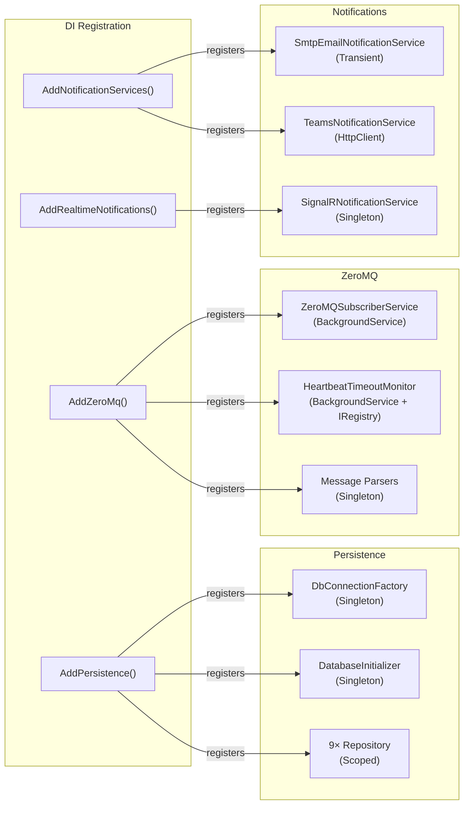

# BrokerageMonitor.Infrastructure — Architecture Review

> **Reviewer**: Chief Software Architect
> **Date**: 2026-04-25 _(previous: 2026-04-24)_
> **Layer**: Infrastructure (depends on Domain + Application)

### Δ Changes Since Previous Review

| #   | Issue                                                          | Status                                     |
| --- | -------------------------------------------------------------- | ------------------------------------------ |
| 1   | Reflection-based domain mutation in `DailyExecutionRepository` | ✅ **FIXED** (previous review)              |
| 2   | `SmtpClient` deprecated                                        | ✅ **FIXED** — replaced with MailKit        |
| 3   | Fire-and-forget in `OnTimerFired` — `CancellationToken.None`   | ✅ **IMPROVED** — now uses `_stoppingToken` |
| 4   | Inconsistent `IDbConnection` open state                        | 🟡 **STILL OPEN**                           |
| —   | Fire-and-forget still silently swallows exceptions             | 🟡 **NEW (minor)**                          |
| —   | `SmtpEmailNotificationService` registered as `Transient`       | 🟡 **STILL OPEN**                           |

---

## 📊 Architecture Health Score: 8.0 / 10

The Infrastructure layer is in good shape. `MailKit` replaces the deprecated `SmtpClient`, `HeartbeatTimeoutMonitor.OnTimerFired` now propagates the shutdown token, the `Rehydrate()` pattern eliminates all reflection-based domain mutation, and all repositories use parameterized queries. Two minor concerns remain: the fire-and-forget task in `OnTimerFired` still silently discards exceptions (the `_stoppingToken` fix is an improvement but not a complete resolution), and the `Transient` lifetime for `SmtpEmailNotificationService` allocates a new TCP connection per email.

---

## ✅ Architectural Strengths

1. **Parameterized Queries via `CommandDefinition`** — All repositories use Dapper's `CommandDefinition` with anonymous objects rather than string interpolation. No SQL injection vectors identified.

2. **Transaction Scoping in `HealthMonitorDefinitionRepository`** — Both `UpsertAsync` (main row + junction table) and `DeleteAsync` (cascade delete) are wrapped in explicit `BeginTransaction` / `Commit` / `Rollback` blocks, ensuring atomicity.

3. **`[DisallowConcurrentExecution]` on Quartz Jobs** — `DataRetentionJob` and `AggregateHealthEvaluationJob` both carry this attribute, preventing overlapping executions that could cause double-deletes or double-evaluations.

4. **Exponential Backoff in `ZeroMQSubscriberService`** — Reconnection delay doubles from 1 s up to a 60 s ceiling, preventing thundering-herd reconnect storms after broker restarts.

5. **HTML Encoding in Email Templates** — `SmtpEmailNotificationService.Encode()` calls `WebUtility.HtmlEncode()` on all user-controlled values before embedding them in HTML bodies, preventing XSS in email clients.

6. **`HeartbeatTimeoutMonitor` Dual-Role Pattern** — Implementing both `BackgroundService` and `IHeartbeatTimerRegistry` on the same class, with registration forwarding via `AddSingleton<IHeartbeatTimerRegistry>(sp => sp.GetRequiredService<HeartbeatTimeoutMonitor>())`, ensures a single instance is shared across DI resolution paths without lifetime mismatch.

7. **Batch Component Loading in `HealthMonitorDefinitionRepository`** — `BuildDefinitionsAsync` loads all junction rows in a single `IN @Ids` query rather than N individual queries.

---

## ⚠️ Critical Violations

### 1. ✅ ~~Reflection-Based Domain Object Mutation in `DailyExecutionRepository`~~ — FIXED

A `DailyExecution.Rehydrate()` static factory method has been added to the domain aggregate, allowing `DailyExecutionRepository.MapToDomain()` to reconstitute the object without bypassing encapsulation:

```csharp
// DailyExecution.cs (new)
public static DailyExecution Rehydrate(
    Guid executionId, Guid definitionId, string systemId,
    DateOnly executionDate, DailyExecutionStatus status,
    DateTimeOffset createdAt, DateTimeOffset? evaluatedAt,
    IEnumerable<string>? completedComponents,
    IEnumerable<string>? failedComponents,
    string? missedReason, DateTimeOffset? notificationSentAt) { ... }

// DailyExecutionRepository.cs (updated)
private static DailyExecution MapToDomain(DailyExecutionRow row)
    => DailyExecution.Rehydrate(
        executionId: Guid.Parse(row.ExecutionId),
        ...); // ✅ No reflection
```

---

## ✅ Architectural Strengths

1. **Parameterized Queries via `CommandDefinition`** — All repositories use Dapper's `CommandDefinition` with anonymous objects. No SQL injection vectors identified.

2. **Transaction Scoping in `HealthMonitorDefinitionRepository`** — `UpsertAsync` and `DeleteAsync` are wrapped in explicit `BeginTransaction` / `Commit` / `Rollback` blocks.

3. **`[DisallowConcurrentExecution]` on Quartz Jobs** — `DataRetentionJob` and `AggregateHealthEvaluationJob` prevent overlapping executions.

4. **Exponential Backoff in `ZeroMQSubscriberService`** — Reconnection delay doubles from 1 s to a 60 s ceiling.

5. **HTML Encoding in Email Templates** — `Encode()` calls `WebUtility.HtmlEncode()` on all user-controlled values — no XSS in email clients.

6. **`MailKit` Replaces Deprecated `SmtpClient`** — `SmtpEmailNotificationService` now uses `MailKit.Net.Smtp.SmtpClient` + `MimeMessage`, eliminating the `[Obsolete]` warning and enabling modern TLS/OAuth flows.

7. **`HeartbeatTimeoutMonitor` Dual-Role Pattern** — A single instance shared across DI via `AddSingleton` forwarding, with `_stoppingToken` captured from `ExecuteAsync` so timer callbacks respect graceful shutdown.

8. **`Rehydrate()` Factory Eliminates All Reflection** — `DailyExecution.Rehydrate()` and `ComponentState.Rehydrate()` are used by all repositories — no `SetPrivateProperty` or `AppendToPrivateList` reflection helpers remain.

---

## ⚠️ Remaining Violations

### 1. `HeartbeatTimeoutMonitor.OnTimerFired` Still Silently Swallows Exceptions

`_stoppingToken` is now correctly passed, but the task result is still discarded:

```csharp
private void OnTimerFired(object? state)
{
    _ = Task.Run(
        () => RaiseComponentLostAsync(entry, _stoppingToken),
        _stoppingToken);
    // ❌ Any exception thrown by RaiseComponentLostAsync is silently swallowed
}
```

**Impact**: If `IDomainEventDispatcher.DispatchAsync` throws (e.g., `ObjectDisposedException` on shutdown), the failure is never logged. A component-lost event may be silently dropped.

---

### 2. Inconsistent `IDbConnection` Open State Across Repositories

Some repositories call `conn.Open()` explicitly; others rely on Dapper's lazy-open. Harmless today but signals the absence of a documented convention.

---

### 3. `SmtpEmailNotificationService` Registered as `Transient`

A new `MailKit.SmtpClient` TCP connection is allocated per email send. Under an alert burst, this creates connection overhead. `Scoped` or a `Singleton` with proper connection management would be more efficient.

---

## 💡 Refactoring Suggestions

1. **Add exception logging inside the `Task.Run` lambda** — Wrap `RaiseComponentLostAsync` in a `try/catch` that logs at `Error` level. Swallowing `OperationCanceledException` from `_stoppingToken` is acceptable; all other exceptions should be logged.

2. **Standardize connection opening** — Choose one convention (always explicit `conn.Open()` or always lazy-open) and document it with a comment in `IDbConnectionFactory`. Consistency prevents confusion in code reviews.

3. **Consider `Scoped` for `SmtpEmailNotificationService`** — A scoped lifetime amortizes connection cost across a single request/job unit, which is sufficient for the alert use-case.

---

## 📝 Implementation Example

### Before — Fire-and-Forget Without Exception Handling

```csharp
private void OnTimerFired(object? state)
{
    _ = Task.Run(
        () => RaiseComponentLostAsync(entry, _stoppingToken),
        _stoppingToken);
}
```

### After — Fire-and-Forget With Logged Exception

```csharp
private void OnTimerFired(object? state)
{
    if (state is not TimerEntry entry) return;

    _ = Task.Run(async () =>
    {
        try
        {
            await RaiseComponentLostAsync(entry, _stoppingToken).ConfigureAwait(false);
        }
        catch (OperationCanceledException)
        {
            // Expected during host shutdown — no action required.
        }
        catch (Exception ex)
        {
            _logger.LogError(ex,
                "HeartbeatTimeoutMonitor: unhandled exception raising ComponentLost for {ComponentId}.",
                entry.ComponentId);
        }
    }, _stoppingToken);
}
```

---

A new `SmtpClient` instance (and its underlying TCP state) is allocated for every email send. The `using` ensures disposal, but for high-frequency scenarios (rapid alerts) this is wasteful. The Application layer's `TryAddSingleton` stub is already overridden by this `AddTransient`, so the lifetime choice is uncontested but suboptimal.

---

## 💡 Refactoring Suggestions

1. **Add a private rehydration constructor to `DailyExecution`** — Like the existing Dapper constructors on other aggregates, add a `private` constructor that accepts all persisted state directly. Remove `SetPrivateProperty` and `AppendToPrivateList` reflection helpers.

2. **Replace `SmtpClient` with `MailKit`** — Add `MailKit` NuGet package, create `MailKitEmailService`, and register it in place of `SmtpEmailNotificationService`.

3. **Capture a `CancellationToken` for shutdown in `OnTimerFired`** — Store the `ExecuteAsync` `stoppingToken` on the class. Pass it (or a linked token) to `RaiseComponentLostAsync`. Guard with `if (stoppingToken.IsCancellationRequested) return`.

4. **Standardize connection opening** — Decide on one convention: either always call `conn.Open()` explicitly in the repository, or never call it (rely on Dapper). Document the convention in `IDbConnectionFactory`.

---

## 📝 Implementation Examples

### Before — Reflection Hack in `DailyExecutionRepository`

```csharp
// DailyExecutionRepository.cs (current)
var execution = new DailyExecution(
    Guid.Parse(row.ExecutionId), ...,
    DailyExecutionStatus.InProgress,  // forced initial, then overwritten
    row.MissedReason);

SetPrivateProperty(execution, "CreatedAt",
    DateTimeOffset.Parse(row.CreatedAt)); // ❌ reflection

SetPrivateProperty(execution, "Status", status); // ❌ reflection
AppendToPrivateList<string>(execution, "_completedComponents", items); // ❌ reflection
```

### After — Private Rehydration Constructor on Aggregate

```csharp
// DailyExecution.cs (proposed addition)
// Private constructor for Dapper/repository rehydration
private DailyExecution(
    Guid executionId,
    Guid definitionId,
    string systemId,
    DateOnly executionDate,
    DateTimeOffset createdAt,
    DailyExecutionStatus status,
    DateTimeOffset? evaluatedAt,
    DateTimeOffset? notificationSentAt,
    string? missedReason,
    IEnumerable<string> completedComponents,
    IEnumerable<string> failedComponents)
{
    ExecutionId = executionId;
    DefinitionId = definitionId;
    SystemId = systemId;
    ExecutionDate = executionDate;
    CreatedAt = createdAt;
    Status = status;
    EvaluatedAt = evaluatedAt;
    NotificationSentAt = notificationSentAt;
    MissedReason = missedReason;
    _completedComponents.AddRange(completedComponents);
    _failedComponents.AddRange(failedComponents);
}

// DailyExecutionRepository.cs (proposed)
private static DailyExecution MapToDomain(DailyExecutionRow row) =>
    // Uses the new private constructor — no reflection needed ✅
    DailyExecution.Rehydrate(
        Guid.Parse(row.ExecutionId),
        Guid.Parse(row.DefinitionId),
        row.SystemId,
        DateOnly.Parse(row.ExecutionDate),
        DateTimeOffset.Parse(row.CreatedAt),
        Enum.Parse<DailyExecutionStatus>(row.Status),
        row.EvaluatedAt is not null ? DateTimeOffset.Parse(row.EvaluatedAt) : null,
        row.NotificationSentAt is not null ? DateTimeOffset.Parse(row.NotificationSentAt) : null,
        row.MissedReason,
        row.CompletedComponentsJson is not null
            ? JsonSerializer.Deserialize<string[]>(row.CompletedComponentsJson) ?? []
            : [],
        row.FailedComponentsJson is not null
            ? JsonSerializer.Deserialize<string[]>(row.FailedComponentsJson) ?? []
            : []);
```

---

### Before — Fire-and-Forget Timer Callback

```csharp
// HeartbeatTimeoutMonitor.cs (current)
private void OnTimerFired(object? state)
{
    _ = RaiseComponentLostAsync(entry, CancellationToken.None); // ❌
}
```

### After — Tracked with Shutdown Awareness

```csharp
// HeartbeatTimeoutMonitor.cs (proposed)
private CancellationToken _stoppingToken;

protected override async Task ExecuteAsync(CancellationToken stoppingToken)
{
    _stoppingToken = stoppingToken; // ✅ stored for timer callbacks
    await LoadComponentsAsync(stoppingToken).ConfigureAwait(false);
    await Task.Delay(Timeout.Infinite, stoppingToken)
              .ConfigureAwait(ConfigureAwaitOptions.SuppressThrowing);
    foreach (var entry in _timers.Values) entry.Timer?.Dispose();
    _timers.Clear();
}

private void OnTimerFired(object? state)
{
    if (state is not TimerEntry entry) return;
    if (_stoppingToken.IsCancellationRequested) return; // ✅ respect shutdown

    // Track the task to allow structured error handling
    _ = RaiseComponentLostAsync(entry, _stoppingToken)
        .ContinueWith(t =>
            _logger.LogError(t.Exception, "RaiseComponentLostAsync faulted."),
            TaskContinuationOptions.OnlyOnFaulted); // ✅ faults are not silently swallowed
}
```

---



> **Design Intent**: Infrastructure is decomposed into four independently callable extension methods (`AddPersistence`, `AddZeroMq`, `AddNotificationServices`, `AddRealtimeNotifications`), each registering a cohesive group of services. This allows test hosts to mix real and stub implementations at the group level.
