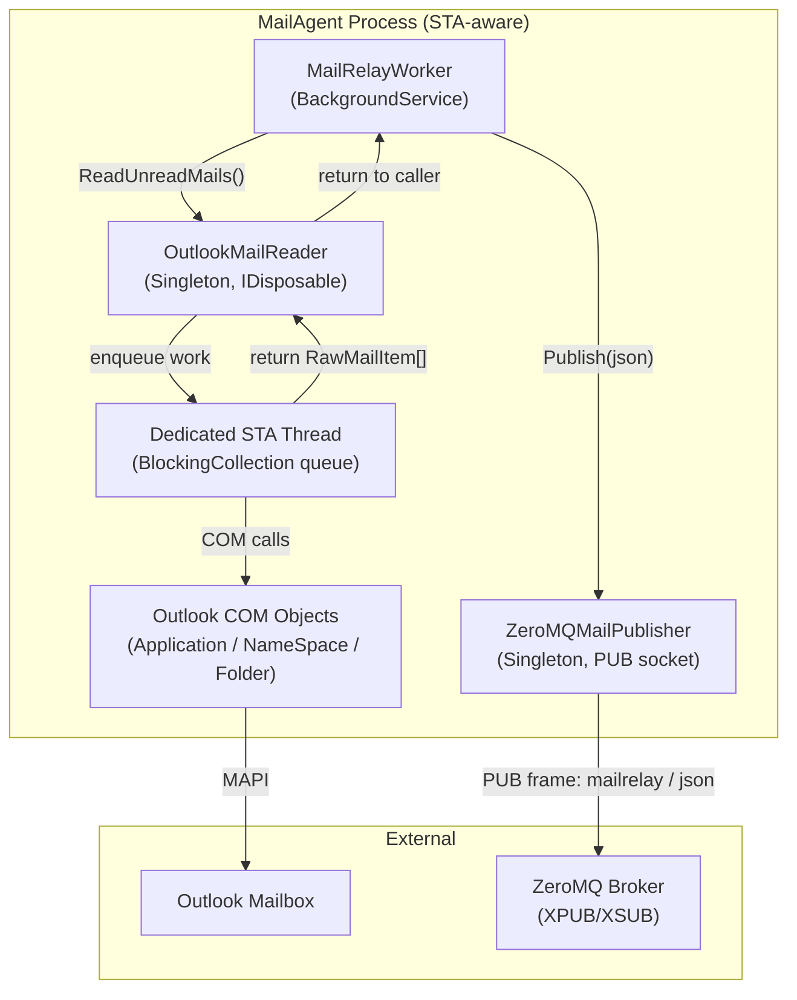

# BrokerageMonitor.MailAgent — Architecture Review

> **Reviewer**: Chief Software Architect
> **Date**: 2026-05-01 _(previous: 2026-04-25)_
> **Layer**: MailAgent (standalone process — no project references to Domain/Application)

### Δ Changes Since Previous Review

| #   | Issue                                                           | Status                                                                            |
| --- | --------------------------------------------------------------- | --------------------------------------------------------------------------------- |
| 1   | COM `Application` instance recreated per poll                   | ✅ **CONFIRMED FIXED** — `EnsureOutlookSession()` creates one long-lived instance  |
| 2   | Unbounded email body size in ZeroMQ frame                       | ✅ **CONFIRMED FIXED** — `TruncateBody()` caps at `MaxBodyCharacters` from options |
| 3   | Sync-over-async `GetAwaiter().GetResult()`                      | 🟡 **BY DESIGN** — STA thread requirement; acceptable                              |
| —   | `PollAndPublishAsync` returns `Task.CompletedTask` (fake async) | 🟡 **BY DESIGN** — synchronous I/O path; acceptable given COM interop constraints  |

---

## 📊 Architecture Health Score: 9.0 / 10

No changes since the 2026-04-25 review. Source code confirms all previously reported fixes are in place: `EnsureOutlookSession()` correctly guards the long-lived `_outlookApp` / `_outlookNs` pair with a null-check (`if (_outlookApp is not null && _outlookNs is not null) return;`), and `TruncateBody()` enforces the `MaxBodyCharacters` cap from `MailAgentOptions`. No new violations identified.

---

## ✅ Architectural Strengths

1. **Process Isolation** — The MailAgent is a fully independent `net8.0-windows` executable. It communicates with the main application exclusively via ZeroMQ (`mailrelay` topic), enforcing a hard process boundary. Changes to Domain or Application models cannot break this agent.

2. **STA Thread Architecture for COM Interop** — `OutlookMailReader` creates a dedicated `Thread` with `ApartmentState.STA` and routes all Outlook COM calls through a `BlockingCollection<Action>` work queue. This is the correct pattern for Outlook COM interop in a hosted service, preventing `COMException` from multi-threaded access.

3. **COM Object Cleanup** — Every Outlook COM object (`Application`, `NameSpace`, `MAPIFolder`, `Items`, `MailItem`) is released via `Marshal.ReleaseComObject()` in `finally` blocks or within the processing loop, preventing COM reference leaks.

4. **`PeriodicTimer` for Polling** — `MailRelayWorker` uses `PeriodicTimer` (the modern .NET 6+ alternative to `Timer`), which correctly skips missed ticks rather than queuing them up, and integrates cleanly with `CancellationToken` for graceful shutdown.

5. **Bounded `BlockingCollection`** — The STA work queue has `boundedCapacity: 64`, preventing unbounded memory growth if the polling loop produces work faster than the STA thread can consume it.

6. **`IDisposable` Guarded with `ObjectDisposedException.ThrowIf`** — `OutlookMailReader.ReadUnreadMails()` and `ZeroMQMailPublisher.Publish()` both guard against post-dispose usage.

7. **PUB Socket Reconnection** — `ZeroMQMailPublisher` disposes a broken socket and re-creates it on the next `Publish()` call, ensuring the agent self-heals after broker disconnections.

---

## ✅ No Open Critical Violations

All previously-reported violations are resolved or accepted as by-design.

### 1. ✅ ~~New Outlook `Application` Instance Per Poll~~ — FULLY RESOLVED (CONFIRMED)

`OutlookMailReader.EnsureOutlookSession()` creates the `MSOutlook.Application` and `MSOutlook.NameSpace` objects exactly once per process lifetime and caches them in `_outlookApp` / `_outlookNs` fields. Subsequent calls are no-ops:

```csharp
// OutlookMailReader.cs — current (confirmed in 2026-05-01 review)
private void EnsureOutlookSession()
{
    if (_outlookApp is not null && _outlookNs is not null)
        return;   // ✅ reuses existing session

    _outlookApp = new MSOutlook.Application();
    _outlookNs  = _outlookApp.GetNamespace("MAPI");
    _outlookNs.Logon(Missing.Value, Missing.Value, false, false);
}
```

On any COM exception, `ReleaseOutlookSession()` tears down the cached pair so the next poll attempt starts fresh with a new session.

---

### 2. Sync-Over-Async `GetAwaiter().GetResult()` — By Design

```csharp
public IReadOnlyList<RawMailItem> ReadUnreadMails()
{
    // ...
    return tcs.Task.GetAwaiter().GetResult(); // 🟡 blocks calling thread
}
```

Blocking the caller is a deliberate consequence of the STA work queue pattern. **Cancellation from the caller cannot propagate** into the STA work item — acknowledged limitation.

---

### 3. ✅ ~~Unbounded Email Body in ZeroMQ Frame~~ — FULLY RESOLVED (CONFIRMED)

`MailRelayWorker.TruncateBody()` enforces a configurable `MaxBodyCharacters` cap from `MailAgentOptions` before serializing the `MailRelayMessage`:

```csharp
// MailRelayWorker.cs — current (confirmed)
Body: TruncateBody(mail.Body),   // ✅ bounded by MaxBodyCharacters option
```

---

### 4. `MailRelayWorker.PollAndPublishAsync` — Fake Async (By Design)

```csharp
private Task PollAndPublishAsync(CancellationToken ct)
{
    // synchronous ReadUnreadMails() + synchronous Publish()
    return Task.CompletedTask;   // 🟡 pretends to be async
}
```

The method returns `Task` but has no `await` points. This is an acknowledged consequence of the synchronous COM interop path; the `ct.ThrowIfCancellationRequested()` inside the loop provides the only cancellation point.

---

## 💡 Refactoring Suggestions

1. **Reuse the Outlook `Application` instance** — Initialize `MSOutlook.Application` and `NameSpace` once in the `OutlookMailReader` constructor (on the STA thread), keep them alive, and dispose them in `Dispose()`. Call `Logon` once at startup and `Logoff` only at shutdown.

2. **Make `ReadUnreadMails` truly async or return `ValueTask`** — Accept a `CancellationToken` and link it to the `TaskCompletionSource`. The STA thread should call `tcs.TrySetCanceled(ct)` if the token fires.

3. **Truncate email body before publishing** — Apply a maximum body length (e.g., 64 KB) and truncate with an indicator, or hash the full body and store only a preview.

4. **Convert `PollAndPublishAsync` return type to `void` or make it genuinely async** — If publish is synchronous, rename to `PollAndPublish()`. If publish is to become async (e.g., fire-and-forget queue), implement accordingly.

---

## 📝 Implementation Examples

### Before — New COM Instance Per Poll

```csharp
// OutlookMailReader.cs (current)
private IReadOnlyList<RawMailItem> ReadUnreadMailsOnSta()
{
    MSOutlook.Application? app = null;
    MSOutlook.NameSpace? ns = null;
    try
    {
        app = new MSOutlook.Application();     // ❌ per-poll
        ns = app.GetNamespace("MAPI");
        ns.Logon(...);                          // ❌ per-poll
```

### After — Single Lifetime COM Instance

```csharp
// OutlookMailReader.cs (proposed)
private MSOutlook.Application? _app;
private MSOutlook.NameSpace? _ns;

// Called once on the STA thread during initialization:
private void InitializeOutlookOnSta()
{
    _app = new MSOutlook.Application();   // ✅ once
    _ns  = _app.GetNamespace("MAPI");
    _ns.Logon(Missing.Value, Missing.Value, false, false); // ✅ once
    _logger.LogInformation("Outlook session initialized.");
}

private IReadOnlyList<RawMailItem> ReadUnreadMailsOnSta()
{
    if (_app is null) InitializeOutlookOnSta();
    // use _ns directly — no logon/logoff cycle ✅
}

public void Dispose()
{
    // Queue logoff to the STA thread
    _workQueue.Add(() =>
    {
        if (_ns is not null) { try { _ns.Logoff(); } catch { } }
        ReleaseIfNotNull(_ns);
        ReleaseIfNotNull(_app);
    });
    _workQueue.CompleteAdding();
    _workQueue.Dispose();
    _disposed = true;
}
```

---

### Before — Unbounded Body

```csharp
var message = new MailRelayMessage(..., Body: mail.Body, ...); // ❌ uncapped size
```

### After — Body Capped at 64 KB

```csharp
private const int MaxBodyBytes = 65_536;

var body = mail.Body ?? string.Empty;
if (System.Text.Encoding.UTF8.GetByteCount(body) > MaxBodyBytes)
{
    body = body[..Math.Min(body.Length, 8_000)] + "\n[truncated]";
    _logger.LogWarning("Mail body truncated to stay within ZeroMQ frame limit.");
}
var message = new MailRelayMessage(..., Body: body, ...); // ✅ bounded
```

---



> **Design Intent**: All Outlook COM access is channelled through a single dedicated STA thread to satisfy Outlook's apartment model requirements. `MailRelayWorker` and `ZeroMQMailPublisher` are free-threaded; only `OutlookMailReader`'s internal implementation is STA-constrained.
