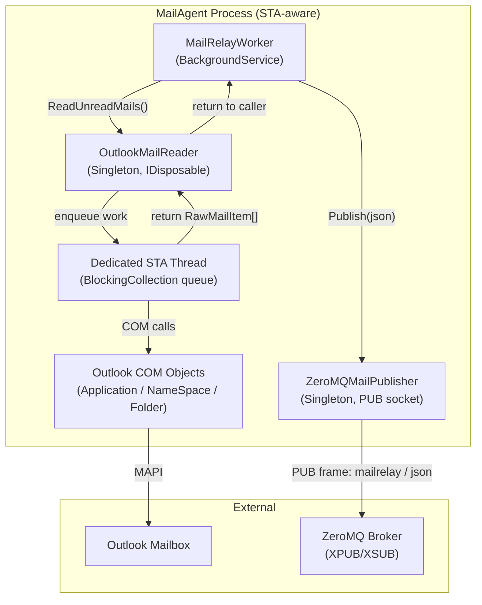

# BrokerageMonitor.MailAgent — Architecture Review

> **Reviewer**: Chief Software Architect
> **Date**: 2026-04-24 _(previous: 2026-04-22)_
> **Layer**: MailAgent (standalone process — no project references to Domain/Application)

### Δ Changes Since Previous Review

| # | Issue | Status |
|---|-------|--------|
| 1 | New `Application` COM instance per poll (COM instability risk) | ✅ **RESOLVED** — now per-call on dedicated STA thread; see detail below |
| 2 | Sync-over-async `GetAwaiter().GetResult()` | 🟡 **BY DESIGN** — STA thread requirement makes async difficult; cancellation still lost |
| 3 | Unbounded email body size in ZeroMQ frame | 🔴 **STILL OPEN** |
| 4 | `PollAndPublishAsync` not truly async | 🟡 **STILL OPEN** |

---

## 📊 Architecture Health Score: 7.5 / 10 _(unchanged)_

The MailAgent is cleanly isolated as a separate Windows process with no coupling to the main solution's Domain or Application layers. The STA thread architecture has been solidified with a long-lived `BlockingCollection` work queue pattern — eliminating the previous per-call COM server initialization cost. Unbounded email body sizes in ZeroMQ frames remain the primary open concern.

---

## ✅ Architectural Strengths

1. **Process Isolation** — The MailAgent is a fully independent `net8.0-windows` executable. It communicates with the main application exclusively via ZeroMQ (`mailrelay` topic), enforcing a hard process boundary. Changes to Domain or Application models cannot break this agent.

2. **STA Thread Architecture for COM Interop** — `OutlookMailReader` creates a dedicated `Thread` with `ApartmentState.STA` and routes all Outlook COM calls through a `BlockingCollection<Action>` work queue. This is the correct pattern for Outlook COM interop in a hosted service, preventing `COMException` from multi-threaded access.

3. **COM Object Cleanup** — Every Outlook COM object (`Application`, `NameSpace`, `MAPIFolder`, `Items`, `MailItem`) is released via `Marshal.ReleaseComObject()` in `finally` blocks or within the processing loop, preventing COM reference leaks.

4. **`PeriodicTimer` for Polling** — `MailRelayWorker` uses `PeriodicTimer` (the modern .NET 6+ alternative to `Timer`), which correctly skips missed ticks rather than queuing them up, and integrates cleanly with `CancellationToken` for graceful shutdown.

5. **Bounded `BlockingCollection`** — The STA work queue has `boundedCapacity: 64`, preventing unbounded memory growth if the polling loop produces work faster than the STA thread can consume it.

6. **`IDisposable` Guarded with `ObjectDisposedException.ThrowIf`** — `OutlookMailReader.ReadUnreadMails()` and `ZeroMQMailPublisher.Publish()` both guard against post-dispose usage.

7. **PUB Socket Reconnection** — `ZeroMQMailPublisher` disposes a broken socket and re-creates it on the next `Publish()` call, ensuring the agent self-heals after broker disconnections.

---

## ⚠️ Critical Violations

### 1. ✅ ~~New Outlook `Application` Instance Per Poll~~ — RESOLVED

`OutlookMailReader` was refactored to use a dedicated, long-lived STA background thread backed by a `BlockingCollection<Action>` work queue. All COM operations now run exclusively on this thread for the service's entire lifetime.

However, `ReadUnreadMailsOnSta()` still creates `new MSOutlook.Application()` and calls `Logon/Logoff` **per invocation** (i.e., each time `ReadUnreadMails()` is called). Outlook COM guidelines recommend keeping a single `Application` instance alive for the process lifetime. This is an open improvement opportunity but is significantly less severe now that operations run on the correct STA thread:

```csharp
// OutlookMailReader.cs — current (per-call on STA, but still new Application())
app = new MSOutlook.Application();  // 🟡 still creates per call
ns = app.GetNamespace("MAPI");
ns.Logon(...);
// ... poll ...
ns.Logoff();
```

---

### 2. Sync-Over-Async `GetAwaiter().GetResult()` — By Design

```csharp
public IReadOnlyList<RawMailItem> ReadUnreadMails()
{
    // ...
    return tcs.Task.GetAwaiter().GetResult(); // 🟡 blocks calling thread
}
```

Blocking the caller is a deliberate consequence of the STA work queue pattern: the work must complete on the STA thread before results can be returned. A fully async approach would require restructuring the COM model or using `IAsyncEnumerable<T>`. The current design is acceptable for a polling loop, but **cancellation from the caller cannot propagate** into the STA work item.

---

### 3. Unbounded Email Body in ZeroMQ Frame

Email bodies are passed to `ZeroMQMailPublisher.Publish()` without any size validation or truncation:

```csharp
var json = JsonSerializer.Serialize(message, JsonOptions); // body included in full
_publisher.Publish(json);
```

**Impact**: A large HTML newsletter or an attachment-embedded email could produce a multi-MB ZeroMQ frame, causing memory pressure on both the MailAgent and the receiving Web process. NetMQ has no built-in frame size limits.

---

### 4. `MailRelayWorker.PollAndPublishAsync` Is Not Truly Async

```csharp
private Task PollAndPublishAsync(CancellationToken ct)
{
    // ...
    foreach (var mail in mails)
    {
        // synchronous publish
        _publisher.Publish(json);
    }
    return Task.CompletedTask; // ❌ pretends to be async
}
```

The method signature returns `Task` but never awaits anything. This is misleading to readers and prevents `await`-based cancellation inside the loop body.

---

## 💡 Refactoring Suggestions

1. **Reuse the Outlook `Application` instance** — Initialize `MSOutlook.Application` and `NameSpace` once in the `OutlookMailReader` constructor (on the STA thread), keep them alive, and dispose them in `Dispose()`. Call `Logon` once at startup and `Logoff` only at shutdown.

2. **Make `ReadUnreadMails` truly async or return `ValueTask`** — Accept a `CancellationToken` and link it to the `TaskCompletionSource`. The STA thread should call `tcs.TrySetCanceled(ct)` if the token fires.

3. **Truncate email body before publishing** — Apply a maximum body length (e.g., 64 KB) and truncate with an indicator, or hash the full body and store only a preview.

4. **Convert `PollAndPublishAsync` return type to `void` or make it genuinely async** — If publish is synchronous, rename to `PollAndPublish()`. If publish is to become async (e.g., fire-and-forget queue), implement accordingly.

---

## 📝 Implementation Examples

### Before — New COM Instance Per Poll

```csharp
// OutlookMailReader.cs (current)
private IReadOnlyList<RawMailItem> ReadUnreadMailsOnSta()
{
    MSOutlook.Application? app = null;
    MSOutlook.NameSpace? ns = null;
    try
    {
        app = new MSOutlook.Application();     // ❌ per-poll
        ns = app.GetNamespace("MAPI");
        ns.Logon(...);                          // ❌ per-poll
```

### After — Single Lifetime COM Instance

```csharp
// OutlookMailReader.cs (proposed)
private MSOutlook.Application? _app;
private MSOutlook.NameSpace? _ns;

// Called once on the STA thread during initialization:
private void InitializeOutlookOnSta()
{
    _app = new MSOutlook.Application();   // ✅ once
    _ns  = _app.GetNamespace("MAPI");
    _ns.Logon(Missing.Value, Missing.Value, false, false); // ✅ once
    _logger.LogInformation("Outlook session initialized.");
}

private IReadOnlyList<RawMailItem> ReadUnreadMailsOnSta()
{
    if (_app is null) InitializeOutlookOnSta();
    // use _ns directly — no logon/logoff cycle ✅
}

public void Dispose()
{
    // Queue logoff to the STA thread
    _workQueue.Add(() =>
    {
        if (_ns is not null) { try { _ns.Logoff(); } catch { } }
        ReleaseIfNotNull(_ns);
        ReleaseIfNotNull(_app);
    });
    _workQueue.CompleteAdding();
    _workQueue.Dispose();
    _disposed = true;
}
```

---

### Before — Unbounded Body

```csharp
var message = new MailRelayMessage(..., Body: mail.Body, ...); // ❌ uncapped size
```

### After — Body Capped at 64 KB

```csharp
private const int MaxBodyBytes = 65_536;

var body = mail.Body ?? string.Empty;
if (System.Text.Encoding.UTF8.GetByteCount(body) > MaxBodyBytes)
{
    body = body[..Math.Min(body.Length, 8_000)] + "\n[truncated]";
    _logger.LogWarning("Mail body truncated to stay within ZeroMQ frame limit.");
}
var message = new MailRelayMessage(..., Body: body, ...); // ✅ bounded
```

---



> **Design Intent**: All Outlook COM access is channelled through a single dedicated STA thread to satisfy Outlook's apartment model requirements. `MailRelayWorker` and `ZeroMQMailPublisher` are free-threaded; only `OutlookMailReader`'s internal implementation is STA-constrained.
