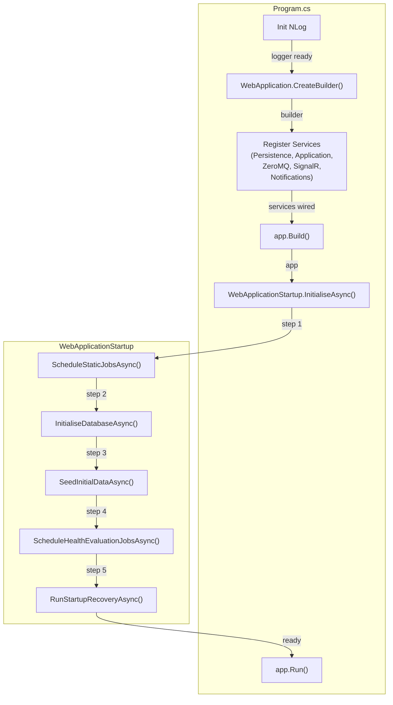

# BrokerageMonitor.Web — Architecture Review

> **Reviewer**: Chief Software Architect
> **Date**: 2026-05-01 _(fourth pass — refactor compliance check)_
> **Layer**: Web / Presentation (depends on Application + Infrastructure)

### Δ Changes Since Previous Review

| #   | Issue                                                                                   | Status                                                                                       |
| --- | --------------------------------------------------------------------------------------- | -------------------------------------------------------------------------------------------- |
| 1   | `Program.cs` SRP violation                                                              | ✅ **FIXED** (previous review)                                                                |
| 2   | Dynamic Quartz job scheduling not triggered on new definitions                          | ✅ **FIXED** (previous review)                                                                |
| —   | Direct Domain repository injection across 5 Blazor pages (8 points)                     | ✅ **FIXED** — all 8 `@inject Repository` directives replaced with Application-layer handlers |
| —   | Orphaned `@inject IMonitoredSystemRepository SystemRepository` in `DashboardPage.razor` | ✅ **FIXED** — injection directive removed                                                    |

---

## 📊 Architecture Health Score: 9.5 / 10

Both violations from the 2026-05-01 review are fully resolved. All eight `@inject` directives that directly referenced Domain repository interfaces have been removed across five Blazor pages; each page now depends only on the Application-layer query handlers introduced this cycle. A grep for `@inject.*Repository` and `@using BrokerageMonitor.Domain.Repositories` across all `.razor` files returns no matches. The Dependency Rule is now fully respected in the Web layer. The only remaining minor observation is that `GetSystemsWithComponentsQueryHandler` (Application layer) still internally executes N+1 queries — tracked in the Application review.

---

## ✅ Fixed Violations (This Cycle)

### 1. Direct Domain Repository Injection in Blazor Pages (FIXED)

All 8 repository `@inject` directives replaced with Application-layer query handlers:

| Page                               | Removed Injection                                              | Replaced With                                                 |
| ---------------------------------- | -------------------------------------------------------------- | ------------------------------------------------------------- |
| `DashboardPage.razor`              | `@inject IMonitoredSystemRepository SystemRepository` (unused) | directive removed entirely                                    |
| `AlertCenterPage.razor`            | `@inject IAlertRecordRepository AlertRepo`                     | `@inject GetAlertsQueryHandler AlertsHandler`                 |
| `HealthDefinitionEditorPage.razor` | `@inject IMonitoredSystemRepository SystemRepo`                | `@inject GetActiveSystemIdsQueryHandler SystemIdsHandler`     |
| `HealthDefinitionEditorPage.razor` | `@inject IMonitoredComponentRepository ComponentRepo`          | `@inject GetActiveComponentsQueryHandler ComponentsHandler`   |
| `HealthManagementPage.razor`       | `@inject IMonitoredSystemRepository SystemRepo`                | `@inject GetActiveSystemIdsQueryHandler SystemIdsHandler`     |
| `HistoryPage.razor`                | `@inject IMonitoredSystemRepository SystemRepo`                | `@inject GetActiveSystemIdsQueryHandler SystemIdsHandler`     |
| `SystemManagementPage.razor`       | `@inject IMonitoredSystemRepository SystemRepo`                | `@inject GetSystemsWithComponentsQueryHandler SystemsHandler` |
| `SystemManagementPage.razor`       | `@inject IMonitoredComponentRepository ComponentRepo`          | consolidated into `GetSystemsWithComponentsQueryHandler`      |

All `@using BrokerageMonitor.Domain.Repositories` directives have been removed. No `.razor` file references the Domain layer's repository namespace.

### 2. Orphaned Injection in `DashboardPage.razor` (FIXED)

```diff
- @inject IMonitoredSystemRepository SystemRepository
- @using BrokerageMonitor.Domain.Repositories
```

The directive was declared but never referenced in markup or `@code`. Removed.

---

## 💡 Refactoring Suggestion (Historical — Now Applied)

### Repository → Use-Case Handler Migration Pattern

```razor
@* Before — DashboardPage.razor (violates Dependency Rule) *@
@inject IMonitoredSystemRepository SystemRepository
@inject IAlertRecordRepository AlertRepo

@code {
    var systems = await SystemRepository.GetAllActiveAsync();      // ❌ direct repo
    var alerts  = await AlertRepo.GetUnacknowledgedAsync();        // ❌ direct repo
}
```

```razor
@* After — route via Application handler ✅ *@
@inject GetAlertsQueryHandler AlertsHandler

@code {
    var alerts = await AlertsHandler.HandleAsync(new GetAlertsQuery(UnacknowledgedOnly: true));
}
```

---

## ✅ Architectural Strengths

1. **Correct Startup Sequence** — `WebApplicationStartup` correctly orders: DB init → seeding → Quartz scheduling → recovery, preventing FK violations and ensuring idempotent first-run seeding.

2. **Circuit-Scoped `OperatorSessionService`** — Registered as `Scoped` in Blazor Server, giving each browser tab its own operator identity. The `Identify()` / `Clear()` / `IsIdentified` pattern is clean and stateless across circuits.

3. **`IDisposable` on `DashboardPage`** — Broadcaster event handlers are properly unregistered in `Dispose()`, preventing memory leaks and stale callbacks after circuit teardown.

4. **NLog Initialized Before `WebApplication.CreateBuilder`** — Startup exceptions are captured before the DI container is built.

5. **`AddZeroMq` / `AddPersistence` / `AddApplicationServices` Separation** — The composition root calls Infrastructure extension methods in a clean dependency order.

---

## 💡 Additional Observations

- **Hardcoded cron expressions** — `WebApplicationStartup.ScheduleStaticJobsAsync` hardcodes `SmokeTestJob` and `DailyExecutionCreatorJob` cron strings as literals. Move these to `appsettings.json` / `IOptions<>` for environment-specific scheduling without recompile.

---

## 📝 Fixed Violation Reference (Previous Review)

### Before — `Program.cs` with Inline Orchestration (FIXED)

```csharp
// Program.cs (previous) — mixed startup concerns
var scheduler = await ...GetScheduler();
await scheduler.ScheduleCronJob<SmokeTestJob>("0 0 1 * * ?");
// ... DB init, seeding, per-definition Quartz loop, recovery ...
app.Run();
```

### After — Delegated to `WebApplicationStartup` (current)

```csharp
// Program.cs (current) — single responsibility
await new WebApplicationStartup(app).InitialiseAsync();
app.Run();
```

---



> **Design Intent**: Each startup step is a private method in `WebApplicationStartup`, testable in isolation. The ordering is dependency-driven: schema before data, data before scheduling, scheduling before recovery.
