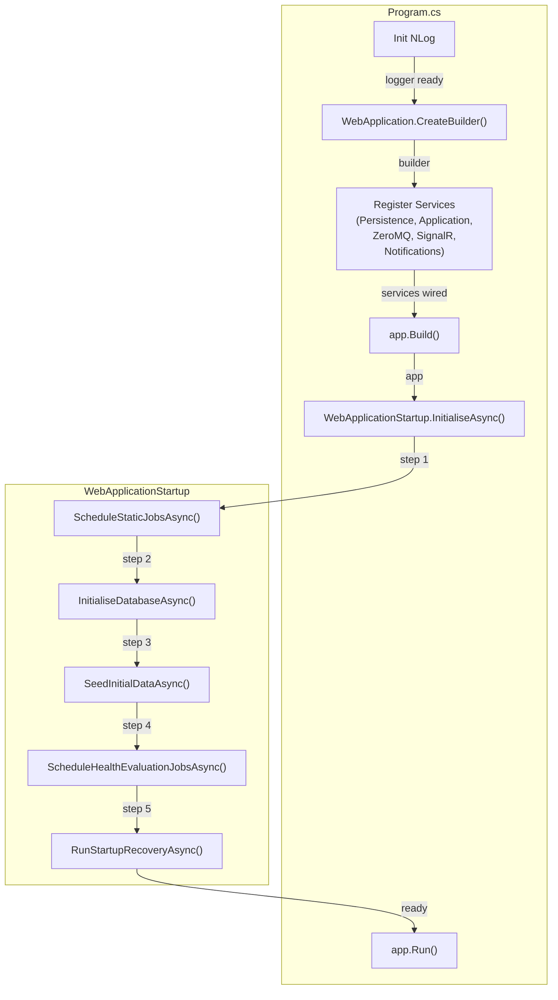

# BrokerageMonitor.Web — Architecture Review

> **Reviewer**: Chief Software Architect
> **Date**: 2026-05-01 _(previous: 2026-04-25)_
> **Layer**: Web / Presentation (depends on Application + Infrastructure)

### Δ Changes Since Previous Review

| #   | Issue                                                                                   | Status                                                              |
| --- | --------------------------------------------------------------------------------------- | ------------------------------------------------------------------- |
| 1   | `Program.cs` SRP violation                                                              | ✅ **FIXED** (previous review)                                       |
| 2   | Dynamic Quartz job scheduling not triggered on new definitions                          | ✅ **FIXED** (previous review)                                       |
| —   | Direct Domain repository injection across 5 Blazor pages (8 points)                     | 🔴 **NEW — Critical** — Clean Architecture Dependency Rule violation |
| —   | Orphaned `@inject IMonitoredSystemRepository SystemRepository` in `DashboardPage.razor` | 🟡 **NEW** — unused injection (dead code)                            |

---

## 📊 Architecture Health Score: 7.5 / 10

A significant architecture regression is present: eight `@inject` directives across five Blazor pages directly bind to Domain repository interfaces (`IMonitoredSystemRepository`, `IAlertRecordRepository`, `IMonitoredComponentRepository`). The Web layer is a dependency boundary — it must communicate with the outer world exclusively through Application-layer handlers and DTOs. Bypassing that boundary makes the pages impossible to test without a live database, couples UI components to persistence concerns, and will fragment business logic into the presentation tier over time.

---

## ⚠️ Critical Violations

### 1. Direct Domain Repository Injection in Blazor Pages

Five Blazor pages inject Domain repository interfaces directly, bypassing the Application layer entirely:

| Page                               | Injected Repositories                                         |
| ---------------------------------- | ------------------------------------------------------------- |
| `DashboardPage.razor`              | `IMonitoredSystemRepository` (also unused — see violation #2) |
| `AlertCenterPage.razor`            | `IAlertRecordRepository`                                      |
| `HealthDefinitionEditorPage.razor` | `IMonitoredSystemRepository`, `IMonitoredComponentRepository` |
| `HealthManagementPage.razor`       | `IMonitoredSystemRepository`                                  |
| `HistoryPage.razor`                | `IMonitoredSystemRepository`                                  |
| `SystemManagementPage.razor`       | `IMonitoredSystemRepository`, `IMonitoredComponentRepository` |

**Why this violates Clean Architecture**: The Dependency Rule states that Web components may only depend on the Application layer. Direct repository access:
- Makes pages impossible to unit-test without a real SQLite database.
- Fragments query logic across the UI tier (no central place to enforce auth, caching, or validation).
- Directly couples a rendering component to the Infrastructure `IDbConnectionFactory` lifecycle.

**Fix**: For each repository usage in a page, either:
1. Route through an existing Application use-case handler, or
2. Create a dedicated query handler in the Application layer and inject that instead.

---

### 2. Orphaned `@inject IMonitoredSystemRepository SystemRepository` in `DashboardPage.razor`

`DashboardPage.razor` declares `@inject IMonitoredSystemRepository SystemRepository` but never references `SystemRepository` anywhere in the component's markup or `@code` block:

```razor
@inject GetDashboardQueryHandler DashboardHandler
@inject IMonitorBroadcaster Broadcaster
@inject IMonitoredSystemRepository SystemRepository   ← never used
```

**Impact**: Dead code that creates a phantom Infrastructure dependency on every Dashboard circuit instantiation.

**Fix**: Remove the injection directive.

---

## 💡 Refactoring Suggestions

### Repository → Use-Case Handler Migration Pattern

```razor
@* Before — DashboardPage.razor (violates Dependency Rule) *@
@inject IMonitoredSystemRepository SystemRepository
@inject IAlertRecordRepository AlertRepo

@code {
    var systems = await SystemRepository.GetAllActiveAsync();      // ❌ direct repo
    var alerts  = await AlertRepo.GetUnacknowledgedAsync();        // ❌ direct repo
}
```

```razor
@* After — route via Application handler *@
@inject GetDashboardQueryHandler DashboardHandler

@code {
    var summaries = await DashboardHandler.HandleAsync(new GetDashboardQuery());  // ✅
}
```

For pages like `AlertCenterPage` that need data not yet exposed through a handler, create a targeted query:

```csharp
// Application/UseCases/Alerts/GetAlertCenterQueryHandler.cs
public sealed class GetAlertCenterQueryHandler
{
    public async Task<AlertCenterDto> HandleAsync(
        GetAlertCenterQuery query, CancellationToken ct = default)
    {
        // Encapsulates all repository calls and business projections
    }
}
```

---

## ✅ Architectural Strengths

1. **Correct Startup Sequence** — `WebApplicationStartup` correctly orders: DB init → seeding → Quartz scheduling → recovery, preventing FK violations and ensuring idempotent first-run seeding.

2. **Circuit-Scoped `OperatorSessionService`** — Registered as `Scoped` in Blazor Server, giving each browser tab its own operator identity. The `Identify()` / `Clear()` / `IsIdentified` pattern is clean and stateless across circuits.

3. **`IDisposable` on `DashboardPage`** — Broadcaster event handlers are properly unregistered in `Dispose()`, preventing memory leaks and stale callbacks after circuit teardown.

4. **NLog Initialized Before `WebApplication.CreateBuilder`** — Startup exceptions are captured before the DI container is built.

5. **`AddZeroMq` / `AddPersistence` / `AddApplicationServices` Separation** — The composition root calls Infrastructure extension methods in a clean dependency order.

---

## 💡 Additional Observations

- **Hardcoded cron expressions** — `WebApplicationStartup.ScheduleStaticJobsAsync` hardcodes `SmokeTestJob` and `DailyExecutionCreatorJob` cron strings as literals. Move these to `appsettings.json` / `IOptions<>` for environment-specific scheduling without recompile.

---

## 📝 Fixed Violation Reference (Previous Review)

### Before — `Program.cs` with Inline Orchestration (FIXED)

```csharp
// Program.cs (previous) — mixed startup concerns
var scheduler = await ...GetScheduler();
await scheduler.ScheduleCronJob<SmokeTestJob>("0 0 1 * * ?");
// ... DB init, seeding, per-definition Quartz loop, recovery ...
app.Run();
```

### After — Delegated to `WebApplicationStartup` (current)

```csharp
// Program.cs (current) — single responsibility
await new WebApplicationStartup(app).InitialiseAsync();
app.Run();
```

---



> **Design Intent**: Each startup step is a private method in `WebApplicationStartup`, testable in isolation. The ordering is dependency-driven: schema before data, data before scheduling, scheduling before recovery.
