# BrokerageMonitor.Web — Architecture Review

> **Reviewer**: Chief Software Architect
> **Date**: 2026-04-24 _(previous: 2026-04-22)_
> **Layer**: Web / Presentation (depends on Application + Infrastructure)

### Δ Changes Since Previous Review

| # | Issue | Status |
|---|-------|--------|
| 1 | `AddZeroMq()` never called — heartbeat pipeline disconnected | ✅ **FIXED** |
| 2 | No concrete `IAuditLogger` / NullAuditLogger in production | ✅ **FIXED** |
| 3 | `Program.cs` SRP violation | 🟡 **STILL OPEN** |
| 4 | Dynamic Quartz job scheduling not re-run on definition changes | 🟡 **STILL OPEN** |
| 5 | `AddZeroMq` missing meant `IHeartbeatTimerRegistry` resolved as no-op | ✅ **FIXED** (consequence of fix #1) |

---

## 📊 Architecture Health Score: 7.5 / 10 _(improved from 6.0)_

The Web project has a clean startup sequence, correct Blazor Server circuit-scoped session design, and proper layering. **Two critical operational bugs from the previous review have been fixed**: `AddZeroMq()` is now called (heartbeat pipeline is active) and the concrete `AuditLogger` is now registered. The remaining concerns are `Program.cs` complexity and the static Quartz job schedule.

---

## ✅ Architectural Strengths

1. **Correct Startup Sequence** — The composition root correctly orders: DB init → seeding → Quartz scheduling → recovery. This prevents FK violations (definitions scheduled before they exist) and ensures idempotent first-run seeding.

2. **Circuit-Scoped `OperatorSessionService`** — Registering `OperatorSessionService` as `Scoped` in Blazor Server gives each browser tab its own operator identity without shared state between circuits. The `Identify()` / `Clear()` / `IsIdentified` pattern is clean.

3. **`AddZeroMq` / `AddPersistence` / `AddApplicationServices` Separation** — The host correctly calls Infrastructure extension methods in a clean dependency order, making the composition root readable.

4. **`AppSettingsImporter` Idempotent Seeding** — First-run seeding is guarded by `GetAllActiveAsync().Count > 0`, making repeated restarts safe.

5. **NLog Initialized Before `WebApplication.CreateBuilder`** — Early NLog initialization means startup exceptions (e.g., connection string missing) are captured in the log file rather than lost.

---

## ⚠️ Critical Violations

### 1. ✅ ~~ZeroMQ Subscriber Service Is Never Registered~~ — FIXED

`builder.Services.AddZeroMq(builder.Configuration)` is now called in `Program.cs`. The `ZeroMQSubscriberService`, `HeartbeatTimeoutMonitor`, and all related parsers are registered and started. The heartbeat pipeline is fully operational.

---

### 2. ✅ ~~Audit Logging Is Silently Disabled~~ — FIXED

`InfrastructureServiceCollectionExtensions.AddPersistence()` now calls `services.AddScoped<IAuditLogger, AuditLogger>()`. The Application layer correctly uses `services.TryAddScoped<IAuditLogger, NullAuditLogger>()` as a test-only fallback, so the Infrastructure implementation takes precedence in any deployment that calls `AddPersistence()`.

---

### 3. `Program.cs` Violates Single Responsibility

The `Program.cs` directly orchestrates:
- Infrastructure registration (4 extension method calls)
- Quartz job scheduling (inline job schedule definitions)
- Database initialization
- First-run seeding
- Per-definition health job scheduling (a nested scope + repository query + loop)
- Station startup recovery

This is 80+ lines of orchestration logic that belongs in dedicated startup services or at minimum in named helper methods.

---

### 4. Dynamic Quartz Job Scheduling Not Re-Run on Definition Changes

Health evaluation jobs (`AggregateHealthEvaluationJob`) are scheduled once at startup from the definition repository. If a `HealthMonitorDefinition` is created or updated via `UpsertHealthMonitorDefinitionHandler` while the application is running, the corresponding Quartz trigger is **not** added or updated.

**Impact**: New definitions will not have their deadline evaluated until the next application restart.

---

## 💡 Refactoring Suggestions

1. **Extract startup orchestration into an `AppStartup` helper** — Create a `static class AppStartup` with methods like `ScheduleJobsAsync(IScheduler, IServiceProvider)` and `SeedAndRecoverAsync(IServiceProvider)` to reduce `Program.cs` to a composition root concern only.

2. **Call `QuartzJobScheduler.ScheduleDefinitionJobAsync()` from `UpsertHealthMonitorDefinitionHandler`** — Inject `ISchedulerFactory` into the handler and schedule/reschedule the `AggregateHealthEvaluationJob` whenever a definition is created or modified.

---

## 📝 Implementation Examples

### Before — Missing Critical Service Registration

```csharp
// Program.cs (current)
builder.Services.AddPersistence();
builder.Services.AddApplicationServices();
// ❌ ZeroMQ not registered — heartbeat pipeline is dead
builder.Services.AddSignalR();
builder.Services.AddRealtimeNotifications();
builder.Services.AddNotificationServices(builder.Configuration);
```

### After — ZeroMQ Properly Registered

```csharp
// Program.cs (proposed)
builder.Services.AddPersistence();
builder.Services.AddApplicationServices();
builder.Services.AddZeroMq(builder.Configuration);  // ✅ heartbeat pipeline live
builder.Services.AddSignalR();
builder.Services.AddRealtimeNotifications();
builder.Services.AddNotificationServices(builder.Configuration);
```

And in `appsettings.json`:
```json
{
  "ZeroMQ": {
    "BrokerAddress": "tcp://localhost:5556"
  }
}
```

---

### Before — No Audit Logging in Production

```csharp
// AddApplicationServices() — NullAuditLogger never overridden
services.AddSingleton<IAuditLogger, NullAuditLogger>();
```

### After — Concrete Implementation in Infrastructure

```csharp
// Infrastructure/AuditLogger.cs (new file)
public sealed class AuditLogger : IAuditLogger
{
    private readonly IAuditLogRepository _repo;
    public AuditLogger(IAuditLogRepository repo) => _repo = repo;

    public Task LogStatusChangedAsync(string systemId, string componentId,
        ComponentStatus previous, ComponentStatus current,
        DateTimeOffset occurredAt, CancellationToken ct = default)
        => _repo.AddAsync(new AuditLogEntry(
            Guid.NewGuid(), systemId, componentId,
            $"StatusChanged:{previous}→{current}",
            "system", null, occurredAt), ct);

    public Task LogOperatorActionAsync(string systemId, string? componentId,
        string actionType, string operatorName,
        string? reason, DateTimeOffset occurredAt, CancellationToken ct = default)
        => _repo.AddAsync(new AuditLogEntry(
            Guid.NewGuid(), systemId, componentId,
            actionType, operatorName, reason, occurredAt), ct);
}

// InfrastructureServiceCollectionExtensions.AddPersistence():
services.AddScoped<IAuditLogger, AuditLogger>(); // ✅ overrides NullAuditLogger
```

---



```mermaid
%% Web Startup Sequence
graph TD
    subgraph "Program.cs Startup"
        NL["Init NLog"]
        WB["WebApplication.CreateBuilder()"]
        REG["Register Services<br/>(Persistence, Application,<br/>ZeroMQ ⚠️ MISSING, SignalR,<br/>Notifications)"]
        BUILD["app.Build()"]
        DBINIT["DatabaseInitializer.InitialiseAsync()"]
        SEED["AppSettingsImporter.ImportIfEmptyAsync()"]
        SCHED["Schedule Quartz Jobs<br/>(SmokeTest, DailyExec, HealthEval)"]
        RECOVER["StationStartupRecoveryService.RecoverAsync()"]
        RUN["app.Run()"]
    end

    NL -->|"logger ready"| WB
    WB -->|"builder"| REG
    REG -->|"services wired"| BUILD
    BUILD -->|"app"| DBINIT
    DBINIT -->|"schema ready"| SEED
    SEED -->|"data seeded"| SCHED
    SCHED -->|"jobs scheduled"| RECOVER
    RECOVER -->|"state restored"| RUN
```

> **Design Intent**: Startup operations are ordered by dependency — schema must exist before seeding, seeding before scheduling, and scheduling before recovery (which reads definitions from DB). The current implementation correctly respects this order; the critical missing step is wiring `AddZeroMq` during service registration.
