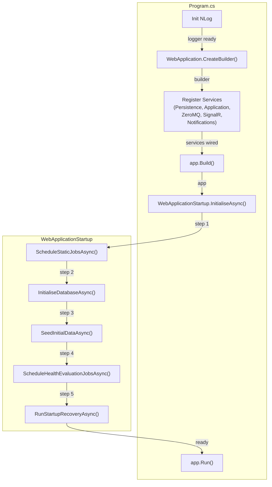

# BrokerageMonitor.Web — Architecture Review

> **Reviewer**: Chief Software Architect
> **Date**: 2026-04-25 _(previous: 2026-04-24)_
> **Layer**: Web / Presentation (depends on Application + Infrastructure)

### Δ Changes Since Previous Review

| #   | Issue                                                          | Status                                                                                 |
| --- | -------------------------------------------------------------- | -------------------------------------------------------------------------------------- |
| 1   | `Program.cs` SRP violation                                     | ✅ **FIXED** — orchestration extracted to `WebApplicationStartup`                       |
| 2   | Dynamic Quartz job scheduling not triggered on new definitions | ✅ **FIXED** — `UpsertHealthMonitorDefinitionHandler` calls `ScheduleOrRescheduleAsync` |

---

## 📊 Architecture Health Score: 9.0 / 10

The Web project has no open violations. `Program.cs` is now a clean entry point; all startup orchestration is in `WebApplicationStartup`. New and updated `HealthMonitorDefinition`s are immediately scheduled in Quartz at runtime, without requiring a restart.

---

## ✅ Architectural Strengths

1. **Correct Startup Sequence** — The composition root correctly orders: DB init → seeding → Quartz scheduling → recovery. This prevents FK violations (definitions scheduled before they exist) and ensures idempotent first-run seeding.

2. **Circuit-Scoped `OperatorSessionService`** — Registering `OperatorSessionService` as `Scoped` in Blazor Server gives each browser tab its own operator identity without shared state between circuits. The `Identify()` / `Clear()` / `IsIdentified` pattern is clean.

3. **`AddZeroMq` / `AddPersistence` / `AddApplicationServices` Separation** — The host correctly calls Infrastructure extension methods in a clean dependency order, making the composition root readable.

4. **`AppSettingsImporter` Idempotent Seeding** — First-run seeding is guarded by `GetAllActiveAsync().Count > 0`, making repeated restarts safe.

5. **NLog Initialized Before `WebApplication.CreateBuilder`** — Early NLog initialization means startup exceptions (e.g., connection string missing) are captured in the log file rather than lost.

---

## ⚠️ Critical Violations

### 1. ✅ ~~ZeroMQ Subscriber Service Is Never Registered~~ — FIXED

`builder.Services.AddZeroMq(builder.Configuration)` is now called in `Program.cs`. The `ZeroMQSubscriberService`, `HeartbeatTimeoutMonitor`, and all related parsers are registered and started. The heartbeat pipeline is fully operational.

---

## ⚠️ No Open Violations

All previously identified violations have been resolved in this sprint:

- **`Program.cs` SRP** — Startup orchestration extracted to `WebApplicationStartup`. `Program.cs` is now a clean top-level entry point (~90 lines including error-handling boilerplate).
- **Dynamic Quartz scheduling** — `UpsertHealthMonitorDefinitionHandler` calls `_jobScheduler.ScheduleOrRescheduleAsync()` on every create and update, ensuring runtime changes take effect immediately.

---

## 💡 Observation

The `ScheduleStaticJobsAsync` method in `WebApplicationStartup` hardcodes the `SmokeTestJob` and `DailyExecutionCreatorJob` cron expressions as string literals (`"0 0 1 * * ?"`, `"0 30 5 * * ?"`). Consider moving these to `appsettings.json` / `IOptions<>` to allow environment-specific scheduling without a recompile.

---

## 📝 Implementation Example — Before vs After (For Reference)

### Before — Bloated `Program.cs`

```csharp
// Program.cs (previous) — 80+ lines of orchestration
var scheduler = await ...GetScheduler();
await scheduler.ScheduleCronJob<SmokeTestJob>("0 0 1 * * ?");
// ... DB init ...
// ... seeding ...
// ... per-definition Quartz loop ...
await using var scope = app.Services.CreateAsyncScope();
var jobScheduler = scope.ServiceProvider.GetRequiredService<IHealthJobScheduler>();
var definitions = await definitionRepo.GetAllActiveAsync();
foreach (var def in definitions)
    await jobScheduler.ScheduleOrRescheduleAsync(def.DefinitionId, def.DeadlineTime);
// ... recovery ...
app.Run();
```

### After — Delegated to `WebApplicationStartup`

```csharp
// Program.cs (current) — focused entry point
await new WebApplicationStartup(app).InitialiseAsync();
app.Run();

// WebApplicationStartup.cs — each concern in its own private method
public async Task InitialiseAsync(CancellationToken ct = default)
{
    await ScheduleStaticJobsAsync(ct);
    await InitialiseDatabaseAsync(ct);
    await SeedInitialDataAsync(ct);
    await ScheduleHealthEvaluationJobsAsync(ct);
    await RunStartupRecoveryAsync(ct);
}
```

---



> **Design Intent**: Each startup step is a private method in `WebApplicationStartup`, testable in isolation. The ordering is dependency-driven: schema before data, data before scheduling, scheduling before recovery.
