# BrokerageMonitor.Web — Architecture Review

> **Reviewer**: Chief Software Architect
> **Date**: 2026-04-22
> **Layer**: Web / Presentation (depends on Application + Infrastructure)

---

## 📊 Architecture Health Score: 6 / 10

The Web project has a clean startup sequence, correct Blazor Server circuit-scoped session design, and proper layering. However, it contains **two critical operational bugs**: the ZeroMQ subscriber service is never registered (the entire heartbeat pipeline is disconnected), and there is no concrete `IAuditLogger` implementation, meaning all operator audit entries are silently discarded. Additionally, the startup `Program.cs` is overloaded with orchestration logic that should be delegated.

---

## ✅ Architectural Strengths

1. **Correct Startup Sequence** — The composition root correctly orders: DB init → seeding → Quartz scheduling → recovery. This prevents FK violations (definitions scheduled before they exist) and ensures idempotent first-run seeding.

2. **Circuit-Scoped `OperatorSessionService`** — Registering `OperatorSessionService` as `Scoped` in Blazor Server gives each browser tab its own operator identity without shared state between circuits. The `Identify()` / `Clear()` / `IsIdentified` pattern is clean.

3. **`AddZeroMq` / `AddPersistence` / `AddApplicationServices` Separation** — The host correctly calls Infrastructure extension methods in a clean dependency order, making the composition root readable.

4. **`AppSettingsImporter` Idempotent Seeding** — First-run seeding is guarded by `GetAllActiveAsync().Count > 0`, making repeated restarts safe.

5. **NLog Initialized Before `WebApplication.CreateBuilder`** — Early NLog initialization means startup exceptions (e.g., connection string missing) are captured in the log file rather than lost.

---

## ⚠️ Critical Violations

### 1. ZeroMQ Subscriber Service Is Never Registered

`AddZeroMq(builder.Configuration)` is not called anywhere in `Program.cs`. This means:
- `ZeroMQSubscriberService` (the heartbeat receiver) is **not** started
- `HeartbeatTimeoutMonitor` (the timer registry) is **not** registered as a singleton or hosted service
- The `IHeartbeatTimerRegistry` resolves to `NullHeartbeatTimerRegistry` (no-op) from the Application layer
- `IHeartbeatMessageParser` and `IMailChannelMessageParser` are never registered

**Result**: The application starts, the UI renders, but **no heartbeats are ever processed**. The dashboard will show all components at `Unknown` status indefinitely. This is a **complete loss of the system's core monitoring function**.

```csharp
// Program.cs (current) — ZeroMQ never wired:
builder.Services.AddPersistence();
builder.Services.AddApplicationServices();
// ❌ builder.Services.AddZeroMq(builder.Configuration); — MISSING
builder.Services.AddSignalR();
```

---

### 2. Audit Logging Is Silently Disabled

`AddApplicationServices()` registers `NullAuditLogger` as a singleton. No Infrastructure extension method replaces it with a concrete implementation. **Every operator action (acknowledge alert, toggle maintenance, override state) produces zero audit records**, even though `AuditLogRepository` exists and the SQLite table is created by `DatabaseInitializer`.

```csharp
// ApplicationServiceCollectionExtensions.cs
services.AddSingleton<IAuditLogger, NullAuditLogger>(); // ❌ never replaced
```

---

### 3. `Program.cs` Violates Single Responsibility

The `Program.cs` directly orchestrates:
- Infrastructure registration (4 extension method calls)
- Quartz job scheduling (inline job schedule definitions)
- Database initialization
- First-run seeding
- Per-definition health job scheduling (a nested scope + repository query + loop)
- Station startup recovery

This is 80+ lines of orchestration logic that belongs in dedicated startup services or at minimum in named helper methods.

---

### 4. Dynamic Quartz Job Scheduling Is Not Re-Run on Definition Changes

Health evaluation jobs (`AggregateHealthEvaluationJob`) are scheduled once at startup from the definition repository. If a `HealthMonitorDefinition` is created or updated via `UpsertHealthMonitorDefinitionHandler` while the application is running, the corresponding Quartz trigger is **not** added or updated.

**Impact**: New definitions will not have their deadline evaluated until the next application restart.

---

### 5. `AddZeroMq` Not Called Means `IHeartbeatTimerRegistry` Resolves as No-Op

Because `AddZeroMq` is missing, the concrete `HeartbeatTimeoutMonitor` (which implements `IHeartbeatTimerRegistry`) is never registered. The `NullHeartbeatTimerRegistry` registered in `AddApplicationServices()` wins. Even if someone manually calls `ProcessAsync` on `HeartbeatProcessor`, timers are never armed or reset, so `ComponentLost` events are never raised.

---

## 💡 Refactoring Suggestions

1. **Add `builder.Services.AddZeroMq(builder.Configuration)` to `Program.cs`** — This is the single most impactful fix. Bind `ZeroMqOptions` from the `"ZeroMQ"` appsettings section and ensure the section is present in `appsettings.json`.

2. **Create a concrete `AuditLogger` in Infrastructure** — Implement `IAuditLogger` delegating to `IAuditLogRepository`. Register it in `AddPersistence()` using `services.AddScoped<IAuditLogger, AuditLogger>()` to override the null stub.

3. **Extract startup orchestration into an `AppStartup` helper** — Create a `static class AppStartup` with methods like `ScheduleJobsAsync(IScheduler, IServiceProvider)` and `SeedAndRecoverAsync(IServiceProvider)` to reduce `Program.cs` to a composition root concern only.

4. **Call `QuartzJobScheduler.ScheduleDefinitionJobAsync()` from `UpsertHealthMonitorDefinitionHandler`** — Inject `ISchedulerFactory` into the handler and schedule/reschedule the `AggregateHealthEvaluationJob` whenever a definition is created or modified.

5. **Add `"ZeroMQ"` section to `appsettings.json`** — Currently the section is absent from `appsettings.json`, which would cause `AddZeroMq` to bind empty options and attempt to connect to an empty address.

---

## 📝 Implementation Examples

### Before — Missing Critical Service Registration

```csharp
// Program.cs (current)
builder.Services.AddPersistence();
builder.Services.AddApplicationServices();
// ❌ ZeroMQ not registered — heartbeat pipeline is dead
builder.Services.AddSignalR();
builder.Services.AddRealtimeNotifications();
builder.Services.AddNotificationServices(builder.Configuration);
```

### After — ZeroMQ Properly Registered

```csharp
// Program.cs (proposed)
builder.Services.AddPersistence();
builder.Services.AddApplicationServices();
builder.Services.AddZeroMq(builder.Configuration);  // ✅ heartbeat pipeline live
builder.Services.AddSignalR();
builder.Services.AddRealtimeNotifications();
builder.Services.AddNotificationServices(builder.Configuration);
```

And in `appsettings.json`:
```json
{
  "ZeroMQ": {
    "BrokerAddress": "tcp://localhost:5556"
  }
}
```

---

### Before — No Audit Logging in Production

```csharp
// AddApplicationServices() — NullAuditLogger never overridden
services.AddSingleton<IAuditLogger, NullAuditLogger>();
```

### After — Concrete Implementation in Infrastructure

```csharp
// Infrastructure/AuditLogger.cs (new file)
public sealed class AuditLogger : IAuditLogger
{
    private readonly IAuditLogRepository _repo;
    public AuditLogger(IAuditLogRepository repo) => _repo = repo;

    public Task LogStatusChangedAsync(string systemId, string componentId,
        ComponentStatus previous, ComponentStatus current,
        DateTimeOffset occurredAt, CancellationToken ct = default)
        => _repo.AddAsync(new AuditLogEntry(
            Guid.NewGuid(), systemId, componentId,
            $"StatusChanged:{previous}→{current}",
            "system", null, occurredAt), ct);

    public Task LogOperatorActionAsync(string systemId, string? componentId,
        string actionType, string operatorName,
        string? reason, DateTimeOffset occurredAt, CancellationToken ct = default)
        => _repo.AddAsync(new AuditLogEntry(
            Guid.NewGuid(), systemId, componentId,
            actionType, operatorName, reason, occurredAt), ct);
}

// InfrastructureServiceCollectionExtensions.AddPersistence():
services.AddScoped<IAuditLogger, AuditLogger>(); // ✅ overrides NullAuditLogger
```

---



```mermaid
%% Web Startup Sequence
graph TD
    subgraph "Program.cs Startup"
        NL["Init NLog"]
        WB["WebApplication.CreateBuilder()"]
        REG["Register Services<br/>(Persistence, Application,<br/>ZeroMQ ⚠️ MISSING, SignalR,<br/>Notifications)"]
        BUILD["app.Build()"]
        DBINIT["DatabaseInitializer.InitialiseAsync()"]
        SEED["AppSettingsImporter.ImportIfEmptyAsync()"]
        SCHED["Schedule Quartz Jobs<br/>(SmokeTest, DailyExec, HealthEval)"]
        RECOVER["StationStartupRecoveryService.RecoverAsync()"]
        RUN["app.Run()"]
    end

    NL -->|"logger ready"| WB
    WB -->|"builder"| REG
    REG -->|"services wired"| BUILD
    BUILD -->|"app"| DBINIT
    DBINIT -->|"schema ready"| SEED
    SEED -->|"data seeded"| SCHED
    SCHED -->|"jobs scheduled"| RECOVER
    RECOVER -->|"state restored"| RUN
```

> **Design Intent**: Startup operations are ordered by dependency — schema must exist before seeding, seeding before scheduling, and scheduling before recovery (which reads definitions from DB). The current implementation correctly respects this order; the critical missing step is wiring `AddZeroMq` during service registration.
