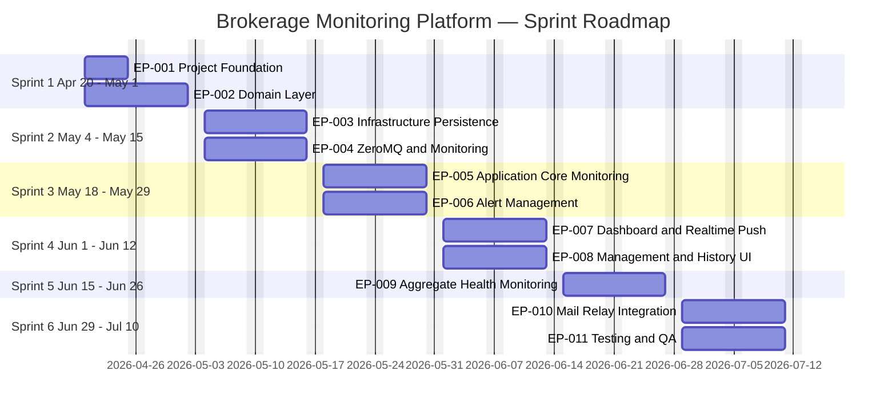

# 券商內部系統排程與服務監控站台 — Scrum Sprint Plan

> **建立日期**: 2026-04-18
> **版本**: v1.0
> **依據**: `docs/architecture/BrokerageMonitoringPlatform.design.md` (v1.4)
> **Product Backlog**: `docs/sprints/BrokerageMonitoringPlatform.backlog.csv`

---

## Sprint 概覽

| Sprint   | 期間                     | 目標                                 | Story Points | 主要 Epic      |
| -------- | ------------------------ | ------------------------------------ | ------------ | -------------- |
| Sprint 1 | 2026-04-20 ～ 2026-05-01 | 基礎建設 + Domain 模型層完整建立     | 53           | EP-001, EP-002 |
| Sprint 2 | 2026-05-04 ～ 2026-05-15 | Persistence 層 + ZeroMQ 訂閱基礎建立 | 47           | EP-003, EP-004 |
| Sprint 3 | 2026-05-18 ～ 2026-05-29 | Application 核心邏輯 + 告警管理      | 43           | EP-005, EP-006 |
| Sprint 4 | 2026-06-01 ～ 2026-06-12 | Blazor UI + SignalR 即時推送         | 53           | EP-007, EP-008 |
| Sprint 5 | 2026-06-15 ～ 2026-06-26 | 彙整健康監控全流程                   | 55           | EP-009         |
| Sprint 6 | 2026-06-29 ～ 2026-07-10 | 郵件轉送整合 + 測試驗收              | 75           | EP-010, EP-011 |
| **合計** |                          |                                      | **326 SP**   |                |

---

## Epic 摘要

| EpicId | Title                          | Sprint   | Story Points |
| ------ | ------------------------------ | -------- | ------------ |
| EP-001 | 專案基礎建設                   | Sprint 1 | 11           |
| EP-002 | Domain 模型層                  | Sprint 1 | 42           |
| EP-003 | Infrastructure - 持久化層      | Sprint 2 | 31           |
| EP-004 | Infrastructure - ZeroMQ & 監控 | Sprint 2 | 16           |
| EP-005 | Application 層 - 核心監控      | Sprint 3 | 24           |
| EP-006 | Application 層 - 告警管理      | Sprint 3 | 19           |
| EP-007 | 展示層 - 儀表板 & 即時推送     | Sprint 4 | 31           |
| EP-008 | 展示層 - 管理 & 歷史           | Sprint 4 | 22           |
| EP-009 | 彙整健康監控                   | Sprint 5 | 55           |
| EP-010 | 郵件轉送整合                   | Sprint 6 | 37           |
| EP-011 | 測試 & 品質驗收                | Sprint 6 | 38           |

---

## Gantt Chart — Epic 層級總覽

---

## Gantt Chart — Story 層級詳細計畫

```mermaid
%%  Gantt Chart — Brokerage Monitoring Platform (Story Level)
gantt
    title Brokerage Monitoring Platform — Story-Level Sprint Plan
    dateFormat  YYYY-MM-DD
    excludes    weekends

    section Sprint 1 — Foundation and Domain
        US-001 Solution Architecture Setup          :us001, 2026-04-20, 2d
        US-002 NLog Structured Logging              :us002, 2026-04-20, 1d
        US-003 Quartz.NET Integration               :us003, after us002, 2d
        US-004 SQLite WAL and Dapper Factory        :us004, after us001, 2d
        US-005 MonitoredSystem Aggregate Root       :us005, 2026-04-20, 3d
        US-006 MonitoredComponent Aggregate Root    :us006, after us005, 3d
        US-007 AlertRecord Aggregate Root           :us007, 2026-04-22, 2d
        US-008 HealthMonitorDefinition Aggregate    :us008, after us006, 3d
        US-009 DailyExecution Aggregate Root        :us009, 2026-04-27, 3d
        US-010 NotificationInboxItem Aggregate      :us010, after us009, 2d
        US-011 All Value Objects                    :us011, 2026-04-22, 3d
        US-012 Domain Events Definition             :us012, after us011, 2d
        US-013 Repository Interface Definitions     :us013, after us012, 2d
        US-014 Domain Layer Unit Tests              :us014, 2026-04-29, 3d

    section Sprint 2 — Persistence and ZeroMQ
        US-015 DatabaseInitializer and Schema       :us015, 2026-05-04, 3d
        US-016 System and Component Repositories    :us016, after us015, 3d
        US-017 ComponentState Repository            :us017, 2026-05-06, 2d
        US-018 AlertRecord Repository               :us018, after us017, 2d
        US-019 HealthDefinition and DailyExec Repos :us019, after us016, 3d
        US-020 ExecutionHistory AuditLog Inbox Repos:us020, after us019, 3d
        US-021 Persistence Integration Tests        :us021, after us020, 3d
        US-022 ZeroMQSubscriberService XSUB         :us022, 2026-05-04, 3d
        US-023 HeartbeatMessageParser               :us023, after us022, 2d
        US-024 HeartbeatTimeoutMonitor              :us024, after us023, 3d
        US-025 DataRetentionService Quartz Job      :us025, after us024, 2d

    section Sprint 3 — Application Core and Alerts
        US-026 HeartbeatProcessor State Machine     :us026, 2026-05-18, 5d
        US-027 StateRollupService                   :us027, 2026-05-18, 2d
        US-028 ComponentStatusChanged Event Chain   :us028, after us026, 3d
        US-029 GetDashboardQueryHandler             :us029, after us027, 2d
        US-030 Station Restart State Recovery       :us030, after us028, 3d
        US-031 AlertEvaluationService               :us031, 2026-05-18, 5d
        US-032 AcknowledgeAlert Use Case            :us032, after us031, 2d
        US-033 ToggleMaintenanceMode Use Case       :us033, after us032, 2d
        US-034 OverrideComponentState Use Case      :us034, after us033, 3d

    section Sprint 4 — Presentation Layer
        US-035 MonitorHub SignalR Hub               :us035, 2026-06-01, 3d
        US-036 SignalRNotificationService           :us036, after us035, 2d
        US-037 DashboardPage.razor                  :us037, 2026-06-01, 5d
        US-038 SystemGroupCard and ComponentStatusRow:us038, after us037, 3d
        US-039 AlertPopup Component                 :us039, after us038, 3d
        US-040 AlertCenterPage.razor                :us040, after us039, 3d
        US-041 OperatorSessionModal                 :us041, 2026-06-03, 2d
        US-042 SystemManagementPage.razor           :us042, after us041, 5d
        US-043 HistoryPage.razor                    :us043, after us042, 3d
        US-044 NotificationToast Component          :us044, 2026-06-04, 2d
        US-045 AppSettingsImporter                  :us045, after us044, 2d

    section Sprint 5 — Aggregate Health Monitoring
        US-046 HealthManagementPage.razor           :us046, 2026-06-15, 3d
        US-047 HealthDefinitionEditorPage.razor     :us047, after us046, 5d
        US-048 DailyExecutionCreatorService and Job :us048, 2026-06-15, 5d
        US-049 HealthEvaluation Progress Tracking   :us049, after us048, 5d
        US-050 HealthEvaluation Deadline Evaluation :us050, after us049, 5d
        US-051 AggregateHealthEvaluationJob Quartz  :us051, after us050, 2d
        US-052 RecoverTodayAsync Station Restart    :us052, after us051, 3d
        US-053 EmailNotificationService Health      :us053, 2026-06-22, 3d
        US-054 TeamsNotificationService             :us054, after us053, 3d

    section Sprint 6 — Mail Relay and Testing
        US-055 MailAgent Project Structure          :us055, 2026-06-29, 2d
        US-056 OutlookMailReader COM Interop        :us056, after us055, 5d
        US-057 ZeroMQMailPublisher NetMQ PUB        :us057, after us056, 3d
        US-058 MailRelayWorker IHostedService       :us058, after us057, 3d
        US-059 MailChannelMessageParser             :us059, 2026-06-29, 2d
        US-060 MailChannelProcessor Rule Matching   :us060, after us059, 5d
        US-061 MailParsingRule Management UI        :us061, after us060, 3d
        US-062 ComponentStatus State Machine Tests  :us062, 2026-06-29, 3d
        US-063 AlertEvaluationService Unit Tests    :us063, after us062, 3d
        US-064 HeartbeatProcessor Unit Tests        :us064, 2026-06-30, 3d
        US-065 AggregateHealthEvaluation Unit Tests :us065, after us063, 3d
        US-066 DailyExecutionCreator Unit Tests     :us066, after us064, 3d
        US-067 Infrastructure Integration Tests     :us067, after us066, 3d
        US-068 E2E Acceptance Testing               :us068, after us065, 5d
```

---

## Sprint 詳細工作項目

### Sprint 1：基礎建設 + Domain 模型層
> **期間**: 2026-04-20 ～ 2026-05-01 ｜ **目標 SP**: 53 ｜ **Definition of Done**: Domain 層所有 AR/VO/Event/Interface 完成並通過單元測試；Solution 可成功建置

| ID     | Title                                  | SP  | Priority |
| ------ | -------------------------------------- | --- | -------- |
| US-001 | 建立 Solution 架構與專案參考           | 3   | High     |
| US-002 | 設定 NLog 結構化日誌框架               | 2   | Medium   |
| US-003 | 整合 Quartz.NET 排程框架               | 3   | High     |
| US-004 | 設定 SQLite WAL 模式與 Dapper 連線工廠 | 3   | High     |
| US-005 | 實作 MonitoredSystem Aggregate Root    | 5   | Critical |
| US-006 | 實作 MonitoredComponent Aggregate Root | 5   | Critical |
| US-007 | 實作 AlertRecord Aggregate Root        | 3   | Critical |
| US-008 | 實作 HealthMonitorDefinition Aggregate | 5   | Critical |
| US-009 | 實作 DailyExecution Aggregate Root     | 5   | Critical |
| US-010 | 實作 NotificationInboxItem Aggregate   | 3   | High     |
| US-011 | 實作所有 Value Objects                 | 5   | Critical |
| US-012 | 定義全部 Domain Events                 | 3   | High     |
| US-013 | 定義所有 Repository 介面               | 3   | High     |
| US-014 | Domain 層單元測試                      | 5   | High     |

**Sprint 1 Review 驗收標準**:
- `dotnet build` 全專案無錯誤
- Domain 單元測試覆蓋率 ≥ 80%
- BI-013/BI-014/BI-016 業務不變式測試通過

---

### Sprint 2：Persistence 層 + ZeroMQ 訂閱
> **期間**: 2026-05-04 ～ 2026-05-15 ｜ **目標 SP**: 47 ｜ **Definition of Done**: 所有 Repository 可讀寫 SQLite；ZeroMQ 訂閱服務可接收並解析心跳訊息

| ID     | Title                                              | SP  | Priority |
| ------ | -------------------------------------------------- | --- | -------- |
| US-015 | 實作 DatabaseInitializer & SQLite Schema           | 5   | Critical |
| US-016 | 實作 MonitoredSystem & MonitoredComponent Repo     | 5   | Critical |
| US-017 | 實作 ComponentState Repository                     | 3   | Critical |
| US-018 | 實作 AlertRecord Repository                        | 3   | Critical |
| US-019 | 實作 HealthMonitorDefinition & DailyExecution Repo | 5   | Critical |
| US-020 | 實作 ExecutionHistory / AuditLog / Inbox Repo      | 5   | High     |
| US-021 | Persistence 整合測試                               | 5   | High     |
| US-022 | 實作 ZeroMQSubscriberService (XSUB + 訊息分派)     | 5   | Critical |
| US-023 | 實作 HeartbeatMessageParser                        | 3   | High     |
| US-024 | 實作 HeartbeatTimeoutMonitor (per-component Timer) | 5   | Critical |
| US-025 | 實作 DataRetentionService (Quartz Job)             | 3   | Medium   |

**Sprint 2 Review 驗收標準**:
- SQLite WAL Schema 建立完整；Repository 整合測試通過
- ZeroMQ XSUB 可接收模擬心跳訊息並分派
- HeartbeatTimeoutMonitor 在模擬環境可觸發超時事件

---

### Sprint 3：Application 核心邏輯 + 告警管理
> **期間**: 2026-05-18 ～ 2026-05-29 ｜ **目標 SP**: 43 ｜ **Definition of Done**: 心跳→狀態機轉換→告警觸發完整業務流程可在整合測試中驗證

| ID     | Title                                       | SP  | Priority |
| ------ | ------------------------------------------- | --- | -------- |
| US-026 | 實作 HeartbeatProcessor（含完整狀態機轉換） | 8   | Critical |
| US-027 | 實作 StateRollupService                     | 3   | High     |
| US-028 | 實作 ComponentStatusChanged 事件下游鏈      | 5   | Critical |
| US-029 | 實作 GetDashboardQueryHandler               | 3   | High     |
| US-030 | 實作站台重啟狀態復原機制 (FR-033)           | 5   | Critical |
| US-031 | 實作 AlertEvaluationService                 | 8   | Critical |
| US-032 | 實作 AcknowledgeAlert Use Case              | 3   | High     |
| US-033 | 實作 ToggleMaintenanceMode Use Case         | 3   | High     |
| US-034 | 實作 OverrideComponentState Use Case        | 5   | High     |

**Sprint 3 Review 驗收標準**:
- 心跳→Error→Lost→告警觸發完整流程整合測試通過
- 維護模式抑制告警 (BI-006) 測試通過
- 站台重啟後 Running 狀態 ScheduledJob 正確轉為 Warning (FR-033)

---

### Sprint 4：Blazor UI + SignalR 即時推送
> **期間**: 2026-06-01 ～ 2026-06-12 ｜ **目標 SP**: 53 ｜ **Definition of Done**: 儀表板即時顯示元件狀態；告警彈窗正常觸發；系統管理 CRUD 可操作

| ID     | Title                                     | SP  | Priority |
| ------ | ----------------------------------------- | --- | -------- |
| US-035 | 實作 MonitorHub (SignalR Hub)             | 5   | Critical |
| US-036 | 實作 SignalRNotificationService           | 3   | High     |
| US-037 | 實作 DashboardPage.razor                  | 8   | High     |
| US-038 | 實作 SystemGroupCard & ComponentStatusRow | 5   | High     |
| US-039 | 實作 AlertPopup 即時彈窗元件 (FR-010)     | 5   | Critical |
| US-040 | 實作 AlertCenterPage.razor                | 5   | High     |
| US-041 | 實作 OperatorSessionModal (FR-009)        | 3   | High     |
| US-042 | 實作 SystemManagementPage.razor (FR-031)  | 8   | High     |
| US-043 | 實作 HistoryPage.razor (FR-021~023)       | 5   | Medium   |
| US-044 | 實作 NotificationToast 元件               | 3   | Medium   |
| US-045 | 實作 AppSettingsImporter (FR-031)         | 3   | Medium   |

**Sprint 4 Review 驗收標準**:
- 儀表板在模擬心跳資料下正確顯示 8 種狀態顏色
- 告警 Pop-up 觸發後 Acknowledge 操作完整流程可操作
- 系統 / 元件 CRUD 操作在 UI 正常運作

---

### Sprint 5：彙整健康監控全流程
> **期間**: 2026-06-15 ～ 2026-06-26 ｜ **目標 SP**: 55 ｜ **Definition of Done**: DailyExecution 建立→進度追蹤→截止時間評估→Email/Teams 通知完整流程可端對端驗證

| ID     | Title                                            | SP  | Priority |
| ------ | ------------------------------------------------ | --- | -------- |
| US-046 | 實作 HealthManagementPage.razor (FR-046)         | 5   | High     |
| US-047 | 實作 HealthDefinitionEditorPage.razor            | 8   | High     |
| US-048 | 實作 DailyExecutionCreatorService & Quartz Job   | 8   | Critical |
| US-049 | 實作 AggregateHealthEvaluationService - 進度追蹤 | 8   | Critical |
| US-050 | 實作 AggregateHealthEvaluationService - 截止評估 | 8   | Critical |
| US-051 | 實作 AggregateHealthEvaluationJob (Quartz)       | 3   | High     |
| US-052 | 實作 RecoverTodayAsync - 站台重啟補建 (FR-044)   | 5   | High     |
| US-053 | 實作 EmailNotificationService - 彙整報告         | 5   | High     |
| US-054 | 實作 TeamsNotificationService                    | 5   | Medium   |

**Sprint 5 Review 驗收標準**:
- 05:30 Quartz Job 正確建立當日 DailyExecution 實例
- 元件完成後進度即時更新 (FR-034) 顯示於管理頁面
- 截止時間評估 Success/Failed/Exempted 三種情境通過整合測試
- Email 與 Teams 通知格式正確（測試環境驗收）

---

### Sprint 6：郵件轉送整合 + 測試驗收
> **期間**: 2026-06-29 ～ 2026-07-10 ｜ **目標 SP**: 75 ｜ **Definition of Done**: MailAgent E2E 可投遞郵件至站台並更新元件狀態；所有核心單元測試與 E2E 驗收場景通過

| ID     | Title                                         | SP  | Priority |
| ------ | --------------------------------------------- | --- | -------- |
| US-055 | 建立 MailAgent 專案結構與 DI Composition Root | 3   | High     |
| US-056 | 實作 OutlookMailReader (Outlook COM Interop)  | 8   | High     |
| US-057 | 實作 ZeroMQMailPublisher (NetMQ PUB)          | 5   | High     |
| US-058 | 實作 MailRelayWorker (IHostedService)         | 5   | High     |
| US-059 | 實作 MailChannelMessageParser                 | 3   | Medium   |
| US-060 | 實作 MailChannelProcessor (MailParsingRule)   | 8   | Critical |
| US-061 | 實作 MailParsingRule 管理 UI                  | 5   | Medium   |
| US-062 | ComponentStatus 狀態機單元測試                | 5   | High     |
| US-063 | AlertEvaluationService 單元測試               | 5   | High     |
| US-064 | HeartbeatProcessor 單元測試                   | 5   | High     |
| US-065 | AggregateHealthEvaluationService 單元測試     | 5   | High     |
| US-066 | DailyExecutionCreatorService 單元測試         | 5   | High     |
| US-067 | Infrastructure 整合測試                       | 5   | Medium   |
| US-068 | E2E 場景驗收測試                              | 8   | High     |

**Sprint 6 Review 驗收標準**:
- MailAgent 可從 Outlook 讀取郵件並透過 ZeroMQ 推送至站台
- MailChannelProcessor 正確比對 MailParsingRule 並更新元件狀態
- 所有單元測試通過；測試覆蓋率 ≥ 75%
- 5 個核心 E2E 驗收場景全部通過

---

## Definition of Done (全域)

1. 所有 Acceptance Criteria 通過
2. 單元測試新增並通過（覆蓋率維持 ≥ 75%）
3. Dapper 查詢全部使用參數化（無 SQL Injection 風險）
4. NLog 結構化日誌已加入關鍵流程節點
5. `dotnet build` 無警告、無錯誤
6. Code Review 通過（Pull Request 核准）
7. 相關 FR 需求驗證勾選完成

---

## 風險與相依性

| 風險                                 | 影響         | 緩解策略                                      |
| ------------------------------------ | ------------ | --------------------------------------------- |
| Outlook COM Interop 環境相依         | EP-010 延遲  | Sprint 6 提前驗證 COM 環境；提供 Mock 替代    |
| ZeroMQ Broker 外部基礎設施未就緒     | EP-004 阻擋  | 使用 inproc/loopback 替代進行開發測試         |
| HealthMonitorDefinition 業務規則複雜 | EP-009 超時  | Sprint 5 前半期優先完成 US-048/049 核心邏輯   |
| SQLite 並發寫入效能瓶頸              | 生產環境風險 | WAL Mode + 寫入佇列設計；Sprint 2 驗證效能    |
| Sprint 6 SP 偏高 (75 SP)             | Sprint 超載  | 可將 US-061/US-067 降為 Sprint 5 Stretch Goal |
